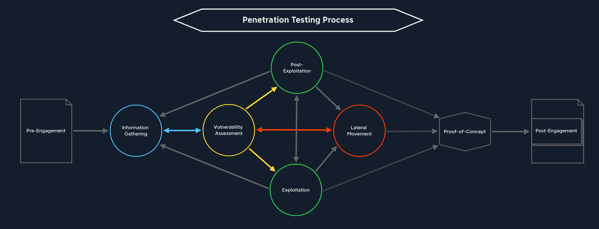

## Academy Modules Layout

### Penetration Testing Process

1. Pre-Engagement
2. Information Gathering
3. Vulnerability Assessment
4. Exploitation
5. Post-Exploitation
6. Lateral Movement
7. Proof-of-Concept
8. Post-Engagement

### Pre-Engagement

- Ghi lại commitments, tasks, scope, limitations và agreements bằng văn bản.
- Soạn thảo contractual documents.
- Trao đổi thông tin cần thiết giữa penetration testers và client.

Kiến thức cần có trong mục này

- Xác định target systems.
- Xây dựng tổng quan về target web application hoặc network trước khi tiếp tục.

#### Fundamental Modules

1. Learning Process

- Hiểu Learning Process của con người.
- Hiểu cách tránh stumbling blocks.
- Hiểu cách tăng learning efficiency.

2. Linux Fundamentals
- Học cấu trúc Linux.
- Hiểu cách Linux hoạt động.

3. Windows Fundamentals

- Hiểu Windows Fundamentals.
- Hiểu cách làm việc với Windows.

4. Introduction to Networking

- Hiểu cách hosts giao tiếp.
- Hiểu Internet và internal networks.
- Hiểu networking fundamentals.

5. Introduction to Web Applications

- Hiểu Web Applications.
- Hiểu cách web applications hoạt động.

6. Web Requests

- Hiểu các loại Web Requests.
- Hiểu cách browsers sử dụng Web Requests.
- Hiểu web server misconfigurations.

7. JavaScript Deobfuscation

- Hiểu JavaScript.
- Hiểu JavaScript obfuscation.
- Hiểu functionality của code JavaScript.

8. Introduction to Active Directory

- Hiểu Active Directory.
- Hiểu quản lý users, computers và resources.

9. Getting Started

- Tips và tricks cho người mới bắt đầu.
- Giới thiệu technologies.
- Giới thiệu attack methods.
- Guided walkthrough của một vulnerable box.
- Giải box đầu tiên không cần assistance.

## Information Gathering

- Information gathering là một phần thiết yếu của assessment.

- Information, knowledge, conclusions và steps được xây dựng dựa trên information available.

- Cần biết cách retrieve information và leverage information dựa trên assessment goals.

- Information Gathering ảnh hưởng đến kết quả của Exploitation stage.

- Cần thorough information gathering trước khi attempt exploitation.

- Cần keeping detailed notes.

- Most assessments are time-based.
- Organization và patience là vital.

### Modules

10. Network Enumeration with Nmap
- Perform Network Enumeration with Nmap.
- Identify potential targets.
- Bypass firewalls.
- Bypass IPS/IDS.

11. Footprinting
- Examine services của hosts.
- Hiểu services được sử dụng như thế nào.
- Hiểu service misconfigurations.
- Hiểu service footprints.

12. Information Gathering - Web Edition
- Discover web applications.
- Gather information về structure và function.
- Discover developer và administrator applications.

13. OSINT: Corporate Recon
- Open-source intelligence (OSINT).
- Gather information từ publicly available sources.
- Structured approach cho nhiều loại data và information sources.

## Vulnerability Assessment

Chia thành hai phần:
- Scan for known vulnerabilities bằng automated tools.
    - Analyze for potential vulnerabilities thông qua information found.
    - Automated tools so sánh với vulnerability databases.
- Analysis yêu cầu creativity và deep technical understanding.
- Connect information points và understand processes.

### Modules

14. Vulnerability Assessment
- Scan defined targets.
- Detect known vulnerabilities.
- Learn scoring systems.
- Configure và use assessment tools.

15. File Transfers
- Transfer data tới target systems.
- Transfer files tới và từ Windows và Linux hosts.
- Learn techniques và methods cho File Transfers.

16. Shells & Payloads
- Learn Shells & Payloads.
- Gain command line access.
- Adapt payloads cho environment và target system.

17. Using the Metasploit-Framework
- Learn Metasploit-Framework.
- Enumeration methods.
- Attack methods.
- Privilege escalation methods.
- Understand capabilities và limitations.

## Exploitation
- Attack performed against a system hoặc application.
- Dựa trên vulnerability discovered trong Information Gathering và Enumeration.
- Use information từ Information Gathering.
- Analyze information trong Vulnerability Assessment.
- Prepare attacks.

### Modules
18. Password Attacks
- Obtain credentials.
- Password attacks trên systems và applications.
- Remote và local methods.
- Windows và Linux systems.

19. Attacking Common Services
- Attack common network services.
- Attack services trong corporate networks.

20. Pivoting, Tunneling & Port Forwarding
- Use exploited system làm node.
- Communicate với internal systems.
- Create tunnels.
- Port forwarding.

21. Active Directory Enumeration & Attacks
- Active Directory Enumeration.
- Active Directory Attacks.
- Vulnerabilities có thể dẫn đến complete domain takeover.

## Web Exploitation
Second part của Exploitation stage.

- Focus vào web applications.
- Web applications có large attack surface.
- Strong web enumeration và exploitation skills là paramount.

### Modules
22. Using Web Proxies
- Analyze HTTP/HTTPS requests.
- Manipulate requests.
- Manipulate HTTP headers.

23. Attacking Web Applications with Ffuf
- Discover parameters.
- Manual và automated discovery.
- Exploit vulnerabilities.

24. Login Brute Forcing
- Attack authentication mechanisms.
- Gain access tới user accounts.

25. SQL Injection Fundamentals
- SQL Injection.
- Manipulate hoặc exploit databases.

26. SQLMap Essentials
- Learn SQLMap.
- Adapt tool cho web application.

27. Cross-Site Scripting (XSS)
- XSS vulnerabilities.
- Phishing.
- Session hijacking.
- Take over web sessions.

28. File Inclusion
- File Inclusion vulnerabilities.
- Access files.
- Execute code.

29. Command Injections
- Execute system commands.
- Identify và bypass filters.

30. Web Attacks
- HTTP Verb Tampering.
- IDOR.
- XXE.

31. Attacking Common Applications
- Attack Common Applications.

## Post-Exploitation

- Escalate privileges.
- Adapt techniques cho operating system.
- Study Linux Privilege Escalation và Windows Privilege Escalation.

### Modules

32. Linux Privilege Escalation
- Linux misconfigurations.
- Escalate privileges.

33. Windows Privilege Escalation
- Windows misconfigurations.
- Escalate privileges.

## Lateral Movement

- Essential component để move through corporate network.
- Overlap với internal hosts.
- Escalate privileges.
- Requires access tới exploited system.

## Proof-of-Concept

- Proof rằng vulnerability exists.
- Administrators reproduce vulnerabilities.
- PoCs được gửi cùng documentation.

### Module

34. Introduction to Python 3
- Learn Python.
- Automate steps.
- Understand exploitation step-by-step.

## Post-Engagement
- Clean up exploited systems.
- Remove transferred content.
- Note system changes.
- Note successful exploitation attempts.
- Note captured credentials.
- Note uploaded files.
- Reconcile notes với documentation.
- Provide comprehensive report.

### Modules
35. Documentation & Reporting
- Documentation and Reporting.
- Stay organized.
- Take detailed notes.
- Write effectively.
- Deliver client deliverables.
- Optimize notetaking và organization.

36. Attacking Enterprise Networks
- Overall view của stages.
- Attack large networks.
- Understand vulnerabilities trong large networks.