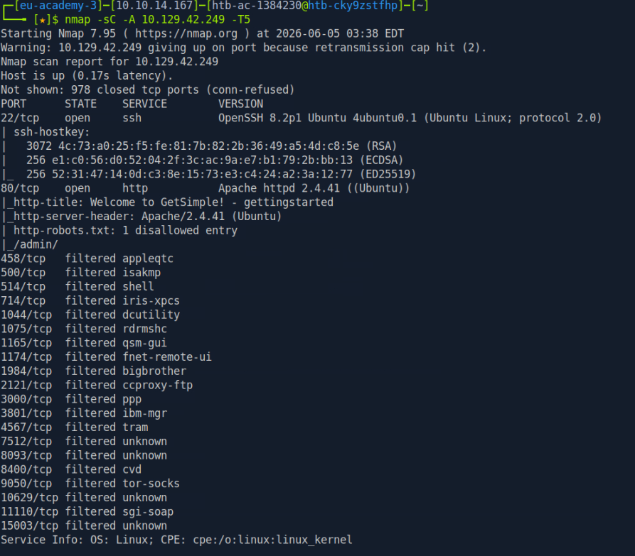

# Lab

## Enum

Nmap:

Gobuster

Recon thoong tin: 

Dùng GetSimple CMS phiên bản 3.3.15

Có CVE RCE unauthen 

Dùng MSF để khai thác 

Đổi payload để ổn định hơn 

Lấy flag user 

## Leo quyền

`sudo -l`

Ta thấy có php chạy quyền root

dùng `sudo /usr/bin/php -r 'system("/bin/bash");'` để lên root 

Lấy flag root

