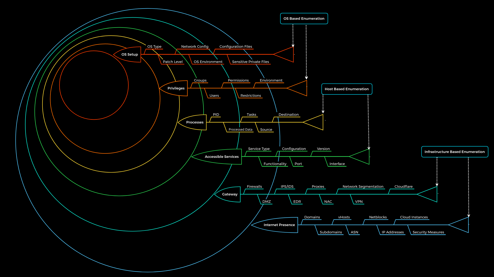

# Enumeration Methodology

Toàn bộ quá trình enumeration được chia thành ba cấp độ:

- Enumeration dựa trên hạ tầng (Infrastructure-based enumeration)
- Enumeration dựa trên host (Host-based enumeration)
- Enumeration dựa trên hệ điều hành (OS-based enumeration)

Chia làm 6 lớp 

| Lớp                    | Mô tả                                                                                         | Danh mục thông tin                                                                     |
| ---------------------- | --------------------------------------------------------------------------------------------- | -------------------------------------------------------------------------------------- |
| 1. Internet Presence   | Xác định sự hiện diện trên Internet và hạ tầng có thể truy cập từ bên ngoài.                  | Domain, Subdomain, vHost, ASN, Netblock, Địa chỉ IP, Cloud Instance, Biện pháp bảo mật |
| 2. Gateway             | Xác định các biện pháp bảo mật có thể đang bảo vệ hạ tầng bên ngoài và bên trong của công ty. | Firewall, DMZ, IPS/IDS, EDR, Proxy, NAC, Phân đoạn mạng, VPN, Cloudflare               |
| 3. Accessible Services | Xác định các giao diện và dịch vụ có thể truy cập từ bên ngoài hoặc bên trong.                | Loại dịch vụ, Chức năng, Cấu hình, Cổng, Phiên bản, Giao diện                          |
| 4. Processes           | Xác định các tiến trình nội bộ, nguồn dữ liệu và đích liên quan tới các dịch vụ.              | PID, Dữ liệu được xử lý, Nhiệm vụ, Nguồn, Đích                                         |
| 5. Privileges          | Xác định quyền hạn và đặc quyền nội bộ đối với các dịch vụ có thể truy cập.                   | Nhóm, Người dùng, Quyền, Hạn chế, Môi trường                                           |
| 6. OS Setup            | Xác định các thành phần nội bộ và cấu hình hệ thống.                                          | Loại HĐH, Mức vá lỗi, Cấu hình mạng, Môi trường HĐH, File cấu hình, File nhạy cảm      |
