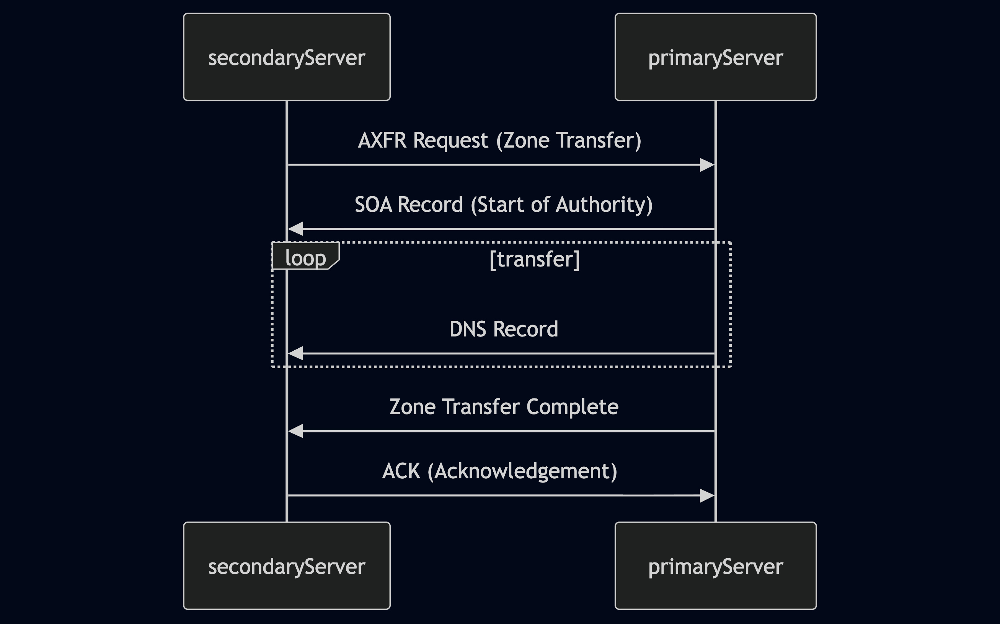

# DNS Zone Transfers

## What is a Zone Transfer

Việc chuyển vùng DNS về cơ bản là sao chép toàn bộ các bản ghi DNS trong một vùng (một tên miền và các tên miền con của nó) từ máy chủ tên miền này sang máy chủ tên miền khác. Tuy nhiên, nếu không được bảo mật đầy đủ, các bên không được phép có thể tải xuống toàn bộ tệp vùng, tiết lộ danh sách đầy đủ các tên miền phụ, địa chỉ IP liên kết của chúng và các dữ liệu DNS nhạy cảm khác.



- Zone Transfer Request (AXFR): Máy chủ DNS phụ khởi tạo quá trình bằng cách gửi yêu cầu chuyển vùng đến máy chủ chính. Yêu cầu này thường sử dụng loại AXFR (Full Zone Transfer).

- SOA Record Transfer: Sau khi nhận được yêu cầu (và có thể xác thực máy chủ phụ), máy chủ chính sẽ phản hồi bằng cách gửi bản ghi Start of Authority (SOA) của nó. Bản ghi SOA chứa thông tin quan trọng về vùng, bao gồm số sê-ri của vùng, giúp máy chủ phụ xác định xem dữ liệu vùng của nó có còn cập nhật hay không.

- DNS Records Transmission: Máy chủ chính sau đó sẽ chuyển tất cả các bản ghi DNS trong vùng đó sang máy chủ phụ, từng bản ghi một. Điều này bao gồm các bản ghi như A, AAAA, MX, CNAME, NS và các bản ghi khác xác định các tên miền phụ, máy chủ thư, máy chủ tên miền và các cấu hình khác của tên miền.

- Zone Transfer Complete: Sau khi tất cả các bản ghi đã được truyền tải, máy chủ chính sẽ phát tín hiệu kết thúc quá trình truyền vùng. Thông báo này cho máy chủ phụ biết rằng nó đã nhận được một bản sao hoàn chỉnh của dữ liệu vùng.

- Acknowledgement (ACK): Máy chủ phụ gửi một thông báo xác nhận đến máy chủ chính, xác nhận việc nhận và xử lý dữ liệu vùng thành công. Điều này hoàn tất quá trình chuyển giao vùng.

## The Zone Transfer Vulnerability

Thông tin thu thập được từ việc chuyển vùng trái phép có thể vô cùng quý giá đối với kẻ tấn công. Nó tiết lộ một bản đồ toàn diện về cơ sở hạ tầng DNS của mục tiêu, bao gồm:

- Subdomains

- IP Addresses

- Name Server Records

## Exploiting Zone Transfers

`dig axfr @nsztm1.digi.ninja zonetransfer.me`

Lệnh này hướng dẫn dig yêu cầu chuyển toàn bộ vùng (axfr) từ máy chủ DNS chịu trách nhiệm cho `zonetransfer.me`. Nếu máy chủ bị cấu hình sai và cho phép chuyển giao, bạn sẽ nhận được danh sách đầy đủ các bản ghi DNS cho tên miền, bao gồm tất cả các tên miền phụ.

```bash
reDrose18@htb[/htb]$ dig axfr @nsztm1.digi.ninja zonetransfer.me

; <<>> DiG 9.18.12-1~bpo11+1-Debian <<>> axfr @nsztm1.digi.ninja zonetransfer.me
; (1 server found)
;; global options: +cmd
zonetransfer.me.    7200    IN  SOA nsztm1.digi.ninja. robin.digi.ninja. 2019100801 172800 900 1209600 3600
zonetransfer.me.    300 IN  HINFO   "Casio fx-700G" "Windows XP"
zonetransfer.me.    301 IN  TXT "google-site-verification=tyP28J7JAUHA9fw2sHXMgcCC0I6XBmmoVi04VlMewxA"
zonetransfer.me.    7200    IN  MX  0 ASPMX.L.GOOGLE.COM.
...
zonetransfer.me.    7200    IN  A   5.196.105.14
zonetransfer.me.    7200    IN  NS  nsztm1.digi.ninja.
zonetransfer.me.    7200    IN  NS  nsztm2.digi.ninja.
_acme-challenge.zonetransfer.me. 301 IN TXT "6Oa05hbUJ9xSsvYy7pApQvwCUSSGgxvrbdizjePEsZI"
_sip._tcp.zonetransfer.me. 14000 IN SRV 0 0 5060 www.zonetransfer.me.
14.105.196.5.IN-ADDR.ARPA.zonetransfer.me. 7200 IN PTR www.zonetransfer.me.
asfdbauthdns.zonetransfer.me. 7900 IN   AFSDB   1 asfdbbox.zonetransfer.me.
asfdbbox.zonetransfer.me. 7200  IN  A   127.0.0.1
asfdbvolume.zonetransfer.me. 7800 IN    AFSDB   1 asfdbbox.zonetransfer.me.
canberra-office.zonetransfer.me. 7200 IN A  202.14.81.230
...
;; Query time: 10 msec
;; SERVER: 81.4.108.41#53(nsztm1.digi.ninja) (TCP)
;; WHEN: Mon May 27 18:31:35 BST 2024
;; XFR size: 50 records (messages 1, bytes 2085)
```

zonetransfer.me là một dịch vụ được thiết lập đặc biệt để minh họa các rủi ro của việc chuyển vùng, sao cho lệnh dig sẽ trả về toàn bộ bản ghi vùng.