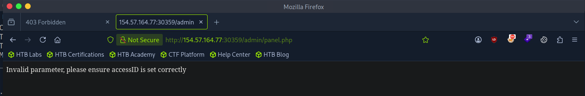
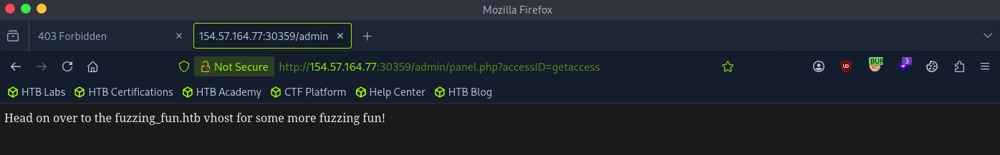
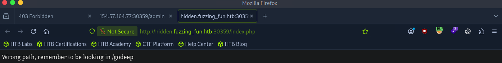

# lab

```bash
┌─[eu-academy-3]─[10.10.15.38]─[htb-ac-1384230@htb-wq2wapqmgp]─[~]
└──╼ [★]$ ffuf -u http://154.57.164.77:30359/FUZZ -w /usr/share/seclists/Discovery/Web-Content/common.txt

        /'___\  /'___\           /'___\       
       /\ \__/ /\ \__/  __  __  /\ \__/       
       \ \ ,__\\ \ ,__\/\ \/\ \ \ \ ,__\      
        \ \ \_/ \ \ \_/\ \ \_\ \ \ \ \_/      
         \ \_\   \ \_\  \ \____/  \ \_\       
          \/_/    \/_/   \/___/    \/_/       

       v2.1.0-dev
________________________________________________

 :: Method           : GET
 :: URL              : http://154.57.164.77:30359/FUZZ
 :: Wordlist         : FUZZ: /usr/share/seclists/Discovery/Web-Content/common.txt
 :: Follow redirects : false
 :: Calibration      : false
 :: Timeout          : 10
 :: Threads          : 40
 :: Matcher          : Response status: 200-299,301,302,307,401,403,405,500
________________________________________________

.htpasswd               [Status: 403, Size: 281, Words: 20, Lines: 10, Duration: 4177ms]
.hta                    [Status: 403, Size: 281, Words: 20, Lines: 10, Duration: 4176ms]
.htaccess               [Status: 403, Size: 281, Words: 20, Lines: 10, Duration: 5184ms]
admin                   [Status: 301, Size: 323, Words: 20, Lines: 10, Duration: 157ms]
server-status           [Status: 403, Size: 281, Words: 20, Lines: 10, Duration: 155ms]
:: Progress: [4750/4750] :: Job [1/1] :: 255 req/sec :: Duration: [0:00:22] :: Errors: 0 ::
```

Ta tiếp tục dùng recursive scan

```bash
─[eu-academy-3]─[10.10.15.38]─[htb-ac-1384230@htb-wq2wapqmgp]─[~]
└──╼ [★]$ ffuf -u http://154.57.164.77:30359/FUZZ -w /usr/share/seclists/Discovery/Web-Content/common.txt -e .html,.php -recursion -recursion-depth 5 -rate 500

        /'___\  /'___\           /'___\       
       /\ \__/ /\ \__/  __  __  /\ \__/       
       \ \ ,__\\ \ ,__\/\ \/\ \ \ \ ,__\      
        \ \ \_/ \ \ \_/\ \ \_\ \ \ \ \_/      
         \ \_\   \ \_\  \ \____/  \ \_\       
          \/_/    \/_/   \/___/    \/_/       

       v2.1.0-dev
________________________________________________

 :: Method           : GET
 :: URL              : http://154.57.164.77:30359/FUZZ
 :: Wordlist         : FUZZ: /usr/share/seclists/Discovery/Web-Content/common.txt
 :: Extensions       : .html .php 
 :: Follow redirects : false
 :: Calibration      : false
 :: Timeout          : 10
 :: Threads          : 40
 :: Matcher          : Response status: 200-299,301,302,307,401,403,405,500
________________________________________________

.hta                    [Status: 403, Size: 281, Words: 20, Lines: 10, Duration: 155ms]
.hta.html               [Status: 403, Size: 281, Words: 20, Lines: 10, Duration: 154ms]
.hta.php                [Status: 403, Size: 281, Words: 20, Lines: 10, Duration: 155ms]
.htaccess               [Status: 403, Size: 281, Words: 20, Lines: 10, Duration: 155ms]
.htaccess.html          [Status: 403, Size: 281, Words: 20, Lines: 10, Duration: 154ms]
.htaccess.php           [Status: 403, Size: 281, Words: 20, Lines: 10, Duration: 154ms]
.htpasswd               [Status: 403, Size: 281, Words: 20, Lines: 10, Duration: 155ms]
.htpasswd.html          [Status: 403, Size: 281, Words: 20, Lines: 10, Duration: 157ms]
.htpasswd.php           [Status: 403, Size: 281, Words: 20, Lines: 10, Duration: 157ms]
admin                   [Status: 301, Size: 323, Words: 20, Lines: 10, Duration: 155ms]
[INFO] Adding a new job to the queue: http://154.57.164.77:30359/admin/FUZZ

server-status           [Status: 403, Size: 281, Words: 20, Lines: 10, Duration: 156ms]
[INFO] Starting queued job on target: http://154.57.164.77:30359/admin/FUZZ

.hta                    [Status: 403, Size: 281, Words: 20, Lines: 10, Duration: 154ms]
.hta.html               [Status: 403, Size: 281, Words: 20, Lines: 10, Duration: 155ms]
.hta.php                [Status: 403, Size: 281, Words: 20, Lines: 10, Duration: 155ms]
.htaccess.html          [Status: 403, Size: 281, Words: 20, Lines: 10, Duration: 154ms]
.htaccess               [Status: 403, Size: 281, Words: 20, Lines: 10, Duration: 157ms]
.htaccess.php           [Status: 403, Size: 281, Words: 20, Lines: 10, Duration: 155ms]
.htpasswd               [Status: 403, Size: 281, Words: 20, Lines: 10, Duration: 155ms]
.htpasswd.html          [Status: 403, Size: 281, Words: 20, Lines: 10, Duration: 153ms]
.htpasswd.php           [Status: 403, Size: 281, Words: 20, Lines: 10, Duration: 154ms]
index.php               [Status: 200, Size: 13, Words: 2, Lines: 1, Duration: 158ms]
index.php               [Status: 200, Size: 13, Words: 2, Lines: 1, Duration: 156ms]
panel.php               [Status: 200, Size: 58, Words: 8, Lines: 1, Duration: 155ms]
:: Progress: [14250/14250] :: Job [2/2] :: 255 req/sec :: Duration: [0:00:59] :: Errors: 0 ::
```

Ta thấy có 2 đường dẫn admin phản hồi 200 là: `/admin/index.php` và `/admin/panel.php`



Ta thấy có gợi ý là sai param `accessID`

```bash
┌─[eu-academy-3]─[10.10.15.38]─[htb-ac-1384230@htb-wq2wapqmgp]─[~]
└──╼ [★]$ ffuf -u http://154.57.164.77:30359/admin/panel.php?accessID=FUZZ -w /usr/share/seclists/Discovery/Web-Content/common.txt -t 50 -fs 58

        /'___\  /'___\           /'___\       
       /\ \__/ /\ \__/  __  __  /\ \__/       
       \ \ ,__\\ \ ,__\/\ \/\ \ \ \ ,__\      
        \ \ \_/ \ \ \_/\ \ \_\ \ \ \ \_/      
         \ \_\   \ \_\  \ \____/  \ \_\       
          \/_/    \/_/   \/___/    \/_/       

       v2.1.0-dev
________________________________________________

 :: Method           : GET
 :: URL              : http://154.57.164.77:30359/admin/panel.php?accessID=FUZZ
 :: Wordlist         : FUZZ: /usr/share/seclists/Discovery/Web-Content/common.txt
 :: Follow redirects : false
 :: Calibration      : false
 :: Timeout          : 10
 :: Threads          : 50
 :: Matcher          : Response status: 200-299,301,302,307,401,403,405,500
 :: Filter           : Response size: 58
________________________________________________

getaccess               [Status: 200, Size: 68, Words: 12, Lines: 1, Duration: 155ms]
:: Progress: [4750/4750] :: Job [1/1] :: 322 req/sec :: Duration: [0:00:15] :: Errors: 0 ::
```



Theem host vào `/etc/hosts` và fuzz vhost 

```bash
┌─[eu-academy-3]─[10.10.15.38]─[htb-ac-1384230@htb-wq2wapqmgp]─[~]
└──╼ [★]$ gobuster vhost -u http://fuzzing_fun.htb:30359 -w /usr/share/seclists/Discovery/Web-Content/common.txt --append-domain | grep "Status: 200"
Found: hidden.fuzzing_fun.htb:30359 Status: 200 [Size: 45] 
```

Thêm tiếp `hidden.fuzzing_fun.htb` vào `/etc/hosts` trước khi scan tiếp 

```ini
154.57.164.77 fuzzing_fun.htb hidden.fuzzing_fun.htb
```

```bash
┌─[eu-academy-3]─[10.10.15.38]─[htb-ac-1384230@htb-wq2wapqmgp]─[~]
└──╼ [★]$ feroxbuster -u http://hidden.fuzzing_fun.htb:30359 -w /usr/share/seclists/Discovery/Web-Content/common.txt --depth 4
                                                                                                                                                                                              
 ___  ___  __   __     __      __         __   ___
|__  |__  |__) |__) | /  `    /  \ \_/ | |  \ |__
|    |___ |  \ |  \ | \__,    \__/ / \ | |__/ |___
by Ben "epi" Risher 🤓                 ver: 2.13.1
───────────────────────────┬──────────────────────
 🎯  Target Url            │ http://hidden.fuzzing_fun.htb:30359/
 🚩  In-Scope Url          │ hidden.fuzzing_fun.htb
 🚀  Threads               │ 50
 📖  Wordlist              │ /usr/share/seclists/Discovery/Web-Content/common.txt
 👌  Status Codes          │ All Status Codes!
 💥  Timeout (secs)        │ 7
 🦡  User-Agent            │ feroxbuster/2.13.1
 💉  Config File           │ /etc/feroxbuster/ferox-config.toml
 🔎  Extract Links         │ true
 🏁  HTTP methods          │ [GET]
 🔃  Recursion Depth       │ 4
───────────────────────────┴──────────────────────
 🏁  Press [ENTER] to use the Scan Management Menu™
──────────────────────────────────────────────────
404      GET        9l       31w      287c Auto-filtering found 404-like response and created new filter; toggle off with --dont-filter
403      GET        9l       28w      290c Auto-filtering found 404-like response and created new filter; toggle off with --dont-filter
200      GET        1l        8w       45c http://hidden.fuzzing_fun.htb:30359/
200      GET        1l        8w       45c http://hidden.fuzzing_fun.htb:30359/index.php
[####################] - 20s     4751/4751    0s      found:2       errors:0      
[####################] - 19s     4751/4751    249/s   http://hidden.fuzzing_fun.htb:30359/ 
```




```bash
─[eu-academy-3]─[10.10.15.38]─[htb-ac-1384230@htb-wq2wapqmgp]─[~]
└──╼ [★]$ feroxbuster -u http://hidden.fuzzing_fun.htb:30359/godeep -w /usr/share/seclists/Discovery/Web-Content/common.txt --depth 4
                                                                                                                                                                                              
 ___  ___  __   __     __      __         __   ___
|__  |__  |__) |__) | /  `    /  \ \_/ | |  \ |__
|    |___ |  \ |  \ | \__,    \__/ / \ | |__/ |___
by Ben "epi" Risher 🤓                 ver: 2.13.1
───────────────────────────┬──────────────────────
 🎯  Target Url            │ http://hidden.fuzzing_fun.htb:30359/godeep
 🚩  In-Scope Url          │ hidden.fuzzing_fun.htb
 🚀  Threads               │ 50
 📖  Wordlist              │ /usr/share/seclists/Discovery/Web-Content/common.txt
 👌  Status Codes          │ All Status Codes!
 💥  Timeout (secs)        │ 7
 🦡  User-Agent            │ feroxbuster/2.13.1
 💉  Config File           │ /etc/feroxbuster/ferox-config.toml
 🔎  Extract Links         │ true
 🏁  HTTP methods          │ [GET]
 🔃  Recursion Depth       │ 4
───────────────────────────┴──────────────────────
 🏁  Press [ENTER] to use the Scan Management Menu™
──────────────────────────────────────────────────
403      GET        9l       28w      290c Auto-filtering found 404-like response and created new filter; toggle off with --dont-filter
404      GET        9l       31w      287c Auto-filtering found 404-like response and created new filter; toggle off with --dont-filter
301      GET        9l       28w      342c http://hidden.fuzzing_fun.htb:30359/godeep => http://hidden.fuzzing_fun.htb:30359/godeep/
200      GET        1l        2w       13c http://hidden.fuzzing_fun.htb:30359/godeep/index.php
301      GET        9l       28w      352c http://hidden.fuzzing_fun.htb:30359/godeep/stoneedge => http://hidden.fuzzing_fun.htb:30359/godeep/stoneedge/
301      GET        9l       28w      360c http://hidden.fuzzing_fun.htb:30359/godeep/stoneedge/bbclone => http://hidden.fuzzing_fun.htb:30359/godeep/stoneedge/bbclone/
200      GET        1l        2w       15c http://hidden.fuzzing_fun.htb:30359/godeep/stoneedge/index.php
200      GET        1l        4w       18c http://hidden.fuzzing_fun.htb:30359/godeep/stoneedge/bbclone/index.php
301      GET        9l       28w      366c http://hidden.fuzzing_fun.htb:30359/godeep/stoneedge/bbclone/typo3 => http://hidden.fuzzing_fun.htb:30359/godeep/stoneedge/bbclone/typo3/
200      GET        1l        1w       23c http://hidden.fuzzing_fun.htb:30359/godeep/stoneedge/bbclone/typo3/index.php
[####################] - 53s    19023/19023   0s      found:8       errors:0      
[####################] - 21s     4751/4751    226/s   http://hidden.fuzzing_fun.htb:30359/godeep/ 
[####################] - 18s     4751/4751    268/s   http://hidden.fuzzing_fun.htb:30359/godeep/stoneedge/ 
[####################] - 15s     4751/4751    312/s   http://hidden.fuzzing_fun.htb:30359/godeep/stoneedge/bbclone/ 
[####################] - 16s     4751/4751    293/s   http://hidden.fuzzing_fun.htb:30359/godeep/stoneedge/bbclone/typo3/ 
```

Và truy cập `http://hidden.fuzzing_fun.htb:30359/godeep/stoneedge/bbclone/typo3/index.php` để lấy flag 


