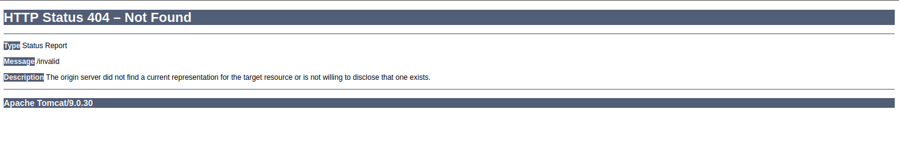

# Tomcat - Discovery & Enumeration

## 1. Tổng quan

Apache Tomcat là web server mã nguồn mở dùng để chạy ứng dụng Java Servlet/JSP, phổ biến trong các framework Java như Spring.

Trong pentest, Tomcat đáng chú ý vì:

- Có thể xuất hiện ở internal network.
- Thường có nhiều instance.
- Có khả năng tồn tại weak/default credentials.
- Nếu truy cập được Tomcat Manager, có thể dẫn tới RCE thông qua WAR/JSP.

## 2. Fingerprinting Tomcat

**Kiểm tra HTTP Header**

Tomcat có thể được nhận diện qua **Server** header.

Nếu reverse proxy che header, thử truy cập một URL không tồn tại:

`http://target:8080/invalid`

Có thể thấy version, ví dụ: `Apache Tomcat/9.0.30`



**Kiểm tra `/docs`**

Nếu error page không leak version thì thử:

```bash
reDrose18@htb[/htb]$ curl -s http://app-dev.inlanefreight.local:8080/docs/ | grep Tomcat 

<html lang="en"><head><META http-equiv="Content-Type" content="text/html; charset=UTF-8"><link href="./images/docs-stylesheet.css" rel="stylesheet" type="text/css"><title>Apache Tomcat 9 (9.0.30) - Documentation Index</title><meta name="author" 

<SNIP>
```

> Lưu ý: `/docs` là trang documentation mặc định và có thể quản trị viên chưa xóa.

## 3. Cấu trúc thư mục Tomcat

```
├── bin
├── conf
│   ├── catalina.policy
│   ├── catalina.properties
│   ├── context.xml
│   ├── tomcat-users.xml
│   ├── tomcat-users.xsd
│   └── web.xml
├── lib
├── logs
├── temp
├── webapps
│   ├── manager
│   │   ├── images
│   │   ├── META-INF
│   │   └── WEB-INF
|   |       └── web.xml
│   └── ROOT
│       └── WEB-INF
└── work
    └── Catalina
        └── localhost
```

Hai file quan trọng

1. `conf/tomcat-users.xml`

    Chứa:

    - User
    - Password
    - Role
    - Quyền truy cập `/manager` và `/host-manager`

2. `webapps/`

    Là nơi chứa các web application.

## 4. Cấu trúc một Web Application

Ví dụ:

```
webapps/customapp
├── images
├── index.jsp
├── META-INF
│   └── context.xml
├── status.xsd
└── WEB-INF
    ├── jsp
    |   └── admin.jsp
    └── web.xml
    └── lib
    |    └── jdbc_drivers.jar
    └── classes
        └── AdminServlet.class   
```

`WEB-INF/web.xml`

Đây là deployment descriptor, chứa thông tin quan trọng như:

-Các route.
- Servlet xử lý route.
- Mapping giữa URL và Java class.

Ví dụ `web.xml`:

```xml
<servlet>
    <servlet-name>AdminServlet</servlet-name>
    <servlet-class>com.inlanefreight.api.AdminServlet</servlet-class>
</servlet>

<servlet-mapping>
    <servlet-name>AdminServlet</servlet-name>
    <url-pattern>/admin</url-pattern>
</servlet-mapping>
```

Nghĩa là: 

```
/admin
   ↓
AdminServlet
   ↓
com.inlanefreight.api.AdminServlet
```

File class tương ứng: `WEB-INF/classes/com/inlanefreight/api/AdminServlet.class`

> `web.xml` đặc biệt đáng chú ý nếu tìm được LFI, vì có thể chứa thông tin về route và application logic.

## 5. Tomcat Manager Roles

Trong `tomcat-users.xml` có các role quan trọng:

| Role             | Quyền                    |
| ---------------- | ------------------------ |
| `manager-gui`    | Truy cập Manager Web GUI |
| `manager-script` | HTTP API                 |
| `manager-jmx`    | JMX proxy                |
| `manager-status` | Chỉ xem status           |

Ví dụ credentials yếu: 

```
tomcat:tomcat
admin:admin
```

Trong tài liệu:

```xml
!-- user manager can access only manager section -->
<role rolename="manager-gui" />
<user username="tomcat" password="tomcat" roles="manager-gui" />

<!-- user admin can access manager and admin section both -->
<role rolename="admin-gui" />
<user username="admin" password="admin" roles="manager-gui,admin-gui" />
```

> Vì vậy `tomcat-users.xml` là file rất đáng chú ý khi có LFI hoặc file disclosure.

## 6. Enumeration

Sau khi fingerprint Tomcat, tập trung tìm:

```
/manager
/host-manager
```

Có thể dùng Gobuster:

```bash
gobuster dir \
-u http://target:8180/ \
-w /usr/share/dirbuster/wordlists/directory-list-2.3-small.txt
```

Ví dụ kết quả:

```
/docs       (302)
/examples   (302)
/manager    (302)
```

## 7. Kiểm tra Credentials

Thử các credential mặc định/ yếu trước:

```
tomcat:tomcat
admin:admin
```

Nếu không thành công → có thể thực hiện password brute-force trong phạm vi được phép.

Nếu đăng nhập được Tomcat Manager, có thể upload WAR (Web Application Archive) chứa JSP webshell → RCE trên Tomcat.

---

Lấy version 

```bash
──(duongnt185㉿WDUONGNT185CSOC)-[~]
└─$ curl -s http://web01.inlanefreight.local:8180/docs/ | grep Tomcat 
<html lang="en"><head><META http-equiv="Content-Type" content="text/html; charset=UTF-8"><link href="./images/docs-stylesheet.css" rel="stylesheet" type="text/css"><title>Apache Tomcat 10 (10.0.10) - Documentation Index</title><meta name="author" content="Craig R. McClanahan"><meta name="author" content="Remy Maucherat"><meta name="author" 
```

