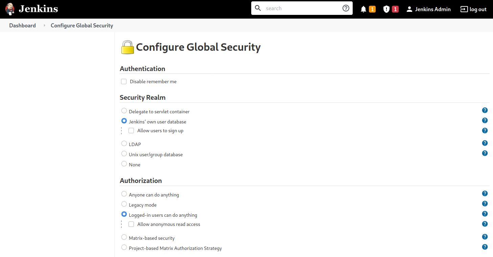

# Jenkins - Discovery & Enumeration

## 1. Tổng quan

Jenkins là một automation server mã nguồn mở, viết bằng Java, dùng để tự động hóa việc build và test phần mềm liên tục (Continuous Integration - CI).

- Ban đầu có tên Hudson, phát hành năm 2005.
- Đổi tên thành Jenkins năm 2011 sau tranh chấp với Oracle.
- Được hơn 86.000 công ty sử dụng.
- Được sử dụng bởi Facebook, Netflix, Udemy, Robinhood, LinkedIn...
- Có hơn 300 plugins hỗ trợ build và test.
- Jenkins chạy trên servlet container như Tomcat.
- Từng có nhiều lỗ hổng, trong đó có những lỗ hổng cho phép RCE không cần authentication.

## 2. Discovery / Footprinting

Trong pentest nội bộ, Jenkins đáng chú ý vì nó thường được cài trên Windows Server và có thể chạy dưới quyền:

`SYSTEM`

Nếu attacker truy cập được Jenkins và đạt RCE với quyền SYSTEM, có thể dùng máy này làm foothold để bắt đầu enumerate Active Directory/domain.

Port mặc định

| Port   | Chức năng                                        |
| ------ | ------------------------------------------------ |
| `8080` | Jenkins web server mặc định                      |
| `5000` | Communication giữa Jenkins master và slave/agent |

Jenkins có thể sử dụng nhiều cơ chế authentication:

- Jenkins database
- LDAP
- Unix user database
- Servlet container
- Hoặc không yêu cầu authentication

Administrator cũng có thể cấu hình:

- Cho phép user tự tạo account.
- Không cho phép user tự đăng ký.

## 3. Enumeration

Fingerprint Jenkins

Trang login là một dấu hiệu khá rõ để nhận diện Jenkins:

```
http://jenkins.inlanefreight.local:8000/login?from=%2F
```


Trang cấu hình security:

```
http://jenkins.inlanefreight.local:8000/configureSecurity/
```



### Kiểm tra authentication

Một số trường hợp có thể gặp: `admin:admin`

hoặc: **Không yêu cầu authentication**

Trong pentest nội bộ, việc tìm thấy Jenkins không có authentication không phải là hiếm.

---

Đăng nhập vào, nhìn góc dưới bên phải ta thấy version 