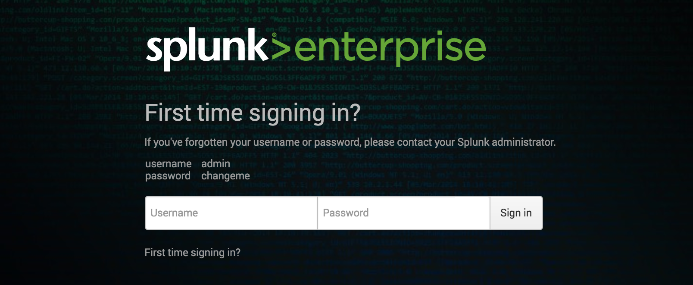
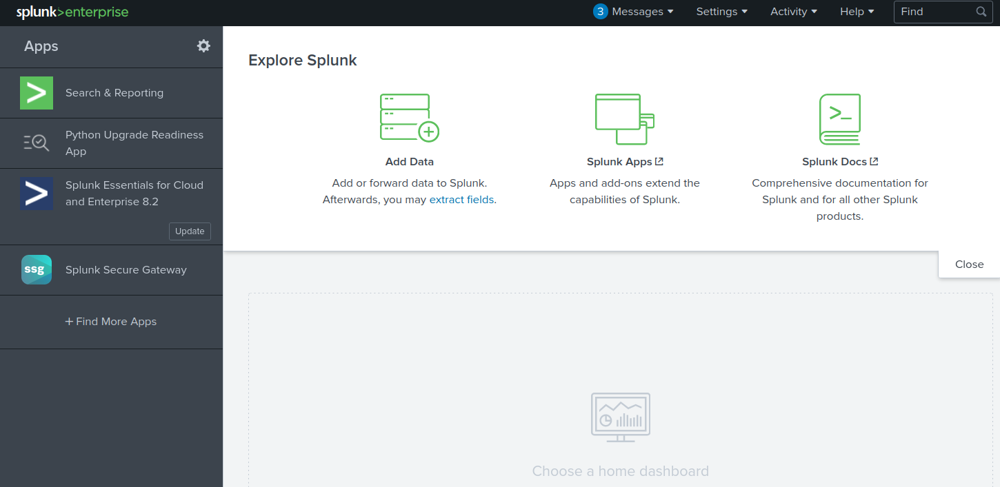

# Splunk – Discovery & Enumeration

## 1. Tổng quan

Splunk là công cụ dùng để thu thập, phân tích và trực quan hóa log/data.

Ban đầu Splunk không được thiết kế chuyên biệt như SIEM, nhưng thường được sử dụng cho:

- Security monitoring.
- Business analytics.
- Phân tích log.

Splunk thường chứa dữ liệu nhạy cảm, nên nếu compromise được server có thể thu được rất nhiều thông tin.

Splunk thường xuất hiện trong mạng nội bộ doanh nghiệp lớn.

Điểm đáng chú ý nhất không phải là số lượng CVE mà là:

```
Weak / Null Authentication
        ↓
Admin Access
        ↓
Install Custom Application
        ↓
Abuse Built-in Functionality
        ↓
RCE
```

## 2. Discovery / Footprinting

Splunk thường chạy với quyền cao:

| Hệ điều hành | Quyền thường gặp |
| ------------ | ---------------- |
| Linux        | `root`           |
| Windows      | `SYSTEM`         |


Do đó nếu RCE thành công, impact có thể rất lớn.

Port mặc định

Splunk Web server mặc định: `8000`

Splunk management / REST API: `8089`

Có thể dùng Nmap để fingerprint: 

```bash
reDrose18@htb[/htb]$ sudo nmap -sV 10.129.201.50

Starting Nmap 7.80 ( https://nmap.org ) at 2021-09-22 08:43 EDT
Nmap scan report for 10.129.201.50
Host is up (0.11s latency).
Not shown: 991 closed ports
PORT     STATE SERVICE       VERSION
80/tcp   open  http          Microsoft IIS httpd 10.0
135/tcp  open  msrpc         Microsoft Windows RPC
139/tcp  open  netbios-ssn   Microsoft Windows netbios-ssn
445/tcp  open  microsoft-ds?
3389/tcp open  ms-wbt-server Microsoft Terminal Services
5357/tcp open  http          Microsoft HTTPAPI httpd 2.0 (SSDP/UPnP)
8000/tcp open  ssl/http      Splunkd httpd
8080/tcp open  http          Indy httpd 17.3.33.2830 (Paessler PRTG bandwidth monitor)
8089/tcp open  ssl/http      Splunkd httpd
Service Info: OS: Windows; CPE: cpe:/o:microsoft:windows

Service detection performed. Please report any incorrect results at https://nmap.org/submit/ .
Nmap done: 1 IP address (1 host up) scanned in 39.22 seconds
```


## 3. Authentication

**Splunk phiên bản cũ**

Default credentials: `admin:changeme`



Thông tin này có thể được hiển thị ngay trên login page.

**Phiên bản mới**

Credentials được thiết lập trong quá trình cài đặt.

Nếu default credential không hoạt động, nội dung bài gợi ý kiểm tra các password yếu phổ biến như:

```
admin
Welcome
Welcome1
Password123
```

## 4. Splunk Free – Null Authentication

Một điểm rất đáng chú ý:

**Splunk Enterprise trial sau 60 ngày có thể tự chuyển thành Free version.**

Theo nội dung bài, Free version: `Không yêu cầu authentication`

Điều này có thể xảy ra khi:

```
Admin cài Splunk Trial
        ↓
Quên instance
        ↓
Trial hết hạn
        ↓
Tự chuyển sang Free
        ↓
Không có authentication
        ↓
Attacker truy cập được Splunk
```

Đây là một misconfiguration/security issue đáng chú ý trong internal pentest.

## 5. Enumeration sau khi truy cập Splunk

Khi đã truy cập được Splunk, có thể:

- Browse dữ liệu.
- Chạy reports.
- Tạo dashboards.
- Cài applications từ Splunkbase.
- Cài custom applications.

URL ví dụ: 

`https://10.129.201.50:8000/en-US/app/launcher/home`



## 6. Scripted Input – Attack Surface quan trọng

Splunk có nhiều cơ chế có khả năng chạy code, ví dụ:

```
Server-side Django applications
REST endpoints
Scripted inputs
Alerting scripts
```

Trong đó Scripted Input là một phương pháp phổ biến để đạt RCE.

**Scripted Input hoạt động thế nào?**

Mục đích ban đầu của nó là cho phép Splunk lấy dữ liệu từ các nguồn như:

- API.
- File server.
- Các data source cần phương thức truy cập tùy chỉnh.

Scripted Input sẽ chạy script và lấy STDOUT làm input cho Splunk.

Do đó nếu attacker có quyền tạo scripted input:

```
Create Scripted Input
        ↓
Splunk executes script
        ↓
OS command execution
        ↓
RCE
```

Có thể chạy nhiều loại script

Splunk hỗ trợ trên cả Windows và Linux:

| OS      | Script             |
| ------- | ------------------ |
| Linux   | Bash               |
| Windows | PowerShell / Batch |
| Cả hai  | Python             |

Đặc biệt, mỗi Splunk installation đều đi kèm Python, nên có thể sử dụng Python script.

Theo bài, một cách nhanh để đạt RCE là tạo scripted input yêu cầu Splunk chạy Python reverse shell.

## 7. Public Vulnerabilities

Ngoài built-in functionality, Splunk cũng từng có nhiều vulnerability.

Ví dụ:

- Một SSRF có thể được sử dụng để truy cập trái phép vào Splunk REST API.
- Tại thời điểm bài viết, Splunk có 47 CVEs.

Tuy nhiên, vulnerability scanner có thể trả về nhiều CVE nhưng không phải tất cả đều exploitable trong môi trường thực tế.

---

```bash
┌──(duongnt185㉿WDUONGNT185CSOC)-[~/Desktop]
└─$ sudo nmap -sV 10.129.214.106
[sudo] password for duongnt185: 
Starting Nmap 7.98 ( https://nmap.org ) at 2026-09-17 15:45 +0700
Nmap scan report for 10.129.214.106
Host is up (0.22s latency).
Not shown: 991 closed tcp ports (reset)
PORT     STATE SERVICE       VERSION
80/tcp   open  http          Microsoft IIS httpd 10.0
135/tcp  open  msrpc         Microsoft Windows RPC
139/tcp  open  netbios-ssn   Microsoft Windows netbios-ssn
445/tcp  open  microsoft-ds?
3389/tcp open  ms-wbt-server Microsoft Terminal Services
5985/tcp open  http          Microsoft HTTPAPI httpd 2.0 (SSDP/UPnP)
8000/tcp open  ssl/http      Splunkd httpd
8080/tcp open  http          Indy httpd 18.1.37.13946 (Paessler PRTG bandwidth monitor)
8089/tcp open  ssl/unknown
Service Info: OS: Windows; CPE: cpe:/o:microsoft:windows

Service detection performed. Please report any incorrect results at https://nmap.org/submit/ .
Nmap done: 1 IP address (1 host up) scanned in 77.23 seconds
```

Truy cập: `https://10.129.214.106:8089/` -> có version 

