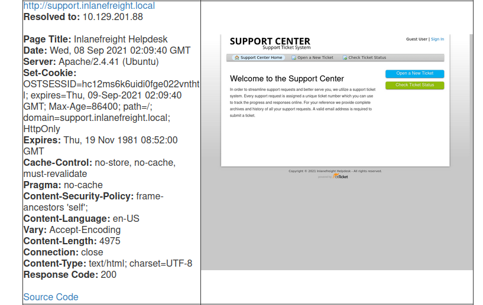
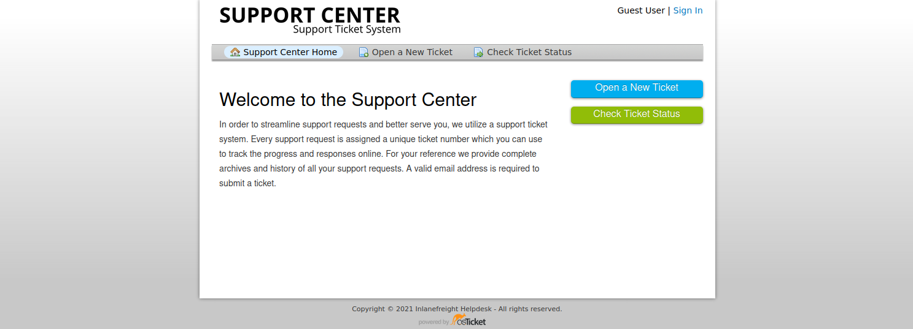
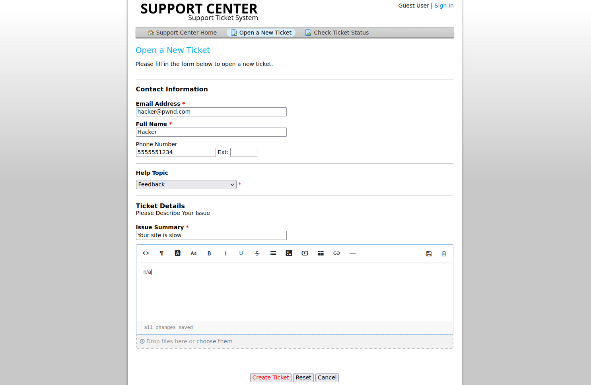
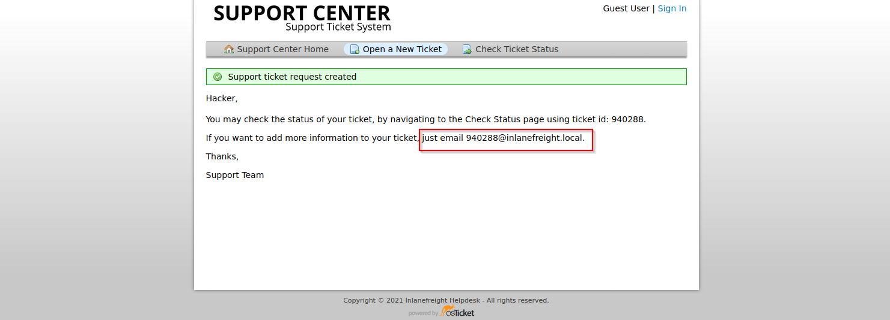
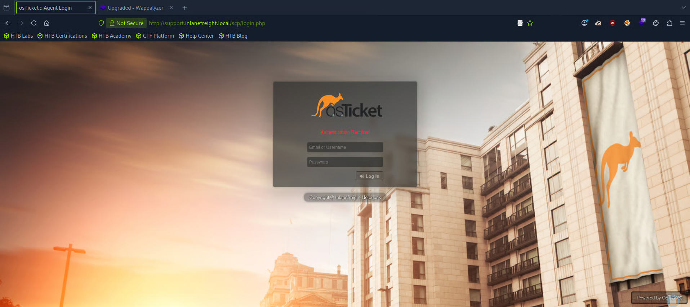
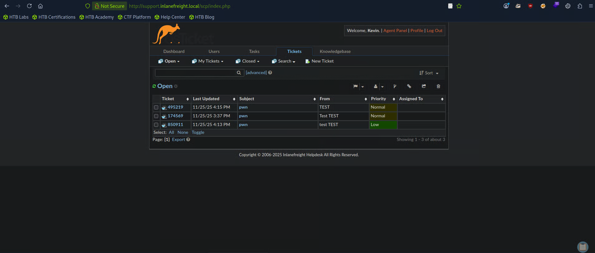

# osTicket

## 1. Tổng quan

osTicket là hệ thống quản lý ticket hỗ trợ khách hàng mã nguồn mở, tương tự Jira, OTRS, Request Tracker, Spiceworks.

- Viết bằng PHP
- Sử dụng MySQL
- Có thể chạy trên Windows/Linux
- Cho phép quản lý yêu cầu từ:
    - Email
    - Điện thoại
    - Web form
- Thường được các công ty, trường học, tổ chức sử dụng.

**Ý nghĩa trong pentest**

Không nên bỏ qua các support/helpdesk portal.

Ngay cả khi ứng dụng không có CVE nghiêm trọng, nó vẫn có thể cung cấp:

- Email nhân viên
- Username
- Thông tin nội bộ
- Thông tin hệ thống
- Password bị nhân viên gửi nhầm
- Company email có thể dùng để đăng ký các dịch vụ khác

## 2. Footprinting / Discovery / Enumeration

**Nhận diện osTicket**

Một số dấu hiệu có thể dùng để nhận diện:

`OSTSESSID` -> Đây là cookie thường xuất hiện khi truy cập osTicket.



Footer thường có: `powered by osTicket` hoặc: `Support Ticket System`



Ví dụ: `http://support.inlanefreight.local/`

**Nmap**

Nmap chủ yếu có thể cho biết web server đang chạy:

```
Apache
IIS
```

nhưng không nhất thiết xác định được osTicket.

=> Cần kết hợp web enumeration + fingerprinting.

## 3. Tư duy quan trọng: User Input → Processing → Solution

Một support portal có thể được phân tích theo 3 lớp:

```
User Input
     ↓
Processing
     ↓
Solution
```

### User Input

Mục đích của osTicket là để người dùng báo vấn đề cho nhân viên support.

Điểm đáng chú ý trong pentest:

> Nếu portal cho phép người ngoài tạo ticket, có thể sử dụng chức năng này để thu thập thông tin.

Ví dụ:

- Tạo một ticket
- Mô tả vấn đề kỹ thuật
- Đóng vai người dùng không hiểu hệ thống
- Trao đổi với support

Qua quá trình hỗ trợ, nhân viên có thể vô tình cung cấp:

- Tên hệ thống
- Email
- Username
- Thông tin infrastructure
- Quy trình nội bộ
- Thông tin xác thực

Đây là một dạng social engineering / information gathering.

## 4. Processing

Sau khi nhận ticket, nhân viên/support sẽ:

- Kiểm tra vấn đề.
- Reproduce lỗi.
- Điều tra nguyên nhân.
- Có thể trao đổi với các bộ phận kỹ thuật khác.

Điều này có thể tạo ra thêm thông tin cho attacker.

Ví dụ ticket ban đầu chỉ giao tiếp với một support agent, nhưng sau đó có thể xuất hiện thêm:

```
developer@company.com
admin@company.com
security@company.com
```

=> Từ một ticket có thể thu thập thêm email và thông tin nhân sự.

## 5. Solution

Khi xử lý ticket, nhiều nhân viên khác có thể tham gia.

Do đó có khả năng thu được:

- Email nhân viên
- Username
- Tên nhân viên
- Thông tin hệ thống
- Thông tin authentication
- Thông tin cấu hình

Các thông tin này có thể được sử dụng cho OSINT hoặc kiểm tra trên các dịch vụ khác trong phạm vi pentest.

## 6. Tấn công osTicket

osTicket trong lịch sử từng xuất hiện các vấn đề như:

- Remote File Inclusion
- SQL Injection
- Arbitrary File Upload
- XSS
- SSRF

**Ví dụ:**

osTicket 1.14.1 từng có: `CVE-2020-24881` là một lỗ hổng SSRF.

SSRF có thể được tận dụng để: 

```
Internet
   ↓
osTicket
   ↓
Internal network
   ↓
Internal services
```

=> Có thể dùng để truy cập tài nguyên nội bộ hoặc hỗ trợ internal port scanning.

**Điểm quan trọng:** không chỉ tìm CVE. Hãy hiểu business logic và chức năng của ứng dụng.

## 7. Support portal → Company Email → Các dịch vụ khác

Đây là phần quan trọng nhất của bài.

Giả sử phát hiện: `http://support.inlanefreight.local/open.php` và portal cho phép tạo ticket.



Khi đăng ký ticket, hệ thống có thể cấp một email tạm thời: `940288@inlanefreight.local`



Nếu email này thực sự nhận được email thông qua ticket portal, có thể xuất hiện chain:

```
Support Portal
      ↓
Company Email
      ↓
Email Verification
      ↓
External Service
      ↓
Account
```

Ví dụ công ty có:

```
GitLab
Slack
Mattermost
Rocket.Chat
Wiki
Bitbucket
```

và các dịch vụ này yêu cầu email công ty để đăng ký.

Nếu support portal cho phép attacker nhận email gửi tới company email, email đó có thể được sử dụng cho quá trình đăng ký/xác minh tài khoản trên dịch vụ khác.

Tư duy pentest

- Không chỉ hỏi: "osTicket có bị exploit không?"

- Mà nên hỏi: "osTicket có thể kết nối hoặc hỗ trợ attack chain sang hệ thống nào khác?"

## 8. Sensitive Data Exposure

Một tình huống khác là tìm được credential bị leak từ OSINT/credential dump.

Ví dụ:

```
email    : julie.clayton@inlanefreight.local
username : jclayton
password : JulieC8765!
```

và:

```
email    : kevin@inlanefreight.local
username : kgrimes
password : Fish1ng_s3ason!
```

Sau đó tiến hành subdomain enumeration và phát hiện:

```
vpn.inlanefreight.local
support.inlanefreight.local
mail.inlanefreight.local
apps.inlanefreight.local
dev.inlanefreight.local
...
```

Trong ví dụ: 

`support.inlanefreight.local` → osTicket

`vpn.inlanefreight.local` → Barracuda SSL VPN

## 9. Credential Reuse + Helpdesk

Thử credential thu được vào osTicket.

Ban đầu: `jclayton` → Không thành công.

Sau đó thử: `kgrimes` → Không thành công.

Nhưng login page cho phép sử dụng email address, nên thử:

`kevin@inlanefreight.local` → Đăng nhập thành công.

## 10. Helpdesk ticket có thể chứa credential

Sau khi truy cập được support account, tìm ticket cũ.

Ví dụ một nhân viên báo:

`Không đăng nhập được VPN.`

Support agent reset password về standard new joiner password.

Sau đó nhân viên yêu cầu gọi điện để cung cấp password.

Nhưng support agent lại gửi password trực tiếp qua ticket portal.

=> Ticket chứa sensitive information.

Nếu password vẫn chưa được thay đổi, nó có thể được sử dụng để kiểm tra VPN account trong phạm vi pentest.

## 11. Standard Password

Một vấn đề nguy hiểm khác:

Doanh nghiệp đôi khi sử dụng password mặc định cho:

- User mới
- Password reset
- Account provisioning

Ví dụ:

```
New user
    ↓
Default password
    ↓
User login
    ↓
Không bắt buộc đổi password
```

Nếu policy yếu, cùng một password có thể tồn tại trên nhiều account.

Trong pentest được ủy quyền, điều này có thể dẫn tới việc kiểm tra password spraying.

Ngoài ra, address book của helpdesk có thể chứa:

```
Email
Username
Employee name
```

=> Đây là nguồn dữ liệu hữu ích để xây dựng danh sách account cần kiểm tra.

## 12. Những thứ cần nhớ khi pentest osTicket

| Hoạt động             | Có thể thu được                  |
| --------------------- | -------------------------------- |
| Fingerprinting        | Xác định osTicket                |
| Cookie `OSTSESSID`    | Dấu hiệu nhận diện               |
| Footer                | `powered by osTicket`            |
| Tạo ticket            | Company email / thông tin nội bộ |
| Trao đổi với support  | Information disclosure           |
| Ticket cũ             | Credential / sensitive data      |
| Address book          | Email / username                 |
| Credential reuse      | Truy cập account                 |
| Standard password     | Có thể ảnh hưởng nhiều account   |
| CVE research          | RFI, SQLi, XSS, upload, SSRF...  |
| Cross-service testing | GitLab, Slack, VPN, Wiki...      |


## 13. Attack chain quan trọng nhất

Có thể ghi nhớ bài này bằng chain:

```
External Support Portal
        ↓
Create Ticket
        ↓
Obtain Company Email
        ↓
Receive Verification Email
        ↓
Register External Service
        ↓
Access Information
```

Hoặc:

```
OSINT / Credential Leak
        ↓
Credential Reuse
        ↓
osTicket Account
        ↓
Read Old Tickets
        ↓
Sensitive Information
        ↓
VPN / Other Services
```

---------

Thêm IP và V-Host vào /etc/hosts

Sau đó vào `support.inlanefreight.local` -> Sign in 

Chọn `I'm an agent — sign in here` 



Ở đây ta dùng https://github.com/sm00v/Dehashed/blob/master/dehashed.py để lấy thông tin tài khoản bị leak 

Nhưng vì ko chạy được ta thử thông tin bài học đã liệt kê 

```
Code4Christ@htb[/htb]$ sudo python3 dehashed.py -q inlanefreight.local -p

id : 5996447501
email : julie.clayton@inlanefreight.local
username : jclayton
password : JulieC8765!
hashed_password : 
name : Julie Clayton
vin : 
address : 
phone : 
database_name : ModBSolutions


id : 7344467234
email : kevin@inlanefreight.local
username : kgrimes
password : Fish1ng_s3ason!
hashed_password : 
name : Kevin Grimes
vin : 
address : 
phone : 
database_name : MyFitnessPal

<SNIP>
```



Chọn `Closed` trong thanh `Tickets` 

Đọc ticket ta thấy là đổi mật khẩu VPN và ta thấy agent có nhắc đến mật khauar mới 

--> flag là mật khauar mới đó 
