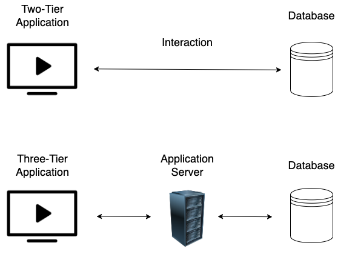
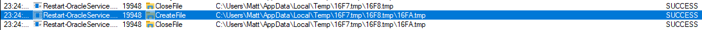
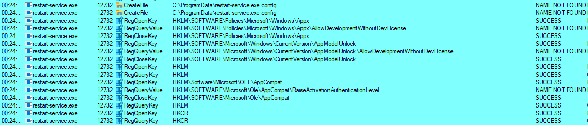
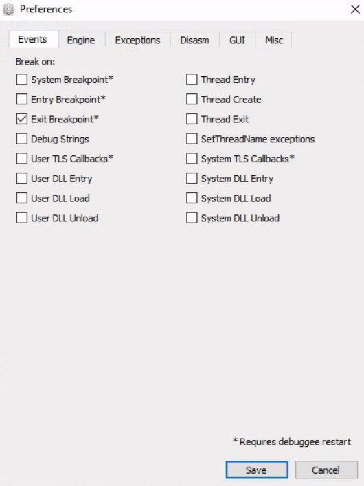
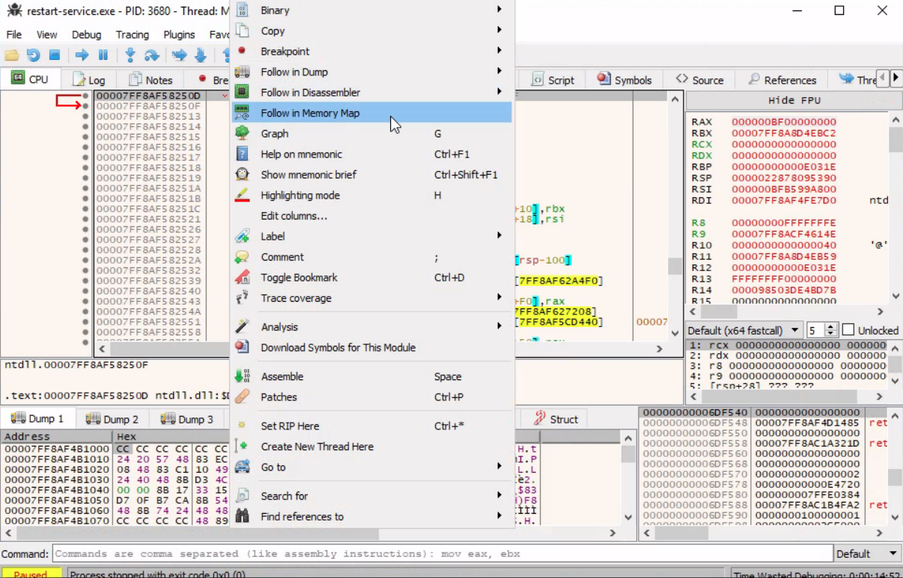
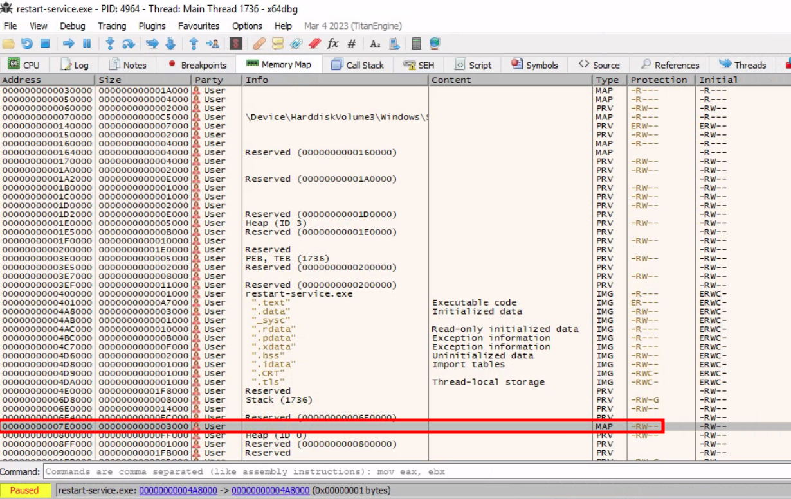
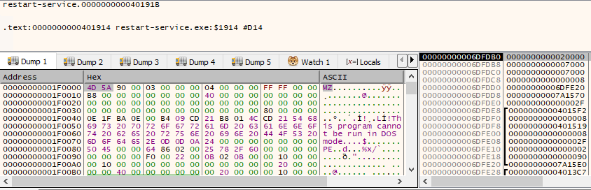
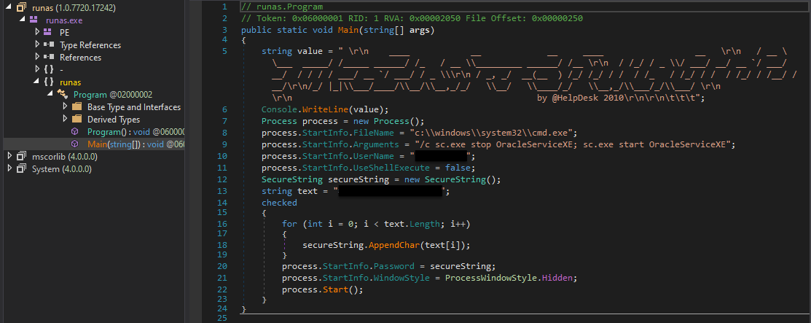

# Attacking Thick Client Applications

## 1. Tổng quan

Thick Client là ứng dụng được cài đặt và xử lý phần lớn công việc ngay trên máy người dùng, thay vì phụ thuộc hoàn toàn vào server như Thin Client.

Đặc điểm:

- Có thể hoạt động không cần Internet.

- Lưu trữ dữ liệu và xử lý cục bộ.

- Thường dùng trong doanh nghiệp: quản lý dự án, CRM, quản lý kho...

- Phổ biến với Java, C++, .NET, Silverlight.

- Tốn tài nguyên và khó cập nhật hơn vì cần triển khai bản vá trên từng máy.

Một số công nghệ bảo vệ như Java Sandbox, giới hạn Java API và Code Signing giúp hạn chế mã không đáng tin cậy truy cập tài nguyên hệ thống.

Kiến trúc Thick Client

| Kiến trúc | Cách hoạt động |
|---|---|
| Two-tier | Ứng dụng kết nối trực tiếp đến database. |
| Three-tier | Ứng dụng kết nối đến Application Server, sau đó server mới truy cập database. |



Three-tier hạn chế việc client truy cập trực tiếp database, nhờ đó giảm bề mặt tấn công trực tiếp vào cơ sở dữ liệu.

Các lỗ hổng thường gặp

- Improper Error Handling

- Hardcoded Sensitive Data

- DLL Hijacking

- Buffer Overflow

- SQL Injection

- Insecure Storage

- Session Management

Các lỗi đặc thù web như XSS, CSRF, Clickjacking thường không áp dụng trực tiếp cho Thick Client, nhưng ứng dụng vẫn có thể gặp các lỗi khi giao tiếp với server.

## 2. Quy trình Pentest Thick Client

### 2.1. Information Gathering

Thu thập thông tin về:

- Kiến trúc ứng dụng, ngôn ngữ và framework.

- Công nghệ phía client/server.

- Cách ứng dụng giao tiếp với hạ tầng.

- Các entry point và dữ liệu đầu vào.

- Những vị trí có thể chứa lỗ hổng phổ biến.

Công cụ: CFF Explorer, Detect It Easy, Process Monitor (ProcMon), Strings.

### 2.2. Client-side Attacks

Kiểm tra dữ liệu và xử lý diễn ra trên máy người dùng:

- Phân tích file ứng dụng để tìm username, password, token, API key hoặc thông tin kết nối được hardcode.

- Static Analysis và reverse engineering các file như EXE, DLL, JAR, CLASS, WAR.

- Dynamic Analysis để kiểm tra dữ liệu nhạy cảm trong bộ nhớ khi ứng dụng chạy.

- Kiểm tra tương tác với server để tìm command injection, SQL injection và lỗi kiểm soát truy cập.

Công cụ: Ghidra, IDA, OllyDbg, Radare2, dnSpy, x64dbg, JADX, Frida.

### 2.3. Network-side Attacks

Phân tích lưu lượng giữa ứng dụng và server qua HTTP/HTTPS hoặc TCP/UDP để:

- Tìm thông tin nhạy cảm truyền qua mạng.

- Hiểu giao thức và cách ứng dụng hoạt động.

- Kiểm tra dữ liệu đầu vào và cơ chế xác thực.

Công cụ: Wireshark, tcpdump, TCPView, Burp Suite.

### 2.4. Server-side Attacks

Kiểm tra server mà Thick Client giao tiếp, tập trung vào các lỗi phổ biến trong OWASP Top 10 và các vấn đề bảo mật web/API.

## 3. Lab: Trích xuất credentials hardcode từ Thick Client

Bối cảnh

Sau khi truy cập được SMB service, kiểm tra share `NETLOGON` phát hiện file: `Restart-Oracle-Service.exe`

Chạy chương trình không thấy output đáng chú ý. Dùng `ProcMon` theo dõi thì phát hiện chương trình tạo file tạm trong:

`C:\Users\Matt\AppData\Local\Temp`



### Bước 1: Giữ lại file tạm

Chương trình tự tạo rồi xóa các file tạm. Để thu thập chúng, thay đổi quyền thư mục Temp, bỏ quyền xóa file và thư mục con.


Để làm điều này, chúng ta nhấp chuột phải vào thư mục: `C:\Users\Matt\AppData\Local\Temp`

`Properties` -> `Security` -> `Advanced` -> `cybervaca` -> `Disable inheritance` -> `Convert inherited permissions into explicit permissions on this object` -> `Edit` -> `Show advanced permissions` rồi deseclect `Delete subfolders and files` và `Delete`

Chạy lại executable, phát hiện file được tạo trong:

`C:\Users\cybervaca\AppData\Local\Temp\2`

```cmd
C:\Apps>dir C:\Users\cybervaca\AppData\Local\Temp\2

...SNIP...
04/03/2023  02:09 PM         1,730,212 6F39.bat
04/03/2023  02:09 PM                 0 6F39.tmp
```

Tên file thay đổi mỗi lần chạy.

### Bước 2: Phân tích batch script

```batch
@shift /0
@echo off

if %username% == matt goto correcto
if %username% == frankytech goto correcto
if %username% == ev4si0n goto correcto
goto error

:correcto
echo TVqQAAMAAAAEAAAA//8AALgAAAAAAAAAQAAAAAAAAAAAAAAAAAAAAAAAAAAAAAAAAAAAAA > c:\programdata\oracle.txt
echo AAAAAAAAAAgAAAAA4fug4AtAnNIbgBTM0hVGhpcyBwcm9ncmFtIGNhbm5vdCBiZSBydW4g >> c:\programdata\oracle.txt
<SNIP>
echo AAAAAAAAAAAAAAAAAAAAAAAAAAAAAAAAAAAAAAAAAAAAAAAAAAAAAA >> c:\programdata\oracle.txt

echo $salida = $null; $fichero = (Get-Content C:\ProgramData\oracle.txt) ; foreach ($linea in $fichero) {$salida += $linea }; $salida = $salida.Replace(" ",""); [System.IO.File]::WriteAllBytes("c:\programdata\restart-service.exe", [System.Convert]::FromBase64String($salida)) > c:\programdata\monta.ps1
powershell.exe -exec bypass -file c:\programdata\monta.ps1
del c:\programdata\monta.ps1
del c:\programdata\oracle.txt
c:\programdata\restart-service.exe
del c:\programdata\restart-service.exe
```

Nội dung file `.bat` cho thấy:

- Chỉ tiếp tục nếu username là `matt`, `frankytech` hoặc `ev4si0n`.

- Ghi nhiều dòng Base64 vào `C:\ProgramData\oracle.txt`.

- Dùng PowerShell giải mã Base64 thành `restart-service.exe`.

- Xóa các file trung gian sau khi chạy.

Để giữ lại dữ liệu phục vụ phân tích, chỉnh sửa batch script và loại bỏ các lệnh xóa file.

```batch
@shift /0
@echo off

echo TVqQAAMAAAAEAAAA//8AALgAAAAAAAAAQAAAAAAAAAAAAAAAAAAAAAAAAAAAAAAAAAAAAA > c:\programdata\oracle.txt
echo AAAAAAAAAAgAAAAA4fug4AtAnNIbgBTM0hVGhpcyBwcm9ncmFtIGNhbm5vdCBiZSBydW4g >> c:\programdata\oracle.txt
<SNIP>
echo AAAAAAAAAAAAAAAAAAAAAAAAAAAAAAAAAAAAAAAAAAAAAAAAAAAAAA >> c:\programdata\oracle.txt

echo $salida = $null; $fichero = (Get-Content C:\ProgramData\oracle.txt) ; foreach ($linea in $fichero) {$salida += $linea }; $salida = $salida.Replace(" ",""); [System.IO.File]::WriteAllBytes("c:\programdata\restart-service.exe", [System.Convert]::FromBase64String($salida)) > c:\programdata\monta.ps1
```

### Bước 3: Khôi phục executable

File `monta.ps1` thực hiện việc đọc `oracle.txt`, loại bỏ khoảng trắng, giải mã Base64 và ghi thành:

`C:\ProgramData\restart-service.exe`

Sau khi chạy script, thu được executable hoàn chỉnh để phân tích tiếp.

```powershell
C:\>  ls C:\programdata\

Mode                LastWriteTime         Length Name
<SNIP>
-a----        3/24/2023   1:01 PM            273 monta.ps1
-a----        3/24/2023   1:01 PM         601066 oracle.txt
-a----        3/24/2023   1:17 PM         432273 restart-service.exe
```

### Bước 4: Phân tích executable trong bộ nhớ

Chạy `restart-service.exe` thấy banner `Restart Oracle`.



Dùng ProcMon nhưng chưa tìm được thông tin đáng chú ý. Tiếp tục dùng x64dbg:



- Trong Options → Preferences, chỉ giữ Exit Breakpoint.

- Mở restart-service.exe để debug.

- Trong CPU view, chọn Follow in Memory Map.



- Tìm vùng memory map có kích thước 0x3000, kiểu MAP, quyền -RW--.



- Kiểm tra vùng nhớ và phát hiện magic bytes MZ, cho thấy đây là dữ liệu của một file PE executable.



Dump vùng nhớ này ra file để phân tích.

### Bước 5: Reverse engineering .NET

```cmd
C:\> C:\TOOLS\Strings\strings64.exe .\restart-service_00000000001E0000.bin

<SNIP>
"#M
z\V
).NETFramework,Version=v4.0,Profile=Client
FrameworkDisplayName
.NET Framework 4 Client Profile
<SNIP>
```

Chạy strings trên file dump và phát hiện: `.NETFramework,Version=v4.0`

Điều này cho thấy file dump chứa executable `.NET`.

Quy trình tiếp theo:

- Dùng De4Dot để xử lý obfuscation và đổi tên các symbol.

```cmd
de4dot v3.1.41592.3405

Detected Unknown Obfuscator (C:\Users\cybervaca\Desktop\restart-service_00000000001E0000.bin)
Cleaning C:\Users\cybervaca\Desktop\restart-service_00000000001E0000.bin
Renaming all obfuscated symbols
Saving C:\Users\cybervaca\Desktop\restart-service_00000000001E0000-cleaned.bin


Press any key to exit...
```

- Dùng dnSpy mở file đã xử lý để xem source code C#.



Kết quả

Source code cho thấy executable là một chương trình tương tự `runas.exe`, được viết riêng để khởi động lại Oracle service bằng credentials hardcode.