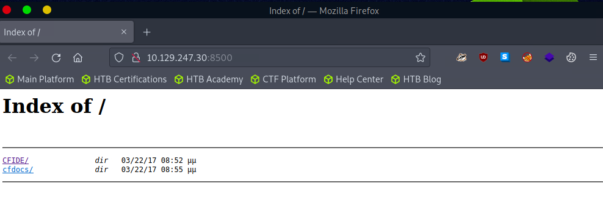

# ColdFusion - Discovery & Enumeration

## 1. Tổng quan về ColdFusion

ColdFusion là nền tảng phát triển ứng dụng web dựa trên Java, được phát triển từ năm 1995 bởi Allaire Corporation, sau đó được Macromedia mua lại và hiện thuộc sở hữu của Adobe.

ColdFusion sử dụng ngôn ngữ CFML (ColdFusion Markup Language), có cú pháp tương tự HTML, giúp lập trình viên dễ dàng xây dựng các ứng dụng web động.

CFML cung cấp các thẻ và hàm hỗ trợ:

- Kết nối và thao tác với database.

- Quản lý email, session và form.

- Xử lý PDF, biểu đồ và web services.

- Tạo nội dung HTML động.

Ví dụ, CFML sử dụng `cfquery` để truy vấn database và `cfloop` để duyệt kết quả.

```html
<cfquery name="myQuery" datasource="myDataSource">
  SELECT * FROM myTable
</cfquery>

<cfloop query="myQuery">
  <p>#myQuery.firstName# #myQuery.lastName#</p>
</cfloop>
```

ColdFusion có thể triển khai trên Windows, Linux, macOS và các nền tảng Cloud như AWS, Azure.

## 2. ColdFusion dưới góc độ bảo mật

ColdFusion từng tồn tại nhiều lỗ hổng bảo mật phổ biến như:

- SQL Injection

- Cross-Site Scripting (XSS)

- Directory Traversal

- Authentication Bypass

- Arbitrary File Upload

Một số CVE đáng chú ý

| CVE | Mô tả |
|---|---|
| CVE-2013-0632 | Remote Code Execution |
| CVE-2013-0629 | Directory Traversal và Sensitive File Disclosure |
| CVE-2010-2861 | Directory Traversal và Arbitrary File Read |
| CVE-2018-15961 | Arbitrary File Upload dẫn đến RCE |
| CVE-2023-26360 | Pre-authentication Remote Code Execution |


Các port mặc định

| Port | Protocol / Service | Mô tả |
|---|---|---|
| 80 | HTTP | HTTP communication |
| 443 | HTTPS | HTTPS communication |
| 1935 | RPC | Remote Procedure Call |
| 25 | SMTP | Gửi email |
| 8500 | SSL | Port thường được ColdFusion sử dụng |
| 5500 | Server Monitor | Remote administration / monitoring |

## 3. Enumeration

| Phương pháp | Dấu hiệu |
|---|---|
| Port Scanning | Kiểm tra port 8500, 80, 443 |
| File Extensions | Tìm `.cfm`, `.cfc` |
| HTTP Headers | Tìm `Server: ColdFusion`, `X-Powered-By: ColdFusion` |
| Error Messages | Error page có thể chứa thông tin đặc trưng của ColdFusion |
| Default Files | Tìm `admin.cfm`, `/CFIDE/administrator/index.cfm` |

### 3.1. Nmap Port Scan

```bash
reDrose18@htb[/htb]$ nmap -p- -sC -Pn 10.129.247.30 --open

Starting Nmap 7.92 ( https://nmap.org ) at 2023-03-13 11:45 GMT
Nmap scan report for 10.129.247.30
Host is up (0.028s latency).
Not shown: 65532 filtered tcp ports (no-response)
Some closed ports may be reported as filtered due to --defeat-rst-ratelimit
PORT      STATE SERVICE
135/tcp   open  msrpc
8500/tcp  open  fmtp
49154/tcp open  unknown

Nmap done: 1 IP address (1 host up) scanned in 350.38 seconds

```

Port 8500 là một dấu hiệu đáng chú ý vì thường được ColdFusion sử dụng.

### 3.2. KIểm tra port 8500

`http://10.129.247.30:8500` -> Có thể thấy các thư mục: `CFIDE`, `cfdocs`



Sự xuất hiện của CFIDE và cfdocs là dấu hiệu mạnh cho thấy server đang chạy ColdFusion.

### 3.3 Enumeration `/CFIDE/`

truy cập: `http://10.129.247.30:8500/CFIDE/`

Có thể thấy các file/thư mục như: 

```
Application.cfm
adminapi/
install.cfm
```

Trong quá trình enumeration, cần chú ý:

- `.cfm` files
- `.cfc` files
- Administrator pages
- Error messages
- Debug information
- Các file/thư mục mặc định

### 3.4. Xác định phiên bản ColdFusion

Kiểm tra: `http://10.129.247.30:8500/CFIDE/administrator`

