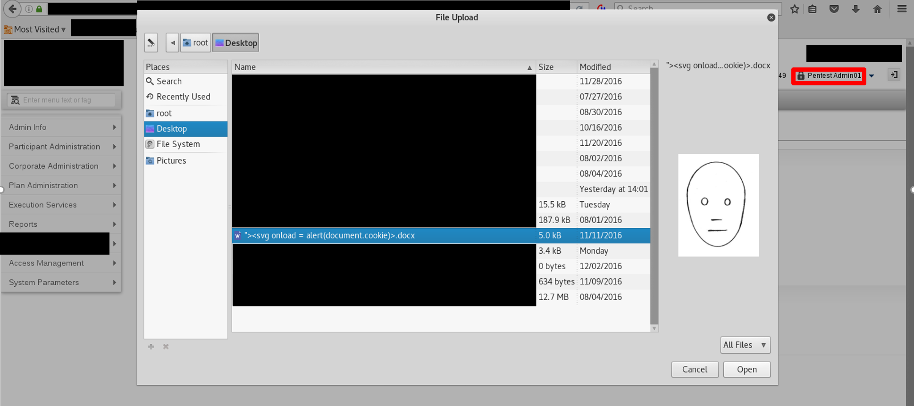
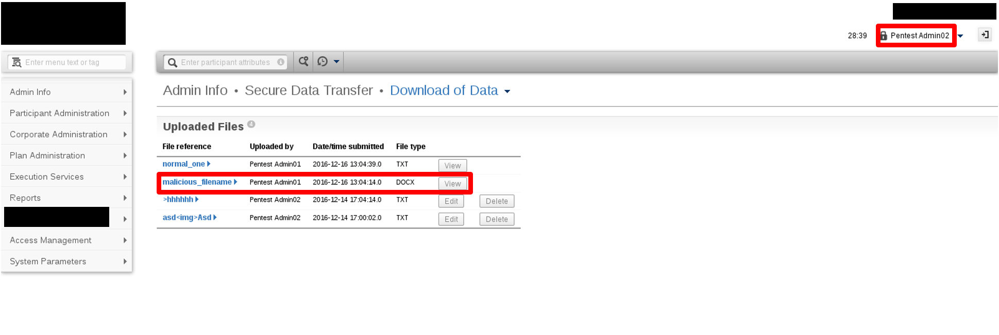
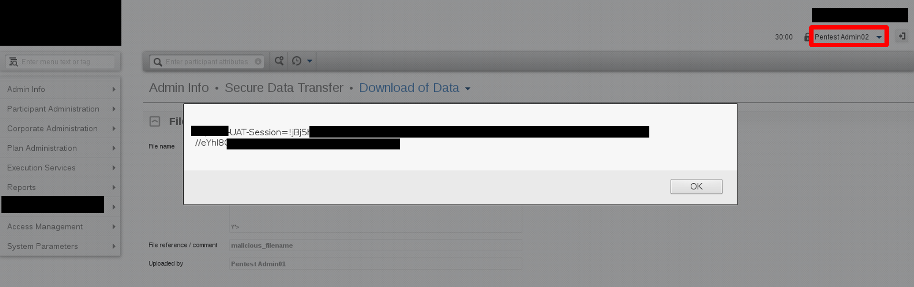

# Example 1: Reporting Stored XSS

# Ví dụ 1: Báo cáo Stored XSS

---

`Title`: Stored Cross-Site Scripting (XSS) trong X Admin Panel

`CWE`: [CWE-79: Neutralization không phù hợp đối với Input trong quá trình tạo Web Page ('Cross-site Scripting')](https://cwe.mitre.org/data/definitions/79.html)

`CVSS 3.1 Score`: 5.5 (Medium)

`Description`: Trong quá trình thực hiện các hoạt động kiểm thử, chúng tôi xác định rằng ứng dụng web "X dành cho quản trị viên" dễ bị tấn công bởi stored cross-site scripting (XSS) do việc làm sạch dữ liệu do người dùng cung cấp không đầy đủ. Cụ thể, cơ chế tải tệp lên tại "Admin Info" -> "Secure Data Transfer" -> "Load of Data" sử dụng một giá trị thu được từ input của người dùng, cụ thể là tên tệp của tệp được tải lên, giá trị này không chỉ được phản hồi trực tiếp trở lại trình duyệt của người dùng mà còn được lưu vào cơ sở dữ liệu của ứng dụng web. Tuy nhiên, giá trị này dường như không được làm sạch đầy đủ. Do đó, điều này khiến ứng dụng dễ bị tấn công bởi reflected và stored cross-site scripting (XSS), vì mã JavaScript có thể được nhập vào trường tên tệp.

`Impact`: Các vấn đề Cross-Site Scripting xảy ra khi một ứng dụng sử dụng dữ liệu không đáng tin cậy do những người dùng có mục đích tấn công cung cấp trong trình duyệt web mà không có quá trình xác thực hoặc escaping đầy đủ trước đó. Một kẻ tấn công tiềm năng có thể nhúng mã không đáng tin cậy vào một client-side script để được trình duyệt thực thi trong khi diễn giải trang. Những kẻ tấn công sử dụng các lỗ hổng XSS để thực thi script trong trình duyệt của một người dùng hợp lệ, dẫn đến đánh cắp thông tin xác thực người dùng, chiếm quyền phiên, thay đổi giao diện website hoặc chuyển hướng đến các trang web độc hại. Bất kỳ ai có thể gửi dữ liệu đến hệ thống, bao gồm cả quản trị viên, đều có thể là đối tượng thực hiện các cuộc tấn công XSS nhằm vào ứng dụng dễ bị tổn thương. Vấn đề này tạo ra một rủi ro đáng kể vì lỗ hổng nằm trong ứng dụng web "X dành cho quản trị viên", và các tệp được tải lên có thể được mọi quản trị viên nhìn thấy và truy cập. Do đó, bất kỳ quản trị viên nào cũng có thể là mục tiêu của một cuộc tấn công Cross-Site Scripting.

`POC`:

Step 1: Một quản trị viên độc hại có thể tận dụng việc giá trị tên tệp được phản hồi trở lại trình duyệt và được lưu trong cơ sở dữ liệu của ứng dụng web để thực hiện các cuộc tấn công cross-site scripting nhằm vào các quản trị viên khác bằng cách tải lên một tệp chứa mã JavaScript độc hại trong tên tệp của nó. Cuộc tấn công khả thi vì quản trị viên có thể xem tất cả các tệp đã tải lên bất kể người tải lên. Cụ thể, chúng tôi đặt tên tệp như sau bằng máy Linux.

```javascript
"><svg onload = alert(document.cookie)>.docx
```



Step 2: Khi một quản trị viên khác nhấp vào nút view để mở tệp đã đề cập ở trên, mã JavaScript độc hại trong tên tệp sẽ được thực thi trên trình duyệt.





---

## Phân tích điểm CVSS

|                        |                                                                                                                                          |
| ---------------------- | ---------------------------------------------------------------------------------------------------------------------------------------- |
| `Attack Vector:`       | Network - Cuộc tấn công có thể được thực hiện qua internet.                                                                              |
| `Attack Complexity:`   | Low - Tất cả những gì kẻ tấn công (quản trị viên độc hại) cần làm là chỉ định XSS payload cuối cùng được lưu trong cơ sở dữ liệu.        |
| `Privileges Required:` | High - Chỉ người có quyền cấp quản trị viên mới có thể truy cập admin panel.                                                             |
| `User Interaction:`    | None - Các quản trị viên khác sẽ bị ảnh hưởng chỉ bằng việc duyệt một trang cụ thể (nhưng được truy cập thường xuyên) trong admin panel. |
| `Scope:`               | Changed - Vì thành phần dễ bị tổn thương là webserver và thành phần bị tác động là trình duyệt                                           |
| `Confidentiality:`     | Low - Có thể truy cập DOM                                                                                                                |
| `Integrity:`           | Low - Thông qua XSS, chúng ta có thể ảnh hưởng một chút đến tính toàn vẹn của một ứng dụng                                               |
| `Availability:`        | None - Chúng ta không thể từ chối dịch vụ thông qua XSS                                                                                  |

```
```
