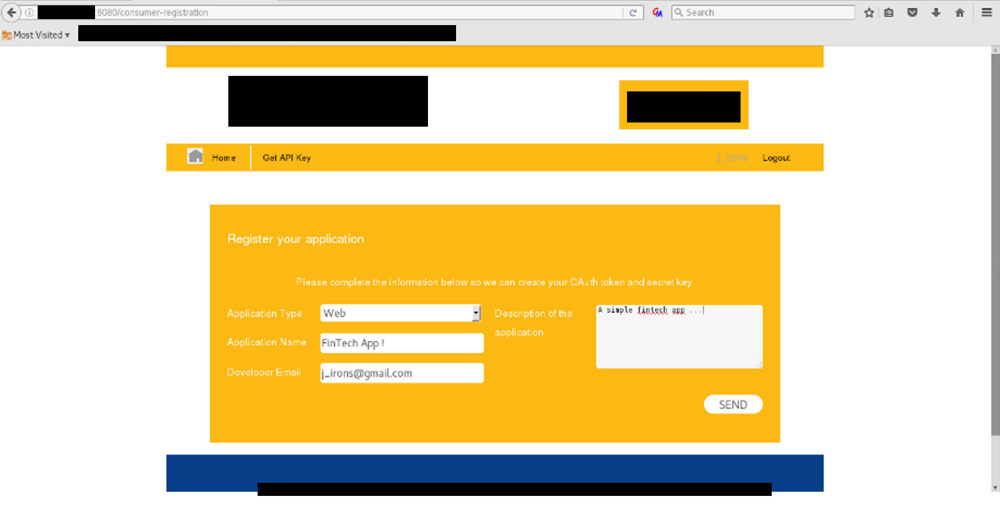
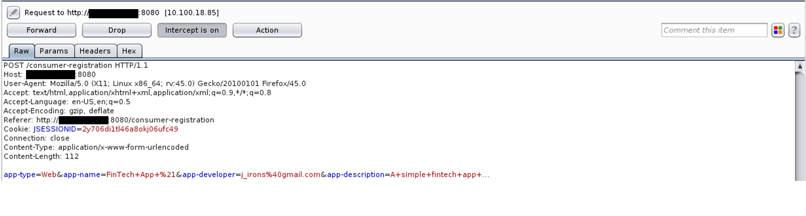
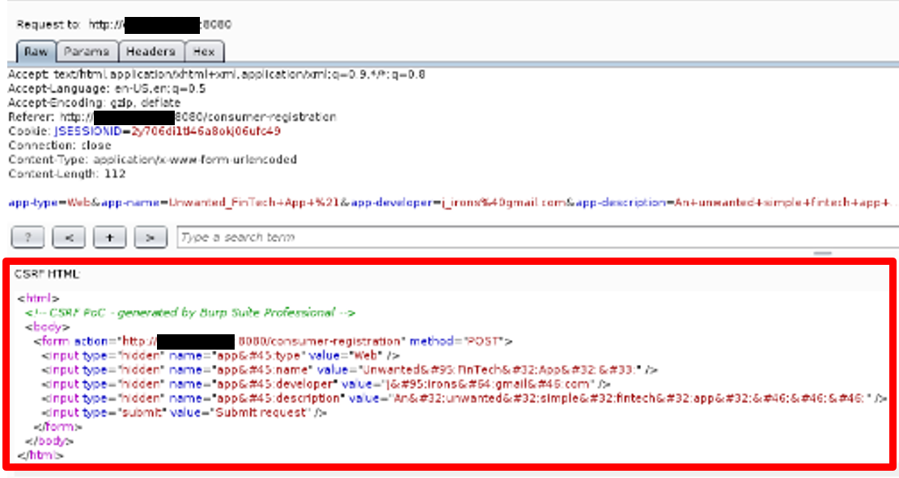
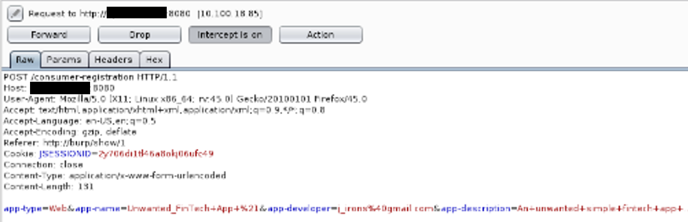
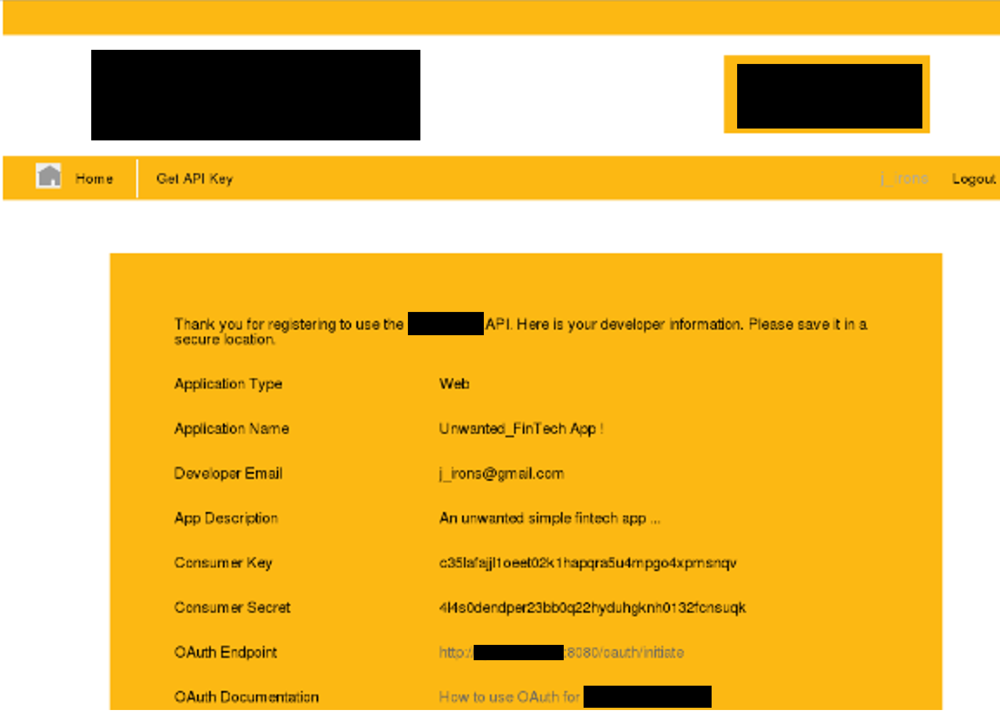

# Ví dụ 2: Báo cáo CSRF

---

`Title`: Cross-Site Request Forgery (CSRF) trong Consumer Registration

`CWE`: [CWE-352: Cross-Site Request Forgery (CSRF)](https://cwe.mitre.org/data/definitions/352.html)

`CVSS 3.1 Score`: 5.4 (Medium)

`Description`: Trong quá trình thực hiện các hoạt động kiểm thử, chúng tôi xác định rằng trang web chịu trách nhiệm đăng ký consumer dễ bị tấn công bởi Cross-Site Request Forgery (CSRF). Cross-Site Request Forgery (CSRF) là một cuộc tấn công trong đó kẻ tấn công lừa nạn nhân tải một trang có chứa một request độc hại. Nó mang tính độc hại theo nghĩa request đó kế thừa danh tính và quyền hạn của nạn nhân để thực hiện một chức năng không mong muốn thay mặt nạn nhân, chẳng hạn như thay đổi địa chỉ e-mail, địa chỉ nhà hoặc mật khẩu của nạn nhân, hoặc mua một thứ gì đó. Các cuộc tấn công CSRF thường nhắm vào những chức năng gây ra thay đổi trạng thái trên server nhưng cũng có thể được sử dụng để truy cập dữ liệu nhạy cảm.

`Impact`: Tác động của một lỗ hổng CSRF thay đổi tùy thuộc vào bản chất của chức năng dễ bị tổn thương. Kẻ tấn công về cơ bản có thể thực hiện bất kỳ thao tác nào với tư cách nạn nhân. Vì kẻ tấn công có danh tính của nạn nhân, phạm vi của CSRF chỉ bị giới hạn bởi quyền hạn của nạn nhân. Cụ thể, trong trường hợp này, kẻ tấn công có thể đăng ký một fintech application và tạo một API key với tư cách nạn nhân.

`POC`:

Step 1: Sử dụng một intercepting proxy, chúng tôi xem xét request để tạo một fintech application mới. Chúng tôi nhận thấy không có biện pháp bảo vệ anti-CSRF nào được áp dụng.

Step 2: Chúng tôi sử dụng request đã đề cập ở trên để tạo một trang HTML độc hại mà nếu được một nạn nhân có session đang hoạt động truy cập, một cross-site request sẽ được thực hiện, dẫn đến việc vô tình tạo một fintech application cụ thể cho kẻ tấn công.

Step 3: Để hoàn tất cuộc tấn công, chúng tôi sẽ phải gửi trang web độc hại của mình đến một nạn nhân đang có một session đang mở. Hình ảnh sau đây hiển thị cross-site request thực tế sẽ được gửi nếu nạn nhân truy cập trang web độc hại của chúng tôi.

Step 4: Kết quả sẽ là việc nạn nhân vô tình tạo một fintech application mới. Cần lưu ý rằng cuộc tấn công này có thể đã diễn ra trong nền nếu kết hợp với finding 6.1.1. <-- 6.1.1 là một lỗ hổng XSS.

---

## Phân tích điểm CVSS

|                        |                                                                                                                                                                       |
| ---------------------- | --------------------------------------------------------------------------------------------------------------------------------------------------------------------- |
| `Attack Vector:`       | Network - Cuộc tấn công có thể được thực hiện qua internet.                                                                                                           |
| `Attack Complexity:`   | Low - Tất cả những gì kẻ tấn công cần làm là lừa một người dùng đang có session mở truy cập vào một trang web độc hại.                                                |
| `Privileges Required:` | None - Kẻ tấn công không cần bất kỳ quyền hạn nào để thực hiện cuộc tấn công.                                                                                         |
| `User Interaction:`    | Required - Nạn nhân phải nhấp vào một liên kết được tạo bởi kẻ tấn công.                                                                                              |
| `Scope:`               | Unchanged - Vì thành phần dễ bị tổn thương là webserver và thành phần bị tác động cũng là webserver.                                                                  |
| `Confidentiality:`     | Low - Kẻ tấn công có thể tạo một fintech application và thu được thông tin hạn chế.                                                                                   |
| `Integrity:`           | Low - Kẻ tấn công có thể sửa đổi dữ liệu (tạo một application) nhưng ở mức hạn chế và không ảnh hưởng nghiêm trọng đến tính toàn vẹn của thành phần dễ bị tổn thương. |
| `Availability:`        | None - Kẻ tấn công không thể thực hiện tấn công từ chối dịch vụ thông qua cuộc tấn công CSRF này.                                                                     |
