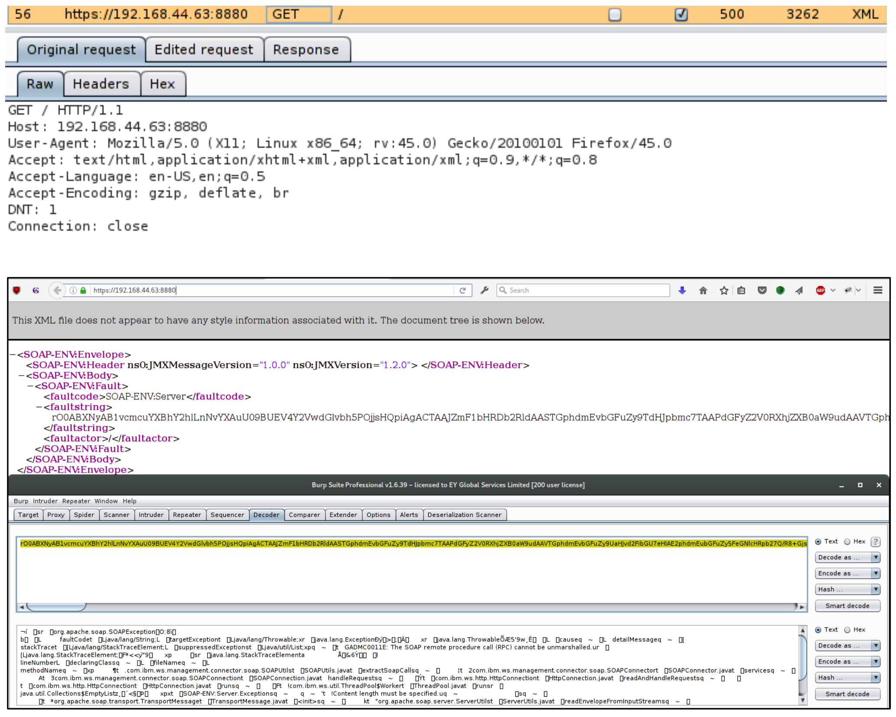
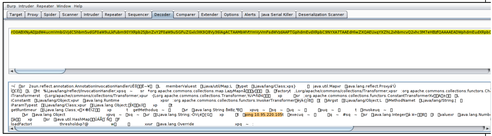
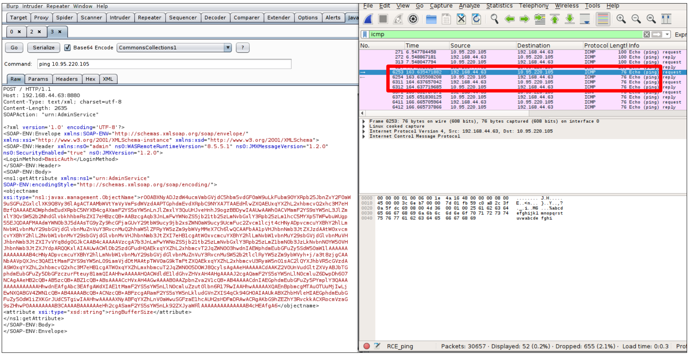

# Ví dụ 3: Báo cáo RCE

---

`Title`: RCE thông qua Java Object Deserialization trên IBM WebSphere

`CWE`: [CWE-502: Deserialization of Untrusted Data](https://cwe.mitre.org/data/definitions/502.html)

`CVSS 3.1 Score`: 9.8 (Critical)

`Description`: Trong quá trình thực hiện các hoạt động kiểm thử, chúng tôi xác định rằng máy chủ ứng dụng WebSphere từ xa bị ảnh hưởng bởi một lỗ hổng liên quan đến việc Java object deserialization không an toàn, cho phép những kẻ tấn công từ xa thực thi các lệnh tùy ý. Bằng cách gửi một request đến máy chủ ứng dụng WebSphere từ xa qua HTTPS trên cổng 8880, chúng tôi xác định sự tồn tại của các Java object thô, được serialized và mã hóa base64. Có thể xác định các Java object đã được serialized và mã hóa base64 thông qua header "rO0". Chúng tôi có thể tạo một SOAP request chứa một Java object đã được serialized có khả năng khai thác lỗ hổng nói trên trong thư viện Apache Commons Collections (ACC) được máy chủ ứng dụng WebSphere sử dụng. Java object được tạo chứa một lệnh `ping` để hệ thống bị ảnh hưởng thực thi.

`Impact`: Các lỗ hổng command injection thường xảy ra khi dữ liệu đi vào ứng dụng từ một nguồn không đáng tin cậy, chẳng hạn như terminal hoặc network socket, mà không xác thực nguồn, hoặc dữ liệu là một phần của một chuỗi được ứng dụng thực thi dưới dạng lệnh, một lần nữa mà không xác thực input dựa trên danh sách các lệnh được phép được xác định trước, chẳng hạn như whitelist. Ứng dụng thực thi lệnh được cung cấp trong security context của người dùng hiện tại. Nếu ứng dụng được thực thi bởi một người dùng có quyền cao, administrative hoặc driver interface, chẳng hạn như tài khoản SYSTEM, điều này có khả năng cho phép chiếm quyền kiểm soát hoàn toàn hệ thống bị ảnh hưởng.

`POC`:

Step 1: Chúng tôi xác định rằng ứng dụng sử dụng các đối tượng dữ liệu đã được serialized bằng cách bắt và giải mã một request đến cổng 8880 của server. Các hình ảnh sau đây hiển thị request ban đầu và response của server từ xa, cùng với nội dung đã được giải mã của nó.

Step 2: Chúng tôi tạo một SOAP request chứa một lệnh được server từ xa thực thi. Lệnh này sẽ gửi các thông điệp `ping` từ server bị ảnh hưởng đến host của chúng tôi. Hình ảnh bên dưới hiển thị request được tạo và payload đã được giải mã của nó.

Step 3: Hình ảnh sau đây hiển thị SOAP request được tạo, cho phép thực thi từ xa một lệnh `ping` từ hệ thống bị ảnh hưởng. Bằng cách bắt traffic thông qua Wireshark, chúng tôi quan sát thấy request `ping` từ máy chủ ứng dụng WebSphere đến máy của chúng tôi.

---

## Phân tích điểm CVSS

---

|                        |                                                                                                                                                                     |
| ---------------------- | ------------------------------------------------------------------------------------------------------------------------------------------------------------------- |
| `Attack Vector:`       | Network - Cuộc tấn công có thể được thực hiện qua internet.                                                                                                         |
| `Attack Complexity:`   | Low - Tất cả những gì kẻ tấn công cần làm là gửi một request được tạo đặc biệt đến ứng dụng dễ bị tổn thương.                                                       |
| `Privileges Required:` | None - Cuộc tấn công có thể được thực hiện từ góc độ không cần xác thực.                                                                                            |
| `User Interaction:`    | None - Không yêu cầu tương tác của người dùng để khai thác thành công lỗ hổng này.                                                                                  |
| `Scope:`               | Unchanged - Vì thành phần dễ bị tổn thương là webserver và thành phần bị tác động cũng là webserver.                                                                |
| `Confidentiality:`     | High - Việc khai thác lỗ hổng thành công dẫn đến remote code execution, và kẻ tấn công có toàn quyền kiểm soát đối với thông tin được thu thập.                     |
| `Integrity:`           | High - Việc khai thác lỗ hổng thành công dẫn đến remote code execution. Kẻ tấn công có thể sửa đổi tất cả hoặc dữ liệu quan trọng trên thành phần dễ bị tổn thương. |
| `Availability:`        | High - Việc khai thác lỗ hổng thành công dẫn đến remote code execution. Kẻ tấn công có thể từ chối dịch vụ đối với người dùng bằng cách tắt webserver.              |
