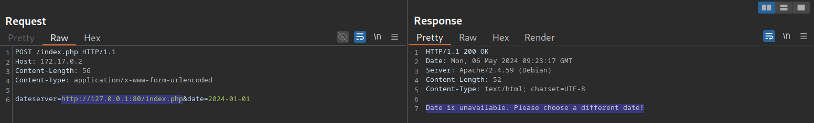

# Blind SSRF

## Identifying Blind SSRF - Xác định Blind SSRF

Cách xác định Blind SSRF là phải cho server request đến 1 máy chủ ta kiểm soát, từ đó mới biết được server có đang thực hiện hành vi với đường dẫn ko 

ví dụ 

```bash
reDrose18@htb[/htb]$ nc -lnvp 8000

listening on [any] 8000 ...
connect to [172.17.0.1] from (UNKNOWN) [172.17.0.2] 32928
GET /index.php HTTP/1.1
Host: 172.17.0.1:8000
Accept: */*
```



## Exploiting Blind SSRF

exploit đối với blind SSRF ko cao như loại hiển thị phản hồi, trong 1 vài trường hợp ta có thể enum được port mở 

