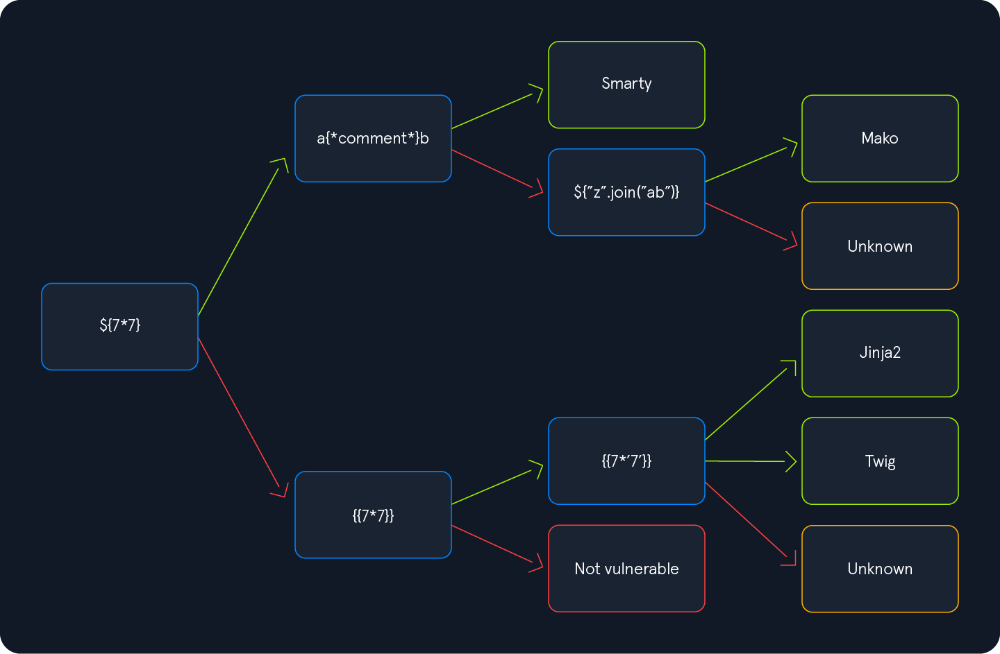

# Identifying SSTI

Trước khi muốn khai thác ssti cần xác định 

- SSTI nằm ở đâu (param nào)
- Engine của nó là gì? -> Cú pháp khai thác khác nhau khi engine khác nhau 

## Confirming SSTI

Chèn vào param nghi ngờ là SSTI 

`${{<%[%'"}}%\.`

Response -> 500 -> có SSTI 

Việc chèn này tương tự việc thêm `'` trong khi test SQLi

## Identifying the Template Engine

Khi thử 1 payload thành công, ta đi theo đươngf màu xanh để tiếp tục thử, khi payload ko thành công, ta đi theo đường màu đỏ 

---

