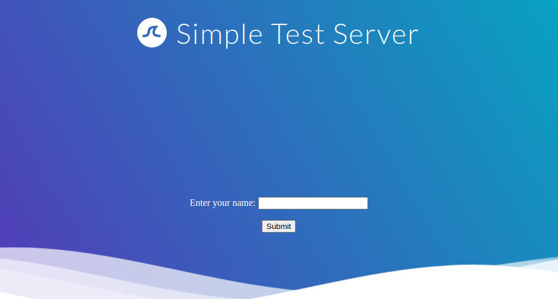
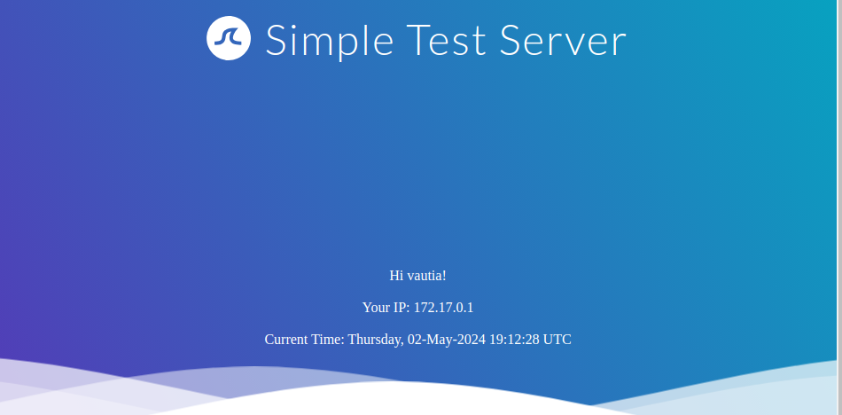
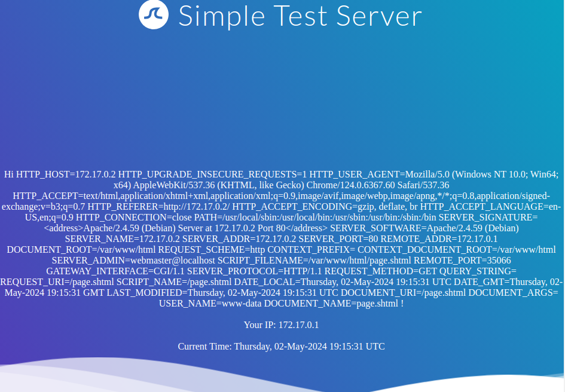

# Exploiting SSI Injection

## Exploitation

Hãy cùng xem ứng dụng web mẫu của chúng ta. Chúng ta được chào đón bằng một biểu mẫu đơn giản yêu cầu nhập tên:

Nếu chúng ta nhập tên của mình, chúng ta sẽ được chuyển hướng đến `/page.shtml`, trang này hiển thị một số thông tin chung:

Dựa vào phần mở rộng tệp, chúng ta có thể đoán rằng trang này hỗ trợ SSI.

Nếu tên người dùng của chúng ta được chèn vào trang mà không được xử lý trước, nó có thể dễ bị tấn công bằng phương pháp tiêm SSI.

Hãy xác nhận điều này bằng cách cung cấp tên người dùng là <!--#printenv -->. Kết quả là trang sau:

Xác định có SSI -> `<!--#exec cmd="id" -->`

