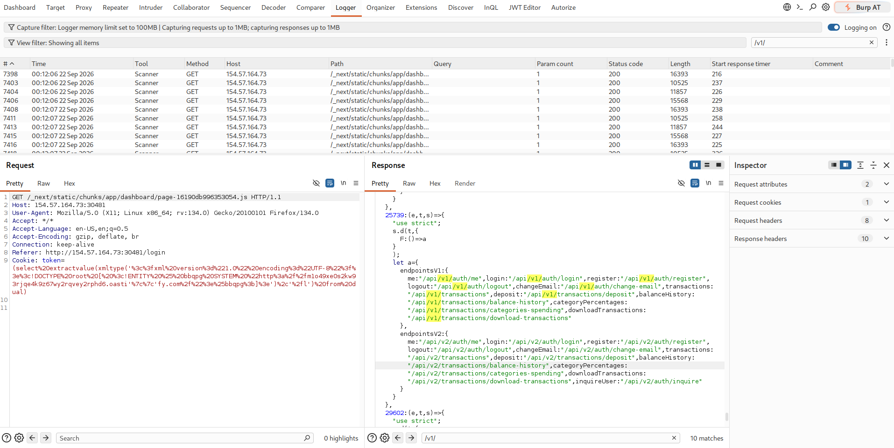
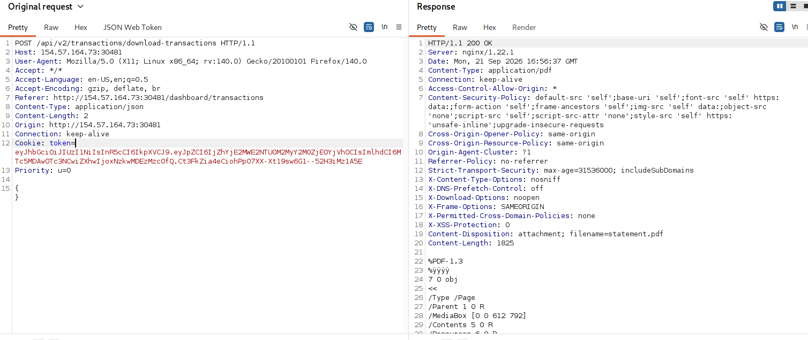
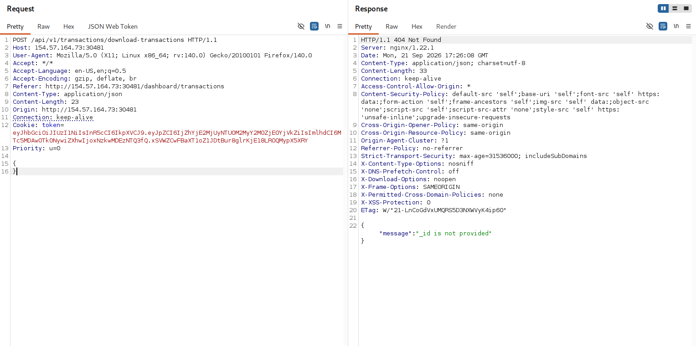
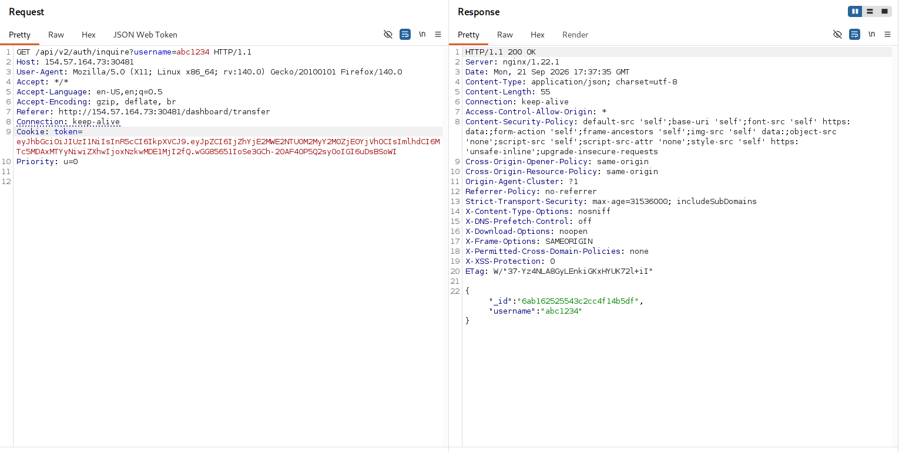
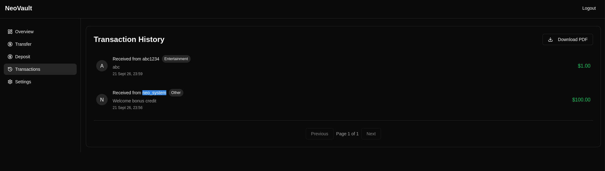
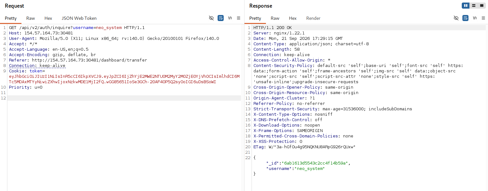
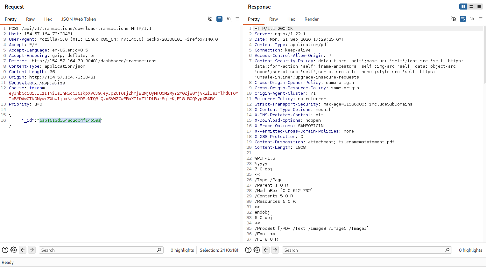
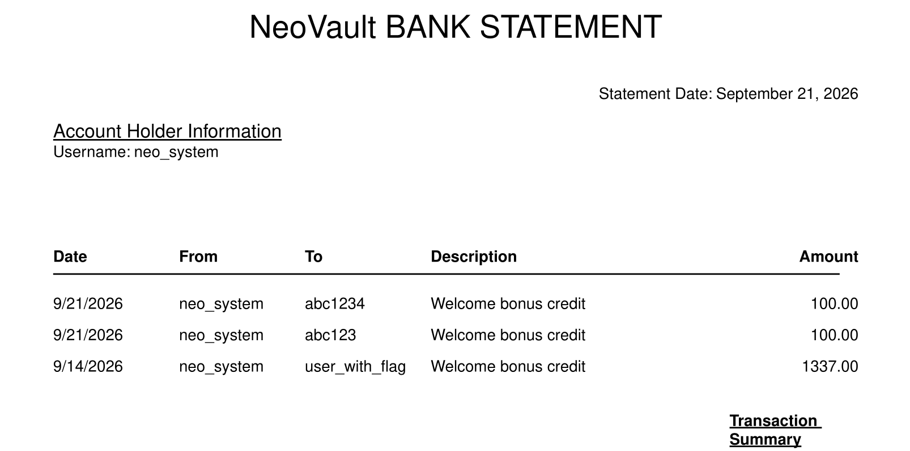
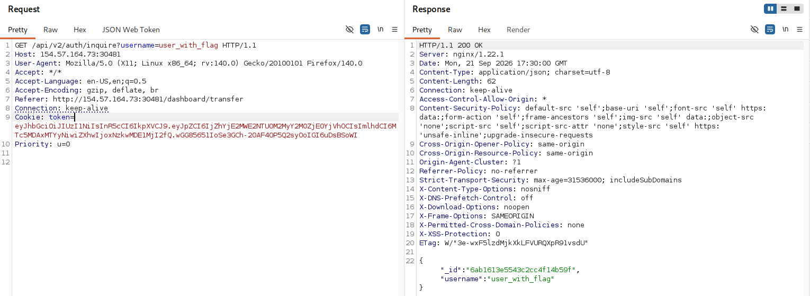

# NeoVault

> api version cũ chưa được tắt

Truy cập, tạo tài khoản, đăng nhập, ta thấy có api v2 

Từ đây ta tìm kiếm api v1 



Ta thấy có các /v1/ api 

```json
endpointsV1:{me:"/api/v1/auth/me",login:"/api/v1/auth/login",register:"/api/v1/auth/register",logout:"/api/v1/auth/logout",changeEmail:"/api/v1/auth/change-email",transactions:"/api/v1/transactions",deposit:"/api/v1/transactions/deposit",balanceHistory:"/api/v1/transactions/balance-history",categoryPercentages:"/api/v1/transactions/categories-spending",downloadTransactions:"/api/v1/transactions/download-transactions"},

endpointsV2:{me:"/api/v2/auth/me",login:"/api/v2/auth/login",register:"/api/v2/auth/register",logout:"/api/v2/auth/logout",changeEmail:"/api/v2/auth/change-email",transactions:"/api/v2/transactions",deposit:"/api/v2/transactions/deposit",balanceHistory:"/api/v2/transactions/balance-history",categoryPercentages:"/api/v2/transactions/categories-spending",downloadTransactions:"/api/v2/transactions/download-transactions",inquireUser:"/api/v2/auth/inquire"}
```

Từ đây, api download ta được, với /v2/ ta không cần cung cấp bất kì param nào 



Nhưng với v1 ta sẽ được gợi ý 



Ta cần cung câps `_id`

Ta lại có 1 api để lấy `_id` (api này khi nhập username ở `http://IP/dashboard/transfer` sẽ tìm kiếm username có tồn tại không)



Với api này ta lấy được `_id` của người dùng bất kì nào 



Nên ta sẽ lấy id của `neo_system`



Thay vào download các transactions của người dùng system này 



Ta thấy có người dùng `user_with_flag`



Làm tương tự để lấy `_id` của `user_with_flag` 



sau đó lấy transactions của `user_with_flag` -> có flag

> Trong write-up chính thức của HTB thì họ đoán `_id` dùng bằng MongoDB ObjectIDs và dùng từ khóa `Predicting or enumerating MongoDB ObjectIDs` để đoán ObjectID tiếp theo, sau đó dùng Intruder brute-force