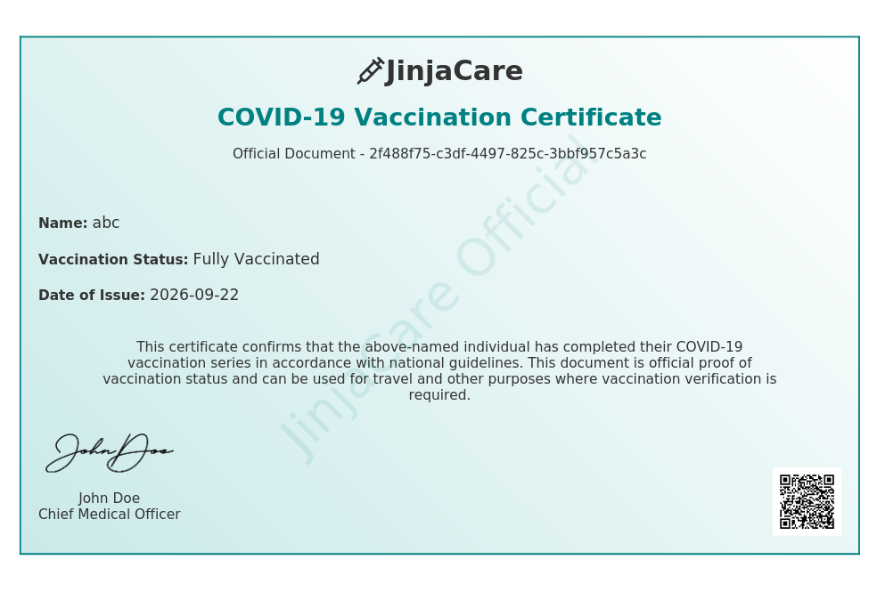
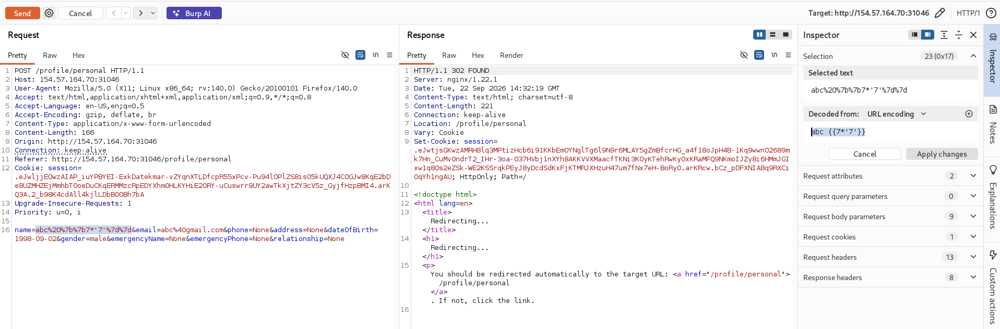
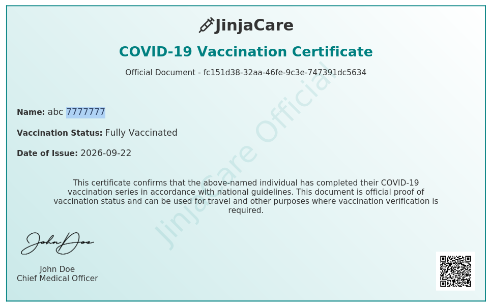
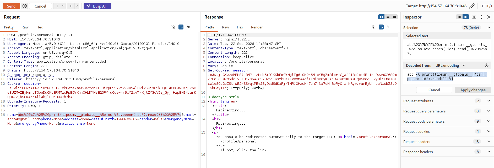
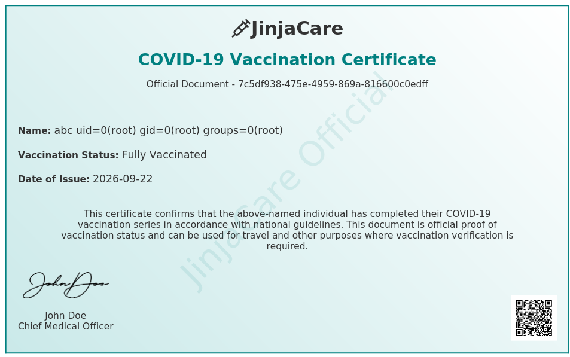
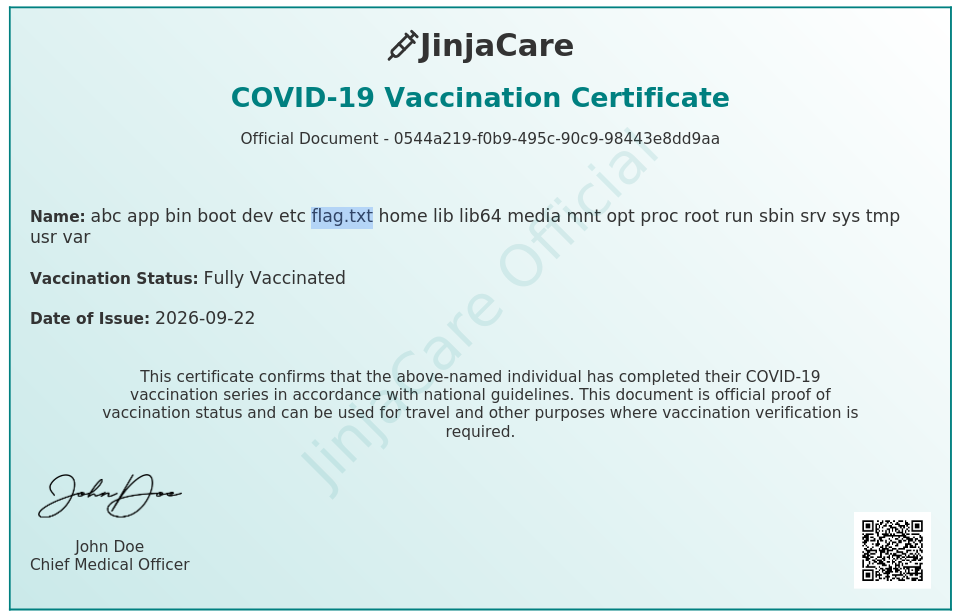

# JinjaCare

Từ tên bài ta cũng có thể đoán được bài muốn đề cập đến Jinja SSTI

Sau khi đăng kí tài khoản và đăng nhập, ta thấy chức năng download certificate, trong certificate sẽ lấy tên đưa vào certificate

Ở chức năng xem info ta đổi tên để inject 

`http://154.57.164.70:31046/profile/personal`

Ta thấy có thể inject SSTI

Kiểm tra ta có thể xác định payload này là Jinja, lấy 1 payload SSTI Jinja thay vào để đọc file 

https://hacktricks.wiki/en/pentesting-web/ssti-server-side-template-injection/jinja2-ssti.html

payload: ``

Tiếp tục download certificate ta được 

Xác nhận có thể tiêm được payload, ta thay các commnad để đọc file 

- `ls /` ta được 

- `cat /flag.txt` ta sẽ đọc được flag 